# diopside 基本設計書

| 項目 | 内容 |
| :--- | :--- |
| 文書名 | diopside 基本設計書 |
| 版 | v0.4 |
| 更新日 | 2026-05-27 |
| 対象 | 白雪巴 YouTube公開アーカイブ検索・閲覧・チャット解析バックエンド |
| システム名 | diopside |
| 設計方針 | 既存 `tsuji-tomonori/diopside` を中心に、周辺のYouTube収集・通知・ファイル出力・ワードクラウド・タイムスタンプ生成サービスを、個人開発向けの徹底低コストなサーバレス構成へ統合する。 |
| 備考 | 本設計では、公開閲覧は可能な限りCloudFront + S3静的JSONで完結させ、常時稼働リソース、RDB、OpenSearch、ECS常駐タスクを初期構成から除外する。 |

## v0.4での主な更新

| 分類 | 内容 |
| :--- | :--- |
| CloudFront設計 | origin、ordered cache behavior、cache policy、origin request policy、OAC、SPA rewrite、security headersを詳細化した。 |
| パス設計 | 公開UI、管理UI、静的データ、versioned export、artifact、API pathの対応を明記した。 |
| フロント設計 | Next.js static exportを前提に、データ駆動SPA、モバイルファースト画面、状態管理、localStorage schema、component構成を追加した。 |
| 管理UI/API保護 | 管理UIは静的配信、管理データと操作はHttpOnly cookie + CSRF付きAPIで保護する設計にした。 |
| Invalidation削減 | `/data/v/{export_version}`をimmutableとし、通常exportでは`latest-manifest.json`中心の差し替えにした。 |

## v0.3での主な更新

| 分類 | 内容 |
| :--- | :--- |
| SQL系DB不採用 | DSQL、Aurora、RDS、PostgreSQL、MySQLを初期構成から除外する方針を明記した。 |
| DynamoDB/S3設計詳細化 | DynamoDB single-tableの物理schema、GSI、TTL、アクセスパターン、item type別schemaを追加した。 |
| 論理ER図 | RDB ER図ではなく、DynamoDB item collectionとS3 artifactを前提にした論理エンティティ関係図を追加した。 |
| 大型データ分離 | チャット本文、raw response、正規化JSONL、画像、公開JSONはS3に置き、DynamoDBにはURI・hash・summaryのみ置く方針を明確化した。 |

## v0.1での主な設計判断

| 分類 | 内容 |
| :--- | :--- |
| 低コスト方針 | 公開UIはS3静的配信、検索用データもS3上の事前生成JSONを基本とする。動的APIは最小限に限定する。 |
| 既存diopside中心 | 現行diopsideのNext.js / FastAPI / Lambda / DynamoDB / S3 / CloudFront / CDK構成を中心に据える。 |
| YouTube取得 | 主要情報はYouTube Data APIを優先し、`search.list`を避け、uploads playlist + `playlistItems.list` + `videos.list`を基本にする。 |
| チャット取得 | 配信中チャットは公式Live Chat API、アーカイブ後チャットは公開リプレイ構造のbest-effort取得として分離する。 |
| 正本データ | 動画メタデータ・ジョブ状態・集計結果はDynamoDB、巨大なチャット本文・rawレスポンス・生成物はS3を正本とする。 |
| イベント | ジョブ状態はイベントとして追記し、画面向けには低コストのread modelへ反映する。 |
| バッチ基盤 | Step Functionsは初期では使わず、EventBridge Scheduler + SQS + Lambdaの自己再投入方式で処理をつなぐ。 |
| 検索基盤 | OpenSearchは初期不採用。タグ・年・種別検索はDynamoDB/静的JSON、全文寄り検索は小規模クライアント検索に寄せる。 |
| 拡張余地 | 将来、検索件数・同時利用者・複雑検索が増えた場合のみ、OpenSearch Serverless、Athena、Step Functionsを段階導入する。 |


| API/バッチ詳細 | 公開API、管理API、S3静的データIF、SQS/EventBridgeバッチIFについて、IF・シーケンス図・入出力・冪等性・エラー方針を追補した。 |

## 目次

1. はじめに
2. 機能要求
3. 非機能要求
4. アーキテクチャ
5. 設計
6. テスト設計
7. 運用設計
8. 参考資料

---

# 1. はじめに

## 1.1. システムの概要

diopsideは、白雪巴の公開YouTube配信・動画アーカイブを、モバイルファーストに探しやすく、見返しやすくする個人開発向けWebアプリケーションである。既存diopsideの公開アーカイブ閲覧機能を中核とし、YouTubeから動画メタデータ、配信予定、公開チャット、チャット集計、ワードクラウド、タイムスタンプ候補を収集・生成するバックエンドを統合する。

このシステムができることは次の通りである。

| できること | 内容 |
| :--- | :--- |
| アーカイブを一覧できる | 公開済み動画・配信アーカイブを投稿日、配信日、種別、タグ、長さで閲覧できる。 |
| モバイルで探しやすい | ホーム起点の検索ハブ、片手操作しやすいフィード、チップ式フィルタを提供する。 |
| YouTube主要情報を自動取得する | タイトル、説明、サムネイル、公開日時、配信予定、実開始・終了、再生時間、視聴数などを低quotaで取得する。 |
| 配信予定を把握する | 新規予定枠を検知し、必要に応じて30分前・開始時刻に通知用イベントを作成する。 |
| チャット欄を収集する | 配信中の公式Live Chat API取得と、アーカイブ後のリプレイチャット取得を別経路として扱う。 |
| チャットを正規化する | 通常メッセージ、絵文字、メンバー・スーパーチャット系メッセージを共通schemaに正規化する。 |
| ワードクラウドを作る | チャット本文から頻出語・盛り上がり語を抽出し、動画ごとの画像/JSONとして出力する。 |
| タイムスタンプ候補を作る | 概要欄、チャット内時刻表現、盛り上がり区間から候補を生成する。 |
| 静的JSONを公開する | フロントエンドが高速・低コストに読める動画一覧、タグ一覧、詳細JSONをS3に生成する。 |

## 1.2. 名前の由来

diopsideは鉱物名に由来する。白雪巴の公開アーカイブを、透明度の高い構造で整理し、必要な配信へ素早くたどり着ける「結晶化されたアーカイブ」として扱う。

## 1.3. システムのスコープ

### 1.3.1. 対象範囲

| 対象 | 内容 |
| :--- | :--- |
| 公開アーカイブ閲覧 | YouTube公開動画・配信アーカイブの一覧、詳細、タグ、ランダム表示。 |
| モバイル検索UI | 検索ハブ、フィード、フィルタ、保存済み/お気に入り。 |
| YouTubeメタデータ取得 | チャンネル、uploads playlist、動画詳細、配信詳細、統計情報の定期取得。 |
| 配信予定検知 | 予定枠・配信中・アーカイブ化の状態遷移検知。 |
| チャット収集 | 公式APIで取得可能な配信中チャット、公開リプレイチャットのbest-effort取得。 |
| チャット正規化 | YouTube live chat/replay chatの差異を吸収したJSONL化。 |
| 集計生成 | チャット件数、時系列ヒート、ワードクラウド、タイムスタンプ候補、動画別検索タグ。 |
| 静的成果物出力 | フロントエンド用JSON、OGP用画像、ワードクラウド画像のS3出力。 |
| 管理・再実行 | 手動ジョブ起動、失敗ジョブ再実行、取得対象チャンネル設定。 |
| IaC | AWS CDKでCloudFront、S3、Lambda、DynamoDB、SQS、EventBridgeを管理する。 |

### 1.3.2. 対象外

| 対象外 | 理由 |
| :--- | :--- |
| YouTube非公開動画・メンバー限定動画の取得 | 公開アーカイブ検索を対象とするため。 |
| 有料メンバー限定チャットの取得 | 認可・規約・倫理上、初期対象外とする。 |
| 常時稼働サーバー | 個人開発のコスト最小化を優先するため。 |
| 全文検索専用基盤 | 初期はOpenSearchを使わず、タグ/年/月/事前生成indexで十分なUXを目指す。 |
| 動画・音声ファイルのダウンロード保存 | YouTubeへのリンク・埋め込み閲覧を基本とし、動画本体は保存しない。 |
| AI要約の常時生成 | LLM費用を抑えるため初期はルールベース集計を中心とする。 |

## 1.4. 既存リポジトリ統合方針

| リポジトリ | 既存の役割 | diopside統合後の位置付け |
| :--- | :--- | :--- |
| `diopside` | 白雪巴VTuberの配信アーカイブサイト。Next.js、FastAPI、Lambda、DynamoDB、S3、CloudFront、CDK構成。 | 中心リポジトリ。フロントエンド、API、インフラ、データモデル、workerを統合管理する。 |
| `CollectYouTubeChatApp` | YouTubeチャット欄を取得するサービス。 | `apps/workers/chat-collector`へ統合する。 |
| `ArchiveChatAggregationMessage` | replay chat JSON構造の解析メモ。 | `packages/youtube-chat-parser`の仕様根拠にする。 |
| `NotifyDeliveryScheduleApp` | YouTube配信30分前・配信時刻通知。 | `schedule-detector` / `notification-planner`へ統合する。 |
| `FileOutputService` | CDK Pythonベースのファイル出力サービス雛形。 | `static-exporter`として、S3公開JSON出力へ役割を整理する。 |
| `LiveMap` | 生配信視聴支援、配信時刻通知、word cloud。 | ライブ検知、ワードクラウド、配信カード生成のドメインに反映する。 |
| `CreateWordCloudService` | S3イベントから処理するサービス。 | `wordcloud-generator`として、正規化チャットJSONLを入力にS3出力する。 |
| `CreateTimestamp` | タイムスタンプ自動生成ツール。 | `timestamp-generator`として、概要欄・チャット・盛り上がりから候補生成する。 |

---

# 2. 機能要求

## 2.1. 役割

| 役割 | 説明 |
| :--- | :--- |
| 閲覧者 | 公開Webアプリを利用し、動画一覧、検索、詳細、ワードクラウド、タイムスタンプを閲覧する。ログイン不要を基本とする。 |
| 管理者 | 個人開発者。対象チャンネル設定、手動ジョブ起動、失敗ジョブ再実行、タグ補正を行う。 |
| collector | EventBridge/SQSから起動されるLambda worker。YouTube情報取得、チャット収集、集計、成果物出力を実行する。 |
| YouTube | 外部データソース。Data API、Live Chat API、公開ページ上のリプレイチャット構造を提供する。 |

## 2.2. 共通要求

| ID | 要求 | 受け入れ条件 |
| :--- | :--- | :--- |
| FR-GEN-001 | 閲覧者は動画アーカイブを一覧できる。 | `/` または `/archive` で最新順の動画カードが表示される。 |
| FR-GEN-002 | 閲覧者はタグ・キーワード・期間で動画を探せる。 | タグチップ、キーワード、年/月、動画長さ、種別で絞り込める。 |
| FR-GEN-003 | 閲覧者は動画詳細を確認できる。 | タイトル、サムネイル、公開日時、配信日時、長さ、タグ、概要、YouTubeリンクを表示する。 |
| FR-GEN-004 | システムはYouTube主要情報を定期取得する。 | 新規動画、配信予定、配信中、アーカイブ化、統計変化を検知して保存する。 |
| FR-GEN-005 | システムは低quotaで動画発見する。 | `search.list`を通常経路に使わず、uploads playlistと動画詳細取得を基本にする。 |
| FR-GEN-006 | システムはチャット欄を取得できる。 | 配信中チャットまたは公開リプレイチャットをS3 JSONLとして保存する。 |
| FR-GEN-007 | システムは取得不能を安全に扱う。 | チャット無効、非公開、削除、403、429、構造変更時にジョブをfailed/retryableへ分類する。 |
| FR-GEN-008 | システムは静的成果物を生成する。 | フロントエンドがS3/CloudFrontから参照できるJSON/画像を生成する。 |
| FR-GEN-009 | システムは手動再実行できる。 | 管理者がvideo_id単位でmetadata/chat/wordcloud/timestamp/static exportを再実行できる。 |

## 2.3. 閲覧者向け機能

| ID | 要求 | 受け入れ条件 |
| :--- | :--- | :--- |
| FR-U-001 | ホームに検索ハブを表示する。 | 検索バー、クイック検索、人気タグ、最近の更新、最新アーカイブが表示される。 |
| FR-U-002 | 片手操作しやすいフィードを表示する。 | モバイル幅で動画カードが縦スクロール表示され、検索・絞り込み・保存が下部導線で操作できる。 |
| FR-U-003 | 動画詳細からYouTubeへ遷移できる。 | YouTube URLまたは埋め込みプレイヤーを開ける。 |
| FR-U-004 | タグから関連動画を探索できる。 | `歌枠`、`雑談`、`ゲーム`、`ASMR`などのタグから一覧へ遷移できる。 |
| FR-U-005 | ワードクラウドを閲覧できる。 | チャット集計済み動画ではワードクラウド画像または上位語リストが表示される。 |
| FR-U-006 | タイムスタンプ候補を閲覧できる。 | 自動生成候補と概要欄由来タイムスタンプが区別して表示される。 |
| FR-U-007 | ランダム動画を表示できる。 | ランダム候補を1件または複数件表示できる。 |

## 2.4. 管理者向け機能

| ID | 要求 | 受け入れ条件 |
| :--- | :--- | :--- |
| FR-A-001 | 対象チャンネルを設定できる。 | channel_id、uploads_playlist_id、表示名、取得有効/無効を保存できる。 |
| FR-A-002 | 手動でメタデータ同期できる。 | channel_idまたはvideo_idを指定してmetadata-syncを起動できる。 |
| FR-A-003 | 手動でチャット収集できる。 | video_idとmode（live/replay/auto）を指定してchat-collectionを起動できる。 |
| FR-A-004 | 失敗ジョブを再実行できる。 | failed/retryableのjob_idを指定して再投入できる。 |
| FR-A-005 | タグを補正できる。 | 自動タグに対して手動タグを追加・削除でき、静的JSONへ反映できる。 |
| FR-A-006 | 生成物を再出力できる。 | public JSON、wordcloud、timestampをvideo_id単位または全体で再生成できる。 |
| FR-A-007 | quota使用量を確認できる。 | 日次の推定quota消費とYouTube API呼び出し数を確認できる。 |

## 2.5. YouTube取得機能

| ID | 要求 | 受け入れ条件 |
| :--- | :--- | :--- |
| FR-YT-001 | uploads playlistから新規動画を取得する。 | `playlistItems.list`で最新N件を取得し、未登録video_idを検出する。 |
| FR-YT-002 | video_idから詳細を取得する。 | `videos.list(part=snippet,contentDetails,liveStreamingDetails,statistics,status)`で動画詳細を取得する。 |
| FR-YT-003 | 配信予定を検知する。 | `scheduledStartTime`または`liveBroadcastContent`からupcoming/live/archiveを判定する。 |
| FR-YT-004 | 配信中チャットIDを検出する。 | `activeLiveChatId`が取得できる場合はlive chat collectionを起動する。 |
| FR-YT-005 | 公式Live Chat APIで配信中チャットを取得する。 | `liveChatMessages.list`の`nextPageToken`と`pollingIntervalMillis`に従い、取得間隔を守る。 |
| FR-YT-006 | 公開リプレイチャットを取得する。 | アーカイブ公開後、公開ページのcontinuationをbest-effortで取得し、構造変更時は安全に失敗する。 |
| FR-YT-007 | replay chatの通常メッセージを正規化する。 | `liveChatTextMessageRenderer`をauthor、message、timestamp、offsetへ変換する。 |
| FR-YT-008 | paid/super chat系を正規化する。 | paid renderer/ticker系を金額・色・author・message・offsetへ変換する。 |
| FR-YT-009 | 絵文字を正規化する。 | text runとemoji runを順序を保って`message_runs`へ格納する。 |
| FR-YT-010 | 重複メッセージを除外する。 | renderer id、offset、author hash、message hashから冪等キーを作成して重複を排除する。 |

## 2.6. ドメイン定義

| ID | ドメイン名 | 英語名 | 意味 |
| :--- | :--- | :--- | :--- |
| D-001 | チャンネル | channel | 取得対象のYouTubeチャンネル。初期は白雪巴チャンネルを主対象とする。 |
| D-002 | 動画 | video | YouTube上の動画または配信アーカイブ。video_idを自然キーとして扱う。 |
| D-003 | 配信詳細 | live_details | 予定開始、実開始、実終了、同時視聴者数、activeLiveChatIdなど。 |
| D-004 | 動画統計 | video_statistics | 再生数、高評価数、コメント数などの時系列snapshot。 |
| D-005 | チャットメッセージ | chat_message | 公開ライブチャットまたはリプレイチャットの1メッセージ。 |
| D-006 | チャット取得ジョブ | chat_collection_job | video_id単位のチャット収集処理。live/replay/autoモードを持つ。 |
| D-007 | チャット正規化ジョブ | chat_normalize_job | raw chatを共通schema JSONLへ変換する処理。 |
| D-008 | チャット集計 | chat_aggregate | 件数、時間帯ヒート、上位語、盛り上がり区間など。 |
| D-009 | ワードクラウド | wordcloud | 動画別の頻出語画像/JSON成果物。 |
| D-010 | タイムスタンプ候補 | timestamp_candidate | 概要欄・チャット・盛り上がりから得た時刻候補。 |
| D-011 | タグ | tag | 自動/手動で付与される検索用分類。 |
| D-012 | 静的成果物 | static_artifact | フロントエンドが読む公開JSON、画像、index。 |
| D-013 | ジョブイベント | job_event | queued、started、page_saved、completed、failedなどの処理事実。 |
| D-014 | quota使用記録 | quota_usage | YouTube APIメソッド別の推定quota消費記録。 |

---

# 3. 非機能要求

## 3.1. 基本方針

| ID | 方針 | 受け入れ条件 |
| :--- | :--- | :--- |
| NFR-BAS-001 | 個人開発の維持費を最優先にする。 | 常時稼働コンピュート、RDB、OpenSearch、ECS/Fargate常駐を初期構成に含めない。 |
| NFR-BAS-002 | 公開閲覧は静的配信を基本にする。 | 一覧・タグ・詳細はCloudFront + S3 JSONで取得できる。 |
| NFR-BAS-003 | 書き込み系は非同期ジョブにする。 | YouTube取得、チャット解析、ワードクラウド、静的出力はSQS/Lambdaで実行する。 |
| NFR-BAS-004 | 生データを捨てない。 | YouTube raw responseと正規化JSONLはS3に保持し、後から再集計できる。 |
| NFR-BAS-005 | YouTube quotaを節約する。 | `search.list`は手動探索・例外時のみ利用し、通常巡回に使わない。 |
| NFR-BAS-006 | 仕様変更に強くする。 | replay chat parserはraw保存、schema version、例外分類、部分成功を持つ。 |
| NFR-BAS-007 | フロントに秘密情報を持たせない。 | YouTube API Key、管理token、AWS credentialはブラウザへ返さない。 |

## 3.2. 技術制約

### 3.2.1. インフラ構成

| 制約 | 選定内容 | 選定理由 |
| :--- | :--- | :--- |
| IaC | AWS CDK | 既存diopsideのCDK方針を継続し、個人運用でも再現性を確保する。 |
| 公開配信 | CloudFront + S3 | 公開UIと静的JSONを低コスト・高キャッシュで配信する。 |
| 動的API | Lambda Function URL または API Gateway HTTP API | 初期はGET中心のFunction URLを優先し、POST管理APIが必要になったらHTTP APIを追加する。 |
| DB | DynamoDB on-demand | 既存diopside構成と親和性が高く、アイドル時課金を最小化しやすい。 |
| バッチ | EventBridge Scheduler + SQS + Lambda | Step Functionsの状態遷移課金と定義複雑性を初期では避ける。 |
| ストレージ | S3 | raw chat、normalized chat、公開JSON、画像成果物を格納する。 |
| 通知 | SNSまたはEventBridgeイベント | 既存NotifyDeliveryScheduleAppの考え方を維持しつつ、通知先は任意にする。 |
| 秘密管理 | SSM Parameter Store SecureString または Secrets Manager | API key/管理tokenをコードから分離する。個人開発ではSSMを基本とする。 |

### 3.2.2. フロントエンド

| 制約 | 選定内容 | 選定理由 |
| :--- | :--- | :--- |
| UI | Next.js static exportまたはSPA配信 | 既存Next.js構成を活かし、SSRサーバーを持たない。 |
| 検索 | 静的index + クライアント絞り込み | 件数が個人アーカイブ規模なら、ブラウザ側検索で十分なUXを実現できる。 |
| API呼び出し | 相対pathのみ | CloudFront配下でS3/Function URL/API Gatewayを切り替え可能にする。 |
| モバイル | モバイルファースト | ホーム起点フィード、ボトムアクション、チップ式フィルタを基本UIにする。 |

### 3.2.3. バックエンド

| 制約 | 選定内容 | 選定理由 |
| :--- | :--- | :--- |
| 言語 | Python 3.13中心、必要に応じてTypeScript | 既存FastAPI/Python Lambda構成を尊重し、YouTube/形態素解析ライブラリを扱いやすくする。 |
| API framework | FastAPI on Lambda | 既存diopsideのバックエンド方針を継続する。低コスト化のためAPI数は絞る。 |
| Worker | Lambda handler | EventBridge/SQS/S3イベントで起動する。 |
| 長時間処理 | SQS自己再投入 | Lambda 15分制限を超えるライブチャット収集はpage tokenを保存して再投入する。 |
| 冪等性 | video_id + job_type + source + page_token_hash | 同じページ・同じ成果物の二重保存を避ける。 |

### 3.2.4. コスト最適化制約

| ID | 制約 | 受け入れ条件 |
| :--- | :--- | :--- |
| NFR-COST-001 | OpenSearchを初期採用しない。 | タグ・年・種別・静的indexで検索UXを成立させる。 |
| NFR-COST-002 | RDBを初期採用しない。 | DynamoDB single-tableとS3 JSONLで正本を構成する。 |
| NFR-COST-003 | Step Functionsを初期採用しない。 | SQS messageに`next_step`と`cursor`を持たせてジョブを進める。 |
| NFR-COST-004 | YouTube APIの高quotaメソッドを避ける。 | `search.list`は通常巡回では使わない。 |
| NFR-COST-005 | チャット全文をDynamoDBへ入れない。 | 全文はS3 JSONL、DynamoDBはsummary/index/manifestのみ保持する。 |
| NFR-COST-006 | CloudWatch Logsへ本文を出さない。 | chat message本文、author名、raw JSONはログに出さず、S3 keyと件数だけ記録する。 |
| NFR-COST-007 | S3 lifecycleを必ず設定する。 | raw一時レスポンス、失敗ファイル、古いexportを保持期間で削除/低頻度化する。 |

### 3.2.5. セキュリティ・コンプライアンス

| ID | 制約 | 受け入れ条件 |
| :--- | :--- | :--- |
| NFR-SEC-001 | YouTube API keyを秘匿する。 | API keyはSSM/Secretsに保存し、Lambda IAMだけが取得できる。 |
| NFR-SEC-002 | 公開データのみ取得する。 | 非公開・メンバー限定・権限が必要なリソースは取得対象外にする。 |
| NFR-SEC-003 | replay取得はbest-effortに限定する。 | 403/429/構造変更時に回避・突破を試みず停止する。 |
| NFR-SEC-004 | 個人識別性を抑える。 | normalized chatのauthorExternalChannelIdは原則hash化し、公開成果物には個別ユーザー一覧を出さない。 |
| NFR-SEC-005 | 管理操作は保護する。 | 管理APIを提供する場合、GitHub Actions OIDC、IAM、または長期でない管理tokenで制限する。 |

---

# 4. アーキテクチャ

## 4.1. 全体構成

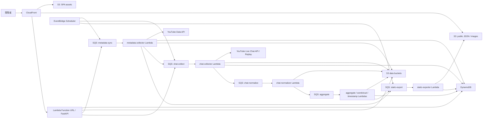

## 4.2. レイヤ構成

| レイヤ | 役割 | 主なAWSリソース |
| :--- | :--- | :--- |
| Presentation | Web UI、静的JSON、画像を配信する。 | CloudFront、S3 |
| Thin API | 必要最小限の動的GET、管理ジョブ起動、health checkを提供する。 | Lambda Function URL、FastAPI、DynamoDB |
| Collection | YouTube Data API、Live Chat API、replay chatからデータを取得する。 | EventBridge Scheduler、SQS、Lambda、SSM |
| Normalize | raw JSONをdiopside共通schemaへ変換する。 | Lambda、S3 |
| Aggregation | タグ、ワードクラウド、タイムスタンプ、チャット統計を生成する。 | Lambda、DynamoDB、S3 |
| Export | フロントエンド用の静的JSON/画像を生成する。 | Lambda、S3、CloudFront invalidation |
| Observability | ログ、メトリクス、失敗ジョブ、quotaを追跡する。 | CloudWatch Logs、DynamoDB、DLQ |

## 4.3. 主要ワークフロー

### 4.3.1. 動画メタデータ同期

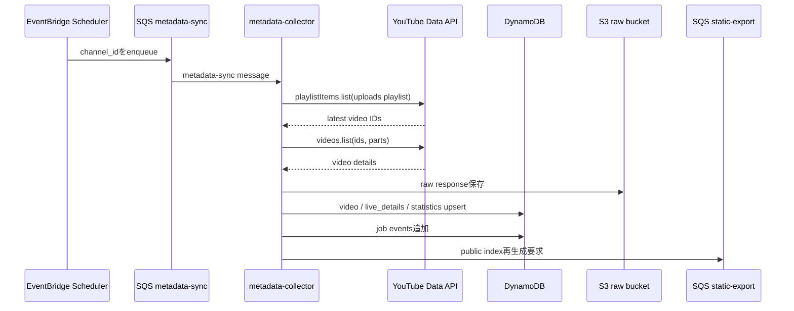

通常巡回では`search.list`を使用しない。uploads playlistから最新動画を取得し、不足分だけ`videos.list`で詳細を補完する。

### 4.3.2. 配信予定・通知計画

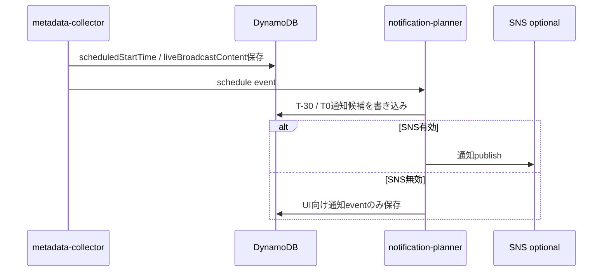

初期構成ではSNS通知を任意にし、費用と運用負荷を下げる。通知を使わない場合でも、配信予定情報はUIに表示できる。

### 4.3.3. 配信中チャット収集

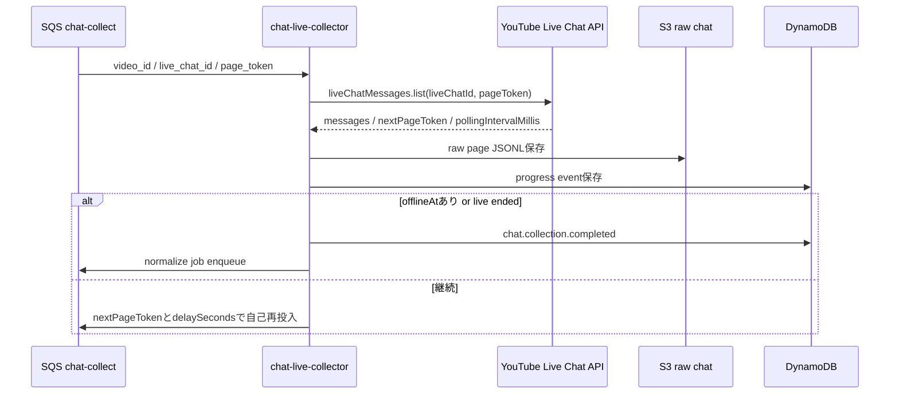

Lambdaは長時間待機しない。APIレスポンスの`pollingIntervalMillis`に従い、SQS DelaySecondsまたはEventBridge Schedulerで次ページ取得を遅延実行する。

### 4.3.4. アーカイブリプレイチャット収集

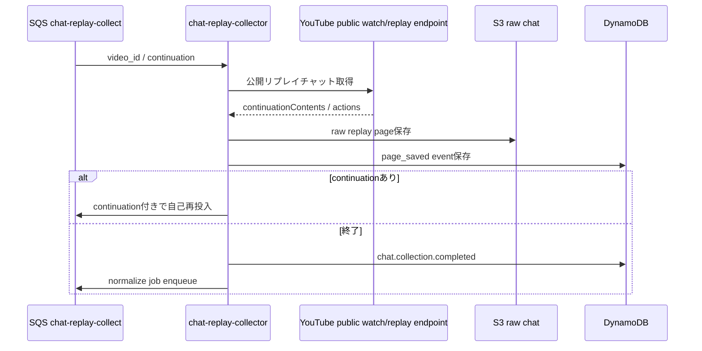

リプレイチャット取得はYouTube Data APIの公式live chat取得とは別扱いにする。取得不能・構造変更・rate limit時は安全に停止し、raw HTML/JSONの最小診断情報だけを保存する。

### 4.3.5. チャット正規化・集計

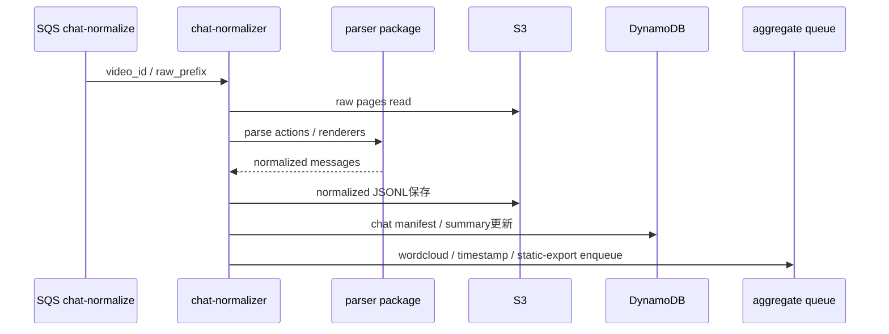

### 4.3.6. 静的成果物出力

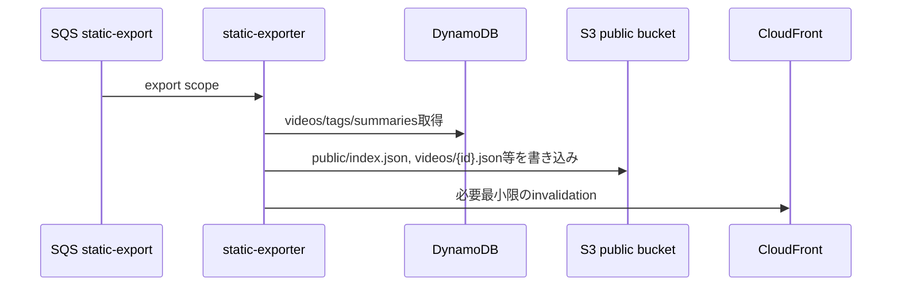

公開UIは基本的にこの静的成果物を読む。API障害時でも既存JSONが配信され続ける。

---

# 5. 設計

## 5.1. モノレポ構成

| ディレクトリ | 内容 |
| :--- | :--- |
| `apps/web` | Next.js/React UI。ホーム、検索、動画詳細、タグ、ランダム、管理簡易画面。 |
| `apps/api` | FastAPI on Lambda。public read API、manual job API、health check。 |
| `apps/workers/metadata-collector` | YouTube Data APIからchannel/video/live metadataを取得する。 |
| `apps/workers/chat-collector` | live chat APIまたはreplay chatを取得する。 |
| `apps/workers/chat-normalizer` | raw chatをdiopside共通schemaへ変換する。 |
| `apps/workers/chat-aggregator` | 時系列件数、上位語、盛り上がり区間を集計する。 |
| `apps/workers/wordcloud-generator` | ワードクラウド画像/JSONを生成する。 |
| `apps/workers/timestamp-generator` | タイムスタンプ候補を生成する。 |
| `apps/workers/static-exporter` | フロントエンド用静的JSON/画像をS3へ出力する。 |
| `packages/domain` | video、chat、tag、job、eventの共通型。 |
| `packages/youtube-client` | YouTube Data API/Live Chat API client、quota計測wrapper。 |
| `packages/youtube-chat-parser` | `ArchiveChatAggregationMessage`を元にしたreplay chat parser。 |
| `packages/storage` | S3 path builder、JSONL reader/writer、圧縮処理。 |
| `packages/db` | DynamoDB single-table repository。 |
| `packages/export-contract` | public JSON schema、version、互換性検査。 |
| `infra` | AWS CDK。edge、data、api、workers、schedules、observabilityを定義する。 |
| `docs` | 基本設計、ADR、運用手順、データschema。 |

## 5.2. バックエンドAPI設計

### 5.2.1. API設計方針

| 原則 | 内容 |
| :--- | :--- |
| 静的優先 | 公開UIの主要データはS3静的JSONで配信し、API依存を減らす。 |
| GET中心 | 動的APIは検索補助、最新状態、管理起動に限定する。 |
| 管理API分離 | 管理操作はCloudFront behaviorまたはFunction URLを分け、管理token/IAMで保護する。 |
| 冪等性 | 手動起動APIは`idempotency_key`を必須にし、同一video_id/job_typeの重複を避ける。 |
| 本文返却最小 | raw chat本文をAPIで大量返却しない。必要な場合はpresigned URLまたはsummaryのみ返す。 |

### 5.2.2. API一覧

| ID | API | Method | Path | 利用者 | 説明 |
| :--- | :--- | :--- | :--- | :--- | :--- |
| API-001 | health API | GET | `/api/health` | 閲覧者/監視 | APIの生存確認。 |
| API-002 | 動画一覧API | GET | `/api/videos` | 閲覧者 | 動的一覧が必要な場合にDynamoDBから取得する。静的JSON利用時はfallback。 |
| API-003 | 動画詳細API | GET | `/api/videos/{video_id}` | 閲覧者 | 動画詳細と集計summaryを返す。静的JSON利用時はfallback。 |
| API-004 | タグ一覧API | GET | `/api/tags` | 閲覧者 | タグと件数を返す。 |
| API-005 | ジョブ一覧API | GET | `/api/admin/jobs` | 管理者 | 直近ジョブと失敗状況を返す。 |
| API-006 | メタデータ同期開始API | POST | `/api/admin/jobs/metadata-sync` | 管理者 | channel_idまたはvideo_idのmetadata-syncをenqueueする。 |
| API-007 | チャット収集開始API | POST | `/api/admin/jobs/chat-collect` | 管理者 | video_idのchat collectをenqueueする。 |
| API-008 | 集計再生成API | POST | `/api/admin/jobs/rebuild-artifacts` | 管理者 | wordcloud/timestamp/static JSONを再生成する。 |
| API-009 | 失敗ジョブ再実行API | POST | `/api/admin/jobs/{job_id}/retry` | 管理者 | failed/retryable jobを再投入する。 |
| API-010 | quota使用量API | GET | `/api/admin/quota-usage` | 管理者 | 日別・メソッド別の推定quota消費を返す。 |

初期の最小構成では、API-002〜004はS3静的JSONで代替し、API-005以降はGitHub Actions workflow dispatchまたはAWS Console/CLIからのLambda invokeで代替できる。

## 5.3. Worker設計

### 5.3.1. Worker一覧

| Worker | 起動元 | 入力 | 出力 | 主な責務 |
| :--- | :--- | :--- | :--- | :--- |
| `metadata-collector` | EventBridge/SQS/manual | `channel_id`, `video_id?`, `mode` | DynamoDB、S3 raw、SQS | uploads playlist取得、videos.list詳細取得、状態判定、統計snapshot。 |
| `schedule-detector` | metadata-collector | `video_id`, `live_details` | DynamoDB、SNS optional | 配信予定・開始・終了イベント、通知候補作成。 |
| `chat-live-collector` | SQS | `video_id`, `live_chat_id`, `page_token?` | S3 raw、DynamoDB、SQS | 公式Live Chat APIで配信中チャットを取得。 |
| `chat-replay-collector` | SQS/manual | `video_id`, `continuation?` | S3 raw、DynamoDB、SQS | アーカイブ後リプレイチャットを取得。 |
| `chat-normalizer` | SQS/S3 event | `video_id`, `raw_prefix` | S3 normalized、DynamoDB | raw actionを共通schemaへ変換。 |
| `chat-aggregator` | SQS | `video_id`, `normalized_uri` | DynamoDB、S3 aggregate | チャット時系列、件数、上位語、盛り上がり区間を生成。 |
| `wordcloud-generator` | SQS | `video_id`, `normalized_uri` | S3 image/json | ワードクラウド生成。 |
| `timestamp-generator` | SQS | `video_id`, `video_details`, `chat_summary` | S3/DynamoDB | タイムスタンプ候補生成。 |
| `static-exporter` | SQS/manual | `scope`, `video_id?` | S3 public JSON | フロント用index/detail/tag JSON出力。 |
| `dlq-redriver` | manual | `queue_name`, `message_id?` | SQS | DLQから再投入。 |

### 5.3.2. YouTube API client設計

| 項目 | 方針 |
| :--- | :--- |
| API key | SSM Parameter Store SecureStringに保存する。 |
| quota計測 | client wrapperがメソッド別に推定quotaをDynamoDBへ記録する。 |
| retry | 5xx/一時ネットワークエラーは指数バックオフ、403/404/410系は業務エラーとして分類する。 |
| partial response | `fields`パラメータで必要項目に限定し、レスポンスサイズを抑える。 |
| page処理 | `nextPageToken`/continuationをSQS messageへ保存して継続する。 |
| rate制御 | 429/rateLimitExceeded時はjobをretryableにし、短時間で再試行しない。 |

### 5.3.3. チャット正規化schema

```json
{
  "schema_version": "chat-message/v1",
  "video_id": "abc123",
  "source": "live_api | replay",
  "message_id": "yt-message-id-or-hash",
  "offset_msec": 123456,
  "timestamp_text": "00:02:03",
  "timestamp_usec": "1710000000000000",
  "author": {
"display_name": "public display name",
"channel_id_hash": "sha256:...",
"badges": ["member"]
  },
  "message_runs": [
{"type": "text", "text": "こんにちは"},
{"type": "emoji", "emoji_id": "...", "label": "...", "is_custom_emoji": true}
  ],
  "plain_text": "こんにちは",
  "paid": {
"is_paid": false,
"amount_text": null,
"currency": null
  },
  "raw_ref": {
"s3_uri": "s3://.../page-0001.json",
"json_pointer": "/continuationContents/liveChatContinuation/actions/0"
  },
  "collected_at": "2026-05-27T00:00:00Z"
}
```

### 5.3.4. replay chat parser設計

| 分岐 | 入力構造 | 処理 |
| :--- | :--- | :--- |
| 通常テキスト | `addChatItemAction.item.liveChatTextMessageRenderer` | author、message runs、timestamp、badgesを抽出する。 |
| 有料メッセージ | `liveChatPaidMessageRenderer` | amount、color、message、author、timestampを抽出する。 |
| ticker | `addLiveChatTickerItemAction` | paid系summaryとして扱い、詳細rendererが別にある場合は重複排除する。 |
| 広告/追跡 | `clickTrackingParams`のみ | 保存対象外。件数だけmetricに残す。 |
| 欠損 | `clientId`なし等 | 必須ではない項目はNULL許容し、message_idはhashで補完する。 |
| 末尾 | actionsなし/continuationなし | 正常終了として扱う。 |

## 5.4. データストア設計（SQL/RDB不採用）

### 5.4.1. 結論

初期構成では、DSQL、Aurora、RDS、PostgreSQL、MySQLのようなSQL系DBは採用しない。diopsideのデータ特性は、JOINよりも「動画IDでまとめて取得」「タグ別・日付別に一覧化」「ジョブ状態を追記」「S3上の巨大成果物を参照」というアクセスが中心であるため、RDBよりもDynamoDB single-table + S3 objectの組み合わせを正とする。

| 判断 | 内容 |
| :--- | :--- |
| SQL系DB | 不採用。RDBのER図・テーブル定義・migrationは初期範囲に含めない。 |
| NoSQL DB | DynamoDBを1物理テーブルで採用する。Lambda間で共有するカーソル、ジョブ状態、quota、lock、軽量manifestの正本とする。 |
| 大きなデータ | チャットraw、正規化チャットJSONL、集計中間ファイル、ワードクラウド画像、公開JSONはS3に置く。DynamoDBにはS3 URI、件数、hash、状態read modelだけを置く。 |
| RDBが必要になる条件 | 複数チャンネル・複数管理者・複雑な集計管理画面・ad-hoc分析・強い整合性を伴う多テーブル更新が必要になった場合に限り再検討する。 |
| ER図の扱い | RDBの物理ER図ではなく、DynamoDB item collectionの論理エンティティ関係図として示す。 |

DynamoDBはon-demand modeを使う。on-demand modeはサーバレスのスループットオプションで、容量計画やスケーリング設定をせず、read/write requestに対するpay-per-requestで利用できるため、個人開発の低頻度アクセスと相性がよい。DynamoDB itemには400KB制限があるため、チャット本文などの大型データはS3へ逃がし、DynamoDB itemにはS3 object identifierを保存する方針とする。

### 5.4.2. 論理エンティティ関係図

RDBを採用しないため外部キー制約は持たない。ただし、ドメイン上の関係は次のように扱う。矢印は「DynamoDB itemのキー設計・S3 prefix・batch処理上の参照関係」を表す。

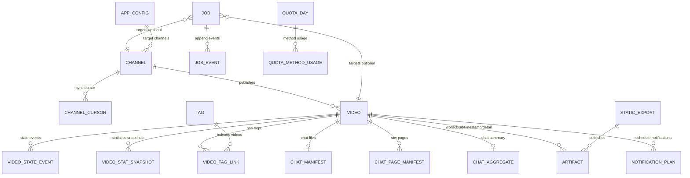

### 5.4.3. アクセスパターン

DynamoDBのキーは、次のアクセスパターンをScanなしで満たすように設計する。

| ID | アクセスパターン | 使用箇所 | DynamoDB操作 |
| :--- | :--- | :--- | :--- |
| AP-01 | アプリ設定を取得する。 | health、各worker起動時 | `GetItem(pk=APP#CONFIG, sk=META)` |
| AP-02 | 取得対象チャンネルを列挙する。 | metadata-sync | `Query(pk=APP#CHANNELS, begins_with(sk, CH#))` |
| AP-03 | チャンネルごとのuploads cursorを取得・更新する。 | metadata-sync | `GetItem/UpdateItem(pk=CH#{channel_id}, sk=CURSOR#uploads)` |
| AP-04 | video_idで動画詳細read modelを取得する。 | 動画詳細API、static-exporter | `GetItem(pk=VID#{video_id}, sk=META)` |
| AP-05 | 公開動画を新しい順に取得する。 | 動画一覧API、public index export | `Query(GSI1PK=VIDEO#PUBLIC, GSI1SK desc)` |
| AP-06 | 年月別に動画を取得する。 | カレンダー、月別export | `Query(GSI1PK=VIDEO#MONTH#{yyyyMM}, GSI1SK)` |
| AP-07 | タグ別に動画を取得する。 | タグ検索、tag export | `Query(GSI2PK=TAG#{tag_id}, GSI2SK desc)` |
| AP-08 | 動画に紐づくタグ・manifest・artifactをまとめて取得する。 | 動画詳細API、export | `Query(pk=VID#{video_id})` |
| AP-09 | ジョブ概要を取得する。 | 管理API、retry判定 | `GetItem(pk=JOB#{job_id}, sk=META)` |
| AP-10 | ジョブイベントを時系列で取得する。 | 管理API、障害調査 | `Query(pk=JOB#{job_id}, begins_with(sk, EVT#))` |
| AP-11 | 実行待ち/再実行待ちジョブを取得する。 | redrive、scheduler | `Query(GSI3PK=JOB#STATE#{state}, GSI3SK <= now)` |
| AP-12 | 通知予定をdue順に取得する。 | notification-planner | `Query(GSI3PK=NOTIFY#DUE, GSI3SK <= now)` |
| AP-13 | video_id/job_type単位の排他lockを取得する。 | chat collector、aggregator | `PutItem(pk=LOCK#{lock_key}, condition attribute_not_exists, ttl)` |
| AP-14 | YouTube API quota使用量を確認する。 | 全YouTube client | `GetItem/UpdateItem(pk=QUOTA#{yyyyMMdd}, sk=METHOD#{method})` |
| AP-15 | 公開JSON export履歴を取得する。 | static-exporter、管理API | `Query(pk=EXPORT#public, begins_with(sk, VERSION#), limit=1)` |
| AP-16 | ランダム表示用bucketを取得する。 | random API/export | `Query(pk=RANDOM#DEFAULT, begins_with(sk, VID#))` |

### 5.4.4. 物理テーブル定義

#### 5.4.4.1. DynamoDB Table: `diopside-{env}-app`

| 項目 | 値 |
| :--- | :--- |
| 用途 | 動画metadata、チャンネル設定、取得cursor、ジョブ、イベント、quota、artifact manifestの軽量正本。 |
| Billing mode | On-demand。 |
| Partition key | `pk` string |
| Sort key | `sk` string |
| TTL attribute | `expires_at` number。UNIX epoch seconds。lock、短期job event、raw page manifestの期限切れ削除に使う。 |
| Stream | 初期は無効。必要になった場合のみ、static export自動起動や監査用途で有効化する。 |
| Point-in-time recovery | prodでは有効、devでは任意。 |
| 暗号化 | AWS owned keyまたは必要に応じてKMS。個人開発の初期ではKMS customer managed keyを増やしすぎない。 |

#### 5.4.4.2. Key / Index schema

| Index | PK | SK | Projection | 用途 |
| :--- | :--- | :--- | :--- | :--- |
| Base table | `pk` | `sk` | all | video単位、channel単位、job単位のitem collection取得。 |
| GSI1 `by_public_date` | `gsi1pk` | `gsi1sk` | keys + list card属性 | 公開動画一覧、年月別一覧、配信日カレンダー。 |
| GSI2 `by_tag` | `gsi2pk` | `gsi2sk` | keys + video card属性 | タグ別動画一覧。 |
| GSI3 `by_work_queue` | `gsi3pk` | `gsi3sk` | keys + job/notification属性 | 実行待ちジョブ、通知due、retry対象。 |

#### 5.4.4.3. 共通属性

全itemは、可能な限り次の共通属性を持つ。

| 属性 | 型 | 必須 | 説明 |
| :--- | :--- | :--- | :--- |
| `pk` | string | はい | Base table partition key。 |
| `sk` | string | はい | Base table sort key。 |
| `item_type` | string | はい | `Video`, `Job`, `ChatManifest`などのitem種別。 |
| `schema_version` | string | はい | item schema version。例: `video/v1`。 |
| `entity_id` | string | 原則はい | video_id、job_id、tag_idなどの主ID。 |
| `created_at` | string(datetime) | はい | 作成日時。ISO-8601。 |
| `updated_at` | string(datetime) | はい | 更新日時。ISO-8601。 |
| `expires_at` | number | 任意 | TTL対象itemだけ設定する。 |
| `gsi1pk` / `gsi1sk` | string | 任意 | 公開日・月別検索用。必要itemのみ設定するsparse index。 |
| `gsi2pk` / `gsi2sk` | string | 任意 | タグ別検索用。必要itemのみ設定するsparse index。 |
| `gsi3pk` / `gsi3sk` | string | 任意 | job/notification due検索用。必要itemのみ設定するsparse index。 |
| `trace_id` | string | 任意 | API/worker横断追跡ID。 |

### 5.4.5. Item schema定義

#### 5.4.5.1. AppConfig item

| 項目 | 内容 |
| :--- | :--- |
| item_type | `AppConfig` |
| key | `pk=APP#CONFIG`, `sk=META` |
| 用途 | アプリ全体の設定。secret値は保存せず、SSM Parameter名のみ保持する。 |

| 属性 | 型 | 必須 | 説明 |
| :--- | :--- | :--- | :--- |
| `system_name` | string | はい | `diopside`。 |
| `target_channel_ids` | string[] | はい | 収集対象YouTube channel_id一覧。 |
| `youtube_api_key_ssm_param` | string | はい | YouTube API keyを格納したSSM Parameter名。値はDynamoDBへ保存しない。 |
| `collection_enabled` | boolean | はい | 定期収集を有効化するか。 |
| `public_export_enabled` | boolean | はい | static exportを実行するか。 |
| `default_locale` | string | はい | UI/データの既定locale。例: `ja-JP`。 |
| `public_base_path` | string | はい | public-data bucket配下の公開prefix。 |
| `maintenance_message` | string | 任意 | 管理者向け停止理由。 |

#### 5.4.5.2. Channel item

| 項目 | 内容 |
| :--- | :--- |
| item_type | `Channel` |
| key | `pk=CH#{channel_id}`, `sk=META` |
| 追加index | `pk=APP#CHANNELS`, `sk=CH#{channel_id}` のChannelRef itemを別途置き、チャンネル列挙をScanなしで行う。 |

| 属性 | 型 | 必須 | 説明 |
| :--- | :--- | :--- | :--- |
| `channel_id` | string | はい | YouTube channel ID。 |
| `channel_title` | string | はい | チャンネル名。 |
| `handle` | string | 任意 | YouTube handle。 |
| `uploads_playlist_id` | string | はい | uploads playlist ID。 |
| `thumbnail_url` | string | 任意 | チャンネルサムネイルURL。 |
| `collect_enabled` | boolean | はい | 収集対象か。 |
| `default_tags` | string[] | 任意 | チャンネル単位で付与する既定タグ。 |
| `last_metadata_sync_at` | string(datetime) | 任意 | 最終metadata同期日時。 |

#### 5.4.5.3. ChannelRef item

| 項目 | 内容 |
| :--- | :--- |
| item_type | `ChannelRef` |
| key | `pk=APP#CHANNELS`, `sk=CH#{channel_id}` |
| 用途 | `Query(pk=APP#CHANNELS)`で取得対象チャンネルを列挙する。 |

| 属性 | 型 | 必須 | 説明 |
| :--- | :--- | :--- | :--- |
| `channel_id` | string | はい | YouTube channel ID。 |
| `collect_enabled` | boolean | はい | 収集対象か。 |
| `priority` | number | 任意 | 同期優先度。 |
| `channel_title` | string | はい | 表示名。 |

#### 5.4.5.4. ChannelSyncCursor item

| 項目 | 内容 |
| :--- | :--- |
| item_type | `ChannelSyncCursor` |
| key | `pk=CH#{channel_id}`, `sk=CURSOR#uploads` |
| 用途 | uploads playlistの差分取得位置を保持する。 |

| 属性 | 型 | 必須 | 説明 |
| :--- | :--- | :--- | :--- |
| `channel_id` | string | はい | YouTube channel ID。 |
| `uploads_playlist_id` | string | はい | 対象playlist ID。 |
| `last_seen_video_id` | string | 任意 | 前回確認した最新video_id。 |
| `last_seen_published_at` | string(datetime) | 任意 | 前回確認した最新公開日時。 |
| `backfill_until` | string(datetime) | 任意 | 過去遡り取得の下限。 |
| `next_page_token_hash` | string | 任意 | 処理途中page tokenのhash。tokenそのものは必要時のみ短期保存。 |
| `last_success_at` | string(datetime) | 任意 | 最終成功日時。 |
| `last_error_at` | string(datetime) | 任意 | 最終失敗日時。 |
| `last_error_code` | string | 任意 | 最終失敗コード。 |

#### 5.4.5.5. Video item

| 項目 | 内容 |
| :--- | :--- |
| item_type | `Video` |
| key | `pk=VID#{video_id}`, `sk=META` |
| GSI1 | `gsi1pk=VIDEO#PUBLIC`, `gsi1sk=PUB#{inverted_published_at}#{video_id}` |
| GSI1（月別） | 月別一覧用に必要な場合は、`VideoMonthIndex` itemを別途置く。Video item自体のGSI1は全体最新順を優先する。 |

| 属性 | 型 | 必須 | 説明 |
| :--- | :--- | :--- | :--- |
| `video_id` | string | はい | YouTube video ID。 |
| `channel_id` | string | はい | YouTube channel ID。 |
| `title` | string | はい | 動画タイトル。 |
| `description_hash` | string | 任意 | 説明文hash。全文はS3またはpublic detail JSONへ置く。 |
| `description_s3_uri` | string | 任意 | 説明文raw保存先。 |
| `thumbnail_url` | string | 任意 | 代表サムネイルURL。 |
| `published_at` | string(datetime) | はい | YouTube公開日時。 |
| `scheduled_start_time` | string(datetime) | 任意 | 配信予定時刻。 |
| `actual_start_time` | string(datetime) | 任意 | 実開始時刻。 |
| `actual_end_time` | string(datetime) | 任意 | 実終了時刻。 |
| `duration_sec` | number | 任意 | 再生時間秒。予定枠ではNULL可。 |
| `live_broadcast_content` | string | 任意 | `none`, `upcoming`, `live`など。 |
| `archive_state` | string | はい | read model。`discovered`, `upcoming`, `live`, `archived`, `unavailable`。 |
| `privacy_status` | string | 任意 | 公開状態。公開対象外はpublic exportしない。 |
| `view_count` | number | 任意 | 最新取得時点の再生数。 |
| `like_count` | number | 任意 | 最新取得時点の高評価数。取得不可ならNULL。 |
| `comment_count` | number | 任意 | 最新取得時点のコメント数。 |
| `tags` | string[] | 任意 | UI表示用の代表タグ。正本のtag linkは`VideoTagLink`。 |
| `chat_available` | boolean | はい | chat manifestが利用可能か。 |
| `wordcloud_available` | boolean | はい | wordcloud artifactが利用可能か。 |
| `timestamp_available` | boolean | はい | timestamp artifactが利用可能か。 |
| `public_detail_s3_key` | string | 任意 | public-data bucketの動画詳細JSON key。 |
| `etag` | string | 任意 | YouTube API response etag。 |

#### 5.4.5.6. VideoMonthIndex item

| 項目 | 内容 |
| :--- | :--- |
| item_type | `VideoMonthIndex` |
| key | `pk=VID#{video_id}`, `sk=INDEX#MONTH#{yyyyMM}` |
| GSI1 | `gsi1pk=VIDEO#MONTH#{yyyyMM}`, `gsi1sk=PUB#{published_at}#{video_id}` |
| 用途 | 月別カレンダー、年表browseをScanなしで取得する。 |

| 属性 | 型 | 必須 | 説明 |
| :--- | :--- | :--- | :--- |
| `video_id` | string | はい | YouTube video ID。 |
| `yyyy_mm` | string | はい | `2026-05`形式。 |
| `published_at` | string(datetime) | はい | 公開日時。 |
| `title` | string | はい | 一覧表示用タイトル。 |
| `thumbnail_url` | string | 任意 | 一覧表示用サムネイル。 |
| `duration_sec` | number | 任意 | 一覧表示用再生時間。 |
| `archive_state` | string | はい | 一覧表示用状態。 |

#### 5.4.5.7. VideoStateEvent item

| 項目 | 内容 |
| :--- | :--- |
| item_type | `VideoStateEvent` |
| key | `pk=VID#{video_id}`, `sk=EVT#STATE#{occurred_at}#{event_id}` |
| 用途 | 予定枠検知、live開始、archive化、不取得化などの状態遷移履歴。 |

| 属性 | 型 | 必須 | 説明 |
| :--- | :--- | :--- | :--- |
| `event_id` | string | はい | イベントID。 |
| `video_id` | string | はい | 対象video_id。 |
| `event_name` | string | はい | `video.discovered`, `video.live_started`, `video.archived`など。 |
| `from_state` | string | 任意 | 遷移前状態。 |
| `to_state` | string | はい | 遷移後状態。 |
| `source_job_id` | string | 任意 | 状態を検知したjob。 |
| `occurred_at` | string(datetime) | はい | 発生日時。 |
| `payload` | object | 任意 | 差分metadata。大きなrawはS3へ置く。 |

#### 5.4.5.8. VideoStatSnapshot item

| 項目 | 内容 |
| :--- | :--- |
| item_type | `VideoStatSnapshot` |
| key | `pk=VID#{video_id}`, `sk=STAT#{yyyyMMddHH}` |
| 用途 | 再生数などの時系列snapshot。高頻度にしない。 |

| 属性 | 型 | 必須 | 説明 |
| :--- | :--- | :--- | :--- |
| `video_id` | string | はい | YouTube video ID。 |
| `sampled_at` | string(datetime) | はい | 取得日時。 |
| `view_count` | number | 任意 | 再生数。 |
| `like_count` | number | 任意 | 高評価数。 |
| `comment_count` | number | 任意 | コメント数。 |
| `concurrent_viewers` | number | 任意 | 配信中に取れる場合のみ。 |
| `raw_s3_uri` | string | 任意 | raw response保存先。 |

#### 5.4.5.9. VideoTagLink item

| 項目 | 内容 |
| :--- | :--- |
| item_type | `VideoTagLink` |
| key | `pk=VID#{video_id}`, `sk=TAG#{tag_id}` |
| GSI2 | `gsi2pk=TAG#{tag_id}`, `gsi2sk=PUB#{inverted_published_at}#{video_id}` |
| 用途 | 動画に付与されたタグとタグ別一覧indexを兼ねる。 |

| 属性 | 型 | 必須 | 説明 |
| :--- | :--- | :--- | :--- |
| `video_id` | string | はい | YouTube video ID。 |
| `tag_id` | string | はい | 正規化タグID。例: `song`, `chat`, `game`。 |
| `tag_label` | string | はい | 表示名。例: `歌枠`。 |
| `tag_type` | string | はい | `manual`, `rule`, `youtube`, `generated`。 |
| `confidence` | number | 任意 | 自動付与時の信頼度。 |
| `source` | string | はい | `title_rule`, `description`, `manual_admin`など。 |
| `published_at` | string(datetime) | はい | タグ別一覧sort用。 |
| `title` | string | はい | タグ一覧カード表示用に非正規化。 |
| `thumbnail_url` | string | 任意 | タグ一覧カード表示用に非正規化。 |
| `duration_sec` | number | 任意 | タグ一覧カード表示用に非正規化。 |

#### 5.4.5.10. TagSummary item

| 項目 | 内容 |
| :--- | :--- |
| item_type | `TagSummary` |
| key | `pk=TAG#{tag_id}`, `sk=META` |
| 用途 | タグ一覧・表示名・件数・カテゴリ管理。 |

| 属性 | 型 | 必須 | 説明 |
| :--- | :--- | :--- | :--- |
| `tag_id` | string | はい | 正規化タグID。 |
| `label` | string | はい | 表示名。 |
| `category` | string | はい | `format`, `game`, `music`, `collab`, `system`など。 |
| `aliases` | string[] | 任意 | 同義語。 |
| `video_count` | number | はい | 現在の動画件数read model。 |
| `latest_video_id` | string | 任意 | 最新動画ID。 |
| `latest_video_at` | string(datetime) | 任意 | 最新動画日時。 |
| `sort_order` | number | 任意 | UI表示順。 |
| `public_visible` | boolean | はい | 公開UIに出すか。 |

#### 5.4.5.11. ChatManifest item

| 項目 | 内容 |
| :--- | :--- |
| item_type | `ChatManifest` |
| key | `pk=VID#{video_id}`, `sk=CHAT#MANIFEST` |
| 用途 | チャット収集状況とS3配置を管理する。チャット本文は保存しない。 |

| 属性 | 型 | 必須 | 説明 |
| :--- | :--- | :--- | :--- |
| `video_id` | string | はい | YouTube video ID。 |
| `live_chat_id` | string | 任意 | 公式Live Chat API用ID。 |
| `live_collection_state` | string | はい | `not_started`, `collecting`, `collected`, `failed`。read model。 |
| `replay_collection_state` | string | はい | `not_started`, `collecting`, `collected`, `failed`, `unavailable`。read model。 |
| `normalization_state` | string | はい | `not_started`, `running`, `succeeded`, `failed`。read model。 |
| `raw_live_prefix` | string | 任意 | S3 raw live chat prefix。 |
| `raw_replay_prefix` | string | 任意 | S3 raw replay chat prefix。 |
| `normalized_s3_uri` | string | 任意 | 正規化JSONL gzipのS3 URI。 |
| `message_count` | number | 任意 | 正規化後メッセージ件数。 |
| `first_offset_ms` | number | 任意 | 最初のチャットoffset。 |
| `last_offset_ms` | number | 任意 | 最後のチャットoffset。 |
| `normalized_schema_version` | string | 任意 | 正規化schema version。 |
| `last_error_code` | string | 任意 | 直近エラー。 |

#### 5.4.5.12. ChatPageManifest item

| 項目 | 内容 |
| :--- | :--- |
| item_type | `ChatPageManifest` |
| key | `pk=VID#{video_id}`, `sk=CHAT#PAGE#{source}#{seq}` |
| 用途 | raw pageの冪等保存・重複排除。長期正本はS3、DynamoDB itemはTTL削除可。 |

| 属性 | 型 | 必須 | 説明 |
| :--- | :--- | :--- | :--- |
| `video_id` | string | はい | YouTube video ID。 |
| `source` | string | はい | `live`または`replay`。 |
| `seq` | number | はい | 収集page連番。 |
| `page_token_hash` | string | 任意 | page tokenまたはcontinuationのhash。 |
| `raw_s3_uri` | string | はい | raw response保存先。 |
| `item_count` | number | はい | page内action/message件数。 |
| `next_token_hash` | string | 任意 | 次page token/continuationのhash。 |
| `polling_interval_ms` | number | 任意 | Live Chat APIが返すpoll間隔。 |
| `checksum` | string | はい | raw response checksum。 |
| `job_id` | string | はい | 収集job ID。 |
| `expires_at` | number | 任意 | raw正本がS3にあるため、DynamoDB page manifestはTTL対象にできる。 |

#### 5.4.5.13. ChatAggregate item

| 項目 | 内容 |
| :--- | :--- |
| item_type | `ChatAggregate` |
| key | `pk=VID#{video_id}`, `sk=CHAT#AGG#v1` |
| 用途 | 動画詳細・wordcloud・timestamp生成で使うチャット集計summary。 |

| 属性 | 型 | 必須 | 説明 |
| :--- | :--- | :--- | :--- |
| `video_id` | string | はい | YouTube video ID。 |
| `source_normalized_s3_uri` | string | はい | 入力JSONL。 |
| `message_count` | number | はい | 対象メッセージ件数。 |
| `unique_author_count_estimate` | number | 任意 | 近似値。個人識別情報は保存しない。 |
| `paid_message_count` | number | 任意 | 有料メッセージ件数。 |
| `member_badge_count` | number | 任意 | メンバーbadgeありメッセージ件数。 |
| `heatmap_s3_uri` | string | はい | 時系列ヒートJSONのS3 URI。 |
| `top_terms` | object[] | 任意 | 上位語の短いsummary。大きい一覧はS3。 |
| `peak_ranges` | object[] | 任意 | 盛り上がり区間候補。 |
| `computed_at` | string(datetime) | はい | 集計日時。 |

#### 5.4.5.14. Artifact item

| 項目 | 内容 |
| :--- | :--- |
| item_type | `Artifact` |
| key | `pk=VID#{video_id}`, `sk=ARTIFACT#{artifact_type}#{artifact_version}` |
| 用途 | wordcloud、timestamp、public detail、OGP画像などの生成物manifest。 |

| 属性 | 型 | 必須 | 説明 |
| :--- | :--- | :--- | :--- |
| `video_id` | string | はい | YouTube video ID。 |
| `artifact_type` | string | はい | `wordcloud`, `timestamp`, `public_detail`, `ogp`, `chat_summary`など。 |
| `artifact_version` | string | はい | `v1`など。 |
| `schema_version` | string | はい | artifact payloadのschema version。 |
| `private_s3_uri` | string | 任意 | 非公開成果物S3 URI。 |
| `public_s3_key` | string | 任意 | public-data bucket上のkey。 |
| `public_url_path` | string | 任意 | CloudFront公開path。 |
| `content_hash` | string | はい | 生成物のhash。 |
| `source_hash` | string | 任意 | 入力データhash。再生成判定に使う。 |
| `summary` | object | 任意 | 件数、画像サイズ、候補数などの短いsummary。 |
| `generated_job_id` | string | 任意 | 生成job。 |
| `generated_at` | string(datetime) | はい | 生成日時。 |

#### 5.4.5.15. NotificationPlan item

| 項目 | 内容 |
| :--- | :--- |
| item_type | `NotificationPlan` |
| key | `pk=VID#{video_id}`, `sk=NOTIFY#{notification_type}` |
| GSI3 | `gsi3pk=NOTIFY#DUE`, `gsi3sk=DUE#{due_at}#{video_id}#{notification_type}` |
| 用途 | 配信30分前・開始時刻通知などの予定。初期はSNS/Discord等への送信はoptional。 |

| 属性 | 型 | 必須 | 説明 |
| :--- | :--- | :--- | :--- |
| `video_id` | string | はい | 対象video_id。 |
| `notification_type` | string | はい | `before_30min`, `at_start`, `archive_available`など。 |
| `due_at` | string(datetime) | はい | 通知予定時刻。 |
| `delivery_state` | string | はい | `planned`, `sent`, `skipped`, `failed`。read model。 |
| `sent_at` | string(datetime) | 任意 | 送信日時。 |
| `target` | string | 任意 | `sns`, `discord`, `none`など。 |
| `message_template_id` | string | 任意 | 通知文テンプレート。 |
| `last_error_code` | string | 任意 | 送信失敗時のコード。 |

#### 5.4.5.16. StaticExport item

| 項目 | 内容 |
| :--- | :--- |
| item_type | `StaticExport` |
| key | `pk=EXPORT#public`, `sk=VERSION#{exported_at}` |
| 用途 | S3 public-dataへ生成した公開JSONの履歴。 |

| 属性 | 型 | 必須 | 説明 |
| :--- | :--- | :--- | :--- |
| `export_id` | string | はい | export ID。 |
| `exported_at` | string(datetime) | はい | export日時。 |
| `reason` | string | はい | `scheduled`, `manual`, `video_updated`など。 |
| `manifest_s3_uri` | string | はい | export manifest S3 URI。 |
| `public_prefix` | string | はい | public-data bucket上のprefix。 |
| `video_count` | number | はい | 出力動画件数。 |
| `tag_count` | number | はい | 出力タグ件数。 |
| `schema_versions` | object | はい | 出力JSONのschema version一覧。 |
| `content_hash` | string | はい | export全体hash。 |
| `publish_state` | string | はい | `published`, `failed`, `superseded`。read model。 |
| `generated_job_id` | string | 任意 | static-exporter job ID。 |

#### 5.4.5.17. Job item

| 項目 | 内容 |
| :--- | :--- |
| item_type | `Job` |
| key | `pk=JOB#{job_id}`, `sk=META` |
| GSI3 | `gsi3pk=JOB#STATE#{latest_state}`, `gsi3sk=NEXT#{next_run_at}#{job_id}` |
| 用途 | worker実行単位の概要read model。状態履歴の正本はJobEvent。 |

| 属性 | 型 | 必須 | 説明 |
| :--- | :--- | :--- | :--- |
| `job_id` | string | はい | job ID。 |
| `job_type` | string | はい | `metadata_sync`, `chat_live_collect`, `chat_replay_collect`, `normalize`, `aggregate`, `wordcloud`, `timestamp`, `static_export`など。 |
| `target_type` | string | はい | `channel`, `video`, `export`, `system`など。 |
| `target_id` | string | 任意 | video_id、channel_idなど。 |
| `dedupe_key` | string | はい | 冪等キー。例: `chat_replay_collect#video_id#v1`。 |
| `latest_state` | string | はい | `queued`, `running`, `retryable`, `succeeded`, `failed`, `canceled`。read model。 |
| `attempt` | number | はい | 現在試行回数。 |
| `max_attempts` | number | はい | 最大試行回数。 |
| `queued_at` | string(datetime) | はい | queued日時。 |
| `started_at` | string(datetime) | 任意 | 開始日時。 |
| `completed_at` | string(datetime) | 任意 | 完了日時。 |
| `next_run_at` | string(datetime) | 任意 | 再実行予定日時。 |
| `input` | object | 任意 | 小さな入力。大きい入力はS3 URI。 |
| `output` | object | 任意 | 小さな出力summary。 |
| `last_error_code` | string | 任意 | 最終エラーコード。 |
| `last_error_message` | string | 任意 | 表示可能な短いエラー。 |
| `trace_id` | string | 任意 | CloudWatch横断追跡ID。 |

#### 5.4.5.18. JobEvent item

| 項目 | 内容 |
| :--- | :--- |
| item_type | `JobEvent` |
| key | `pk=JOB#{job_id}`, `sk=EVT#{seq}` |
| 用途 | ジョブ状態遷移の追記イベント。 |

| 属性 | 型 | 必須 | 説明 |
| :--- | :--- | :--- | :--- |
| `job_id` | string | はい | job ID。 |
| `seq` | number | はい | job内連番。 |
| `event_name` | string | はい | `job.queued`, `job.started`, `job.succeeded`, `job.failed`, `job.retry_scheduled`など。 |
| `state_after` | string | はい | event後の状態。 |
| `occurred_at` | string(datetime) | はい | 発生日時。 |
| `message` | string | 任意 | 表示用短文。 |
| `payload` | object | 任意 | 小さな詳細。大きなrawはS3。 |
| `expires_at` | number | 任意 | debug eventを短期保持にする場合のみ。 |

#### 5.4.5.19. Lock item

| 項目 | 内容 |
| :--- | :--- |
| item_type | `Lock` |
| key | `pk=LOCK#{lock_key}`, `sk=META` |
| 用途 | video_id/job_type単位の短期排他。Conditional Putで取得する。 |

| 属性 | 型 | 必須 | 説明 |
| :--- | :--- | :--- | :--- |
| `lock_key` | string | はい | 排他対象。例: `chat_replay#abc123`。 |
| `owner_job_id` | string | はい | lock所有job ID。 |
| `owner_request_id` | string | 任意 | Lambda request ID。 |
| `acquired_at` | string(datetime) | はい | 取得日時。 |
| `expires_at` | number | はい | TTL。異常終了時の自動解放。 |

#### 5.4.5.20. Idempotency item

| 項目 | 内容 |
| :--- | :--- |
| item_type | `Idempotency` |
| key | `pk=IDEMP#{dedupe_key}`, `sk=META` |
| 用途 | API/バッチの重複実行を抑止し、同じ結果を返す。 |

| 属性 | 型 | 必須 | 説明 |
| :--- | :--- | :--- | :--- |
| `dedupe_key` | string | はい | 冪等キー。 |
| `first_job_id` | string | 任意 | 最初に作成されたjob。 |
| `request_hash` | string | はい | request body hash。 |
| `response_summary` | object | 任意 | 冪等再実行時に返すsummary。 |
| `created_at` | string(datetime) | はい | 作成日時。 |
| `expires_at` | number | 任意 | 保持期限。 |

#### 5.4.5.21. QuotaUsage item

| 項目 | 内容 |
| :--- | :--- |
| item_type | `QuotaUsage` |
| key | `pk=QUOTA#{yyyyMMdd}`, `sk=METHOD#{method}` |
| 用途 | YouTube Data APIの推定quota利用量を日別・method別に記録する。 |

| 属性 | 型 | 必須 | 説明 |
| :--- | :--- | :--- | :--- |
| `quota_date` | string | はい | `yyyyMMdd`。YouTube quota reset基準に合わせる。 |
| `method` | string | はい | `playlistItems.list`, `videos.list`, `liveChatMessages.list`など。 |
| `unit_per_call` | number | はい | 推定quota単価。 |
| `call_count` | number | はい | 呼び出し回数。 |
| `units_used` | number | はい | 推定消費unit。 |
| `last_call_at` | string(datetime) | 任意 | 最終呼び出し日時。 |
| `warning_emitted` | boolean | はい | 閾値警告済みか。 |
| `expires_at` | number | 任意 | 詳細は一定期間後にTTL削除可。 |

#### 5.4.5.22. RandomBucket item

| 項目 | 内容 |
| :--- | :--- |
| item_type | `RandomBucket` |
| key | `pk=RANDOM#DEFAULT`, `sk=VID#{bucket_no}#{video_id}` |
| 用途 | ランダム動画表示用の事前シャッフルbucket。public exportでも利用する。 |

| 属性 | 型 | 必須 | 説明 |
| :--- | :--- | :--- | :--- |
| `bucket_no` | number | はい | 乱択用bucket番号。 |
| `video_id` | string | はい | YouTube video ID。 |
| `title` | string | はい | 表示用タイトル。 |
| `thumbnail_url` | string | 任意 | 表示用サムネイル。 |
| `duration_sec` | number | 任意 | 再生時間。 |
| `tags` | string[] | 任意 | 表示用タグ。 |
| `generated_at` | string(datetime) | はい | bucket生成日時。 |

### 5.4.6. S3に置くためDynamoDBへ保存しないデータ

| データ | 保存先 | DynamoDBに保持するもの |
| :--- | :--- | :--- |
| YouTube API raw response | raw bucket | `raw_s3_uri`, `etag`, `checksum`, `collected_at` |
| replay chat raw page | raw bucket | `ChatPageManifest.raw_s3_uri`, `item_count`, `checksum` |
| 正規化チャット本文 | processed bucket JSONL gzip | `ChatManifest.normalized_s3_uri`, `message_count` |
| wordcloud画像 | public-data bucket | `Artifact.public_s3_key`, `summary.width`, `summary.height` |
| timestamp候補全文 | processed/public-data bucket JSON | `Artifact.public_s3_key`, `summary.candidate_count` |
| public video detail JSON | public-data bucket | `Video.public_detail_s3_key`, `Artifact` manifest |
| export manifest | exports/public-data bucket | `StaticExport.manifest_s3_uri`, `content_hash` |

### 5.4.7. 状態管理方針

状態は完全なイベントソーシングにはしない。個人開発のコストと実装量を優先し、次の折衷にする。

| 対象 | 正本 | read model |
| :--- | :--- | :--- |
| job状態 | `JobEvent` | `Job.latest_state`, `Job.next_run_at` |
| video状態 | `VideoStateEvent` + YouTube metadata raw | `Video.archive_state`, `Video.live_broadcast_content` |
| chat状態 | job event + S3 artifact存在 | `ChatManifest.*_state` |
| artifact状態 | S3 write結果 + StaticExport | `Artifact` / `StaticExport.publish_state` |

一覧画面やworkerの判定はread modelを読む。障害調査や再実行判断ではevent itemを参照する。


## 5.5. S3ストレージ設計

### 5.5.1. Bucket一覧

| Bucket | 用途 | 公開 |
| :--- | :--- | :--- |
| `diopside-{env}-web` | SPA assets | CloudFront経由のみ |
| `diopside-{env}-public-data` | 公開JSON、wordcloud画像、OGP画像 | CloudFront経由で公開 |
| `diopside-{env}-raw` | YouTube raw API/replay response | 非公開 |
| `diopside-{env}-processed` | normalized chat、aggregate intermediate | 非公開 |
| `diopside-{env}-exports` | export manifest、管理用成果物 | 非公開 |

### 5.5.2. Path設計

| 種別 | path template | 内容 |
| :--- | :--- | :--- |
| YouTube metadata raw | `youtube/raw/metadata/videos/{video_id}/{collected_at}.json` | `videos.list` raw response。 |
| uploads raw | `youtube/raw/channels/{channel_id}/uploads/{collected_at}.json` | `playlistItems.list` raw response。 |
| live chat raw | `youtube/raw/chats/{video_id}/source=live/page-{seq}.json` | Live Chat APIのpage response。 |
| replay chat raw | `youtube/raw/chats/{video_id}/source=replay/page-{seq}.json` | replay continuation response。 |
| normalized chat | `youtube/normalized/chats/{video_id}/messages-v1.jsonl.gz` | 共通schema化したチャット。 |
| chat aggregate | `youtube/processed/chats/{video_id}/aggregate-v1.json` | 件数、上位語、ヒート。 |
| wordcloud json | `youtube/processed/wordcloud/{video_id}/wordcloud-v1.json` | ワードクラウド元データ。 |
| wordcloud image | `wordcloud/{video_id}.png` | 公開用画像。public-data bucket。 |
| timestamp json | `youtube/processed/timestamps/{video_id}/timestamps-v1.json` | timestamp候補。 |
| public video detail | `public/videos/{video_id}.json` | フロント動画詳細用JSON。 |
| public index | `public/index/videos-latest.json` | 最新動画一覧。 |
| public tag index | `public/index/tags.json` | タグ一覧。 |
| public search shard | `public/search/videos-{yyyy}.json` | 年別検索用軽量index。 |

### 5.5.3. Lifecycle

| 対象 | 方針 |
| :--- | :--- |
| raw metadata | 180日後に低頻度化、365日後に削除可。 |
| raw chat | 重要な再処理元のため保持。コストが増えた場合はGlacier Instant Retrievalへ移行。 |
| normalized chat | 集計再生成に必要なため保持。gzip圧縮必須。 |
| public JSON | 現行と直近数世代のみ保持。 |
| failed debug | 90日で削除。 |

## 5.6. 静的JSON契約

### 5.6.1. `public/index/videos-latest.json`

```json
{
  "schema_version": "public-video-list/v1",
  "generated_at": "2026-05-27T00:00:00Z",
  "items": [
{
  "video_id": "abc123",
  "title": "【歌枠】...",
  "published_at": "2026-05-20T12:00:00Z",
  "scheduled_start_time": "2026-05-20T21:00:00Z",
  "duration_sec": 7200,
  "thumbnail_url": "https://...",
  "tags": ["歌枠", "アーカイブ"],
  "detail_path": "/public/videos/abc123.json",
  "wordcloud_available": true,
  "timestamp_available": true
}
  ]
}
```

### 5.6.2. `public/videos/{video_id}.json`

```json
{
  "schema_version": "public-video-detail/v1",
  "video": {
"video_id": "abc123",
"youtube_url": "https://www.youtube.com/watch?v=abc123",
"title": "...",
"description": "...",
"published_at": "...",
"live_details": {
  "scheduled_start_time": "...",
  "actual_start_time": "...",
  "actual_end_time": "..."
},
"statistics": {
  "view_count": 12345,
  "like_count": 678
},
"tags": ["歌枠"]
  },
  "chat_summary": {
"message_count": 10000,
"wordcloud_url": "/wordcloud/abc123.png",
"top_terms": [
  {"term": "かわいい", "score": 123.4}
]
  },
  "timestamps": [
{"offset_sec": 123, "label": "候補", "source": "chat_burst", "confidence": 0.71}
  ]
}
```

## 5.7. インフラ設計

### 5.7.1. リソース一覧

| リソース | 個数 | 概要 |
| :--- | :--- | :--- |
| CloudFront Distribution | 1 | Web、public data、必要時APIを単一ドメインで配信する。 |
| S3 Bucket | 5 | web、public-data、raw、processed、exports。 |
| Lambda Function | 8〜10 | API、metadata、chat、normalizer、aggregator、wordcloud、timestamp、exporter、redriver。 |
| Lambda Function URL | 1 | API公開。GET中心で利用する。管理POSTは後述のHTTP API化も可。 |
| API Gateway HTTP API | 0または1 | 管理POSTを安全に公開する必要が出た場合のみ追加する。 |
| DynamoDB Table | 1 | single-table。video/job/tag/quotaを保持する。 |
| SQS Queue | 5 | metadata、chat-collect、normalize、aggregate、static-export。各DLQを持つ。 |
| EventBridge Scheduler | 3〜5 | metadata巡回、stale job掃除、定期export、任意の通知。 |
| SNS Topic | 0または1 | 配信通知を有効化する場合のみ作成する。 |
| SSM Parameter | 複数 | YouTube API key、管理token、対象channel設定の一部。 |
| CloudWatch Log Group | Lambdaごと | 構造化ログ。本文は出力しない。 |
| CloudWatch Alarm | 最小 | DLQ depth、worker error、quota threshold。 |

### 5.7.2. CDK Construct設計

| Construct | 主なリソース | 目的 |
| :--- | :--- | :--- |
| `EdgeConstruct` | CloudFront、S3 web/public、OAC、cache policy | 静的配信とAPI routing。 |
| `DataConstruct` | DynamoDB、S3 raw/processed/exports、SSM parameters | 正本データと秘密情報。 |
| `ApiConstruct` | Lambda API、Function URL、任意HTTP API | 最小API。 |
| `CollectorConstruct` | SQS、Lambda workers、EventBridge schedules | YouTube取得と処理パイプライン。 |
| `NotificationConstruct` | SNS、通知planner | 任意の配信通知。初期は無効化可能。 |
| `ObservabilityConstruct` | Log groups、Alarms、Dashboard | 失敗・quota・DLQの監視。 |

### 5.7.3. Lambda設定値

| Lambda | memory | timeout | reserved concurrency | 備考 |
| :--- | :--- | :--- | :--- | :--- |
| `api` | 512MB | 30秒 | 5 | 個人用途では低め。 |
| `metadata-collector` | 512MB | 120秒 | 2 | API呼び出し中心。 |
| `chat-live-collector` | 512MB | 60秒 | 2 | 1 page取得して再投入。長時間待機しない。 |
| `chat-replay-collector` | 1024MB | 300秒 | 1 | rate制御重視。 |
| `chat-normalizer` | 1024MB | 900秒 | 1 | JSONL変換。 |
| `chat-aggregator` | 1024MB | 900秒 | 1 | 集計処理。 |
| `wordcloud-generator` | 1536MB | 900秒 | 1 | 形態素解析・画像生成。 |
| `timestamp-generator` | 512MB | 300秒 | 1 | ルールベース候補生成。 |
| `static-exporter` | 512MB | 300秒 | 1 | DynamoDBからpublic JSON生成。 |

## 5.8. コスト運用設計

### 5.8.1. 初期採用しないもの

| 技術 | 不採用理由 | 将来採用条件 |
| :--- | :--- | :--- |
| OpenSearch Serverless | 固定費・OCUが個人開発に重い。 | 動画数・検索条件が増え、静的indexではUXが落ちた場合。 |
| Aurora/RDS | アイドル費用と運用負荷がある。 | 複雑な集計・JOIN・管理画面が必要になった場合。 |
| Step Functions Standard | 状態遷移課金と定義量を初期では避けたい。 | 失敗補償・可視化がSQS自前管理より重要になった場合。 |
| ECS/Fargate | 常時/長時間コンテナ費用が発生しやすい。 | Lambdaパッケージ制限や処理時間制限を超えた場合。 |
| AppSync/WebSocket | 公開閲覧には不要。 | リアルタイム進捗UIや複数管理者通知が必要になった場合。 |
| LLM常時要約 | 実行費用が読みづらい。 | 手動実行・代表動画のみなど範囲限定で導入する。 |

### 5.8.2. YouTube quota予算

| 処理 | 標準頻度 | 目安 |
| :--- | :--- | :--- |
| uploads playlist確認 | 15〜60分ごと | `playlistItems.list`中心。 |
| 動画詳細取得 | 新規・変化時・日次 | `videos.list`中心。 |
| search.list | 原則使わない | 手動調査やuploadsで拾えない例外時のみ。 |
| live chat list | 配信中のみ | `pollingIntervalMillis`を尊重し、必要時だけ実行。 |
| replay chat取得 | アーカイブ化後に1回 | 失敗時は短期再試行し、継続失敗なら停止。 |

## 5.9. ログ設計

### 5.9.1. 共通JSONログ

```json
{
  "timestamp": "2026-05-27T00:00:00Z",
  "level": "INFO",
  "service": "diopside",
  "env": "prod",
  "function": "chat-replay-collector",
  "trace_id": "trc_...",
  "job_id": "job_...",
  "video_id": "abc123",
  "channel_id": "UC...",
  "step": "fetch_replay_page",
  "result": "success",
  "metrics": {
"duration_ms": 1234,
"message_count": 500,
"page_seq": 12,
"estimated_quota": 0
  },
  "error": null
}
```

禁止事項は次の通りである。

| 禁止 | 理由 |
| :--- | :--- |
| チャット本文をログ出力する | 個人情報・ログ費用・ノイズ抑制のため。 |
| raw JSON全体をログ出力する | CloudWatch Logs費用と可読性悪化を避けるため。 |
| API keyをログ出力する | 秘密情報保護のため。 |
| authorExternalChannelIdを平文でログ出力する | 個人識別性を抑えるため。 |

---

# 6. テスト設計

## 6.1. テスト方針

| 分類 | 方針 |
| :--- | :--- |
| Unit test | YouTube response parser、DynamoDB repository、S3 path builder、static JSON schemaを検証する。 |
| Contract test | public JSON schemaとWeb UIの互換性を検証する。 |
| Integration test | SQS message -> Lambda -> S3/DynamoDBの代表経路をlocalstackまたはAWS dev環境で検証する。 |
| Replay parser fixture | 実raw responseを匿名化/最小化したfixtureでrenderer分岐を検証する。 |
| E2E | 最新一覧、タグ検索、動画詳細、wordcloud/timestamp表示をPlaywrightで確認する。 |
| Cost regression | API call回数、DynamoDB scan、CloudWatch log量、S3 public JSONサイズをCIで検査する。 |

## 6.2. 代表テストケース

| No | 対象 | 条件 | 期待結果 |
| :--- | :--- | :--- | :--- |
| TC-001 | metadata sync | uploads playlistに新規video_idあり | Video itemが作成され、static-exportがenqueueされる。 |
| TC-002 | metadata sync | 既存video_idのstatistics変化 | statistics snapshotが追加される。 |
| TC-003 | live chat | `activeLiveChatId`あり | `liveChatMessages.list`結果がS3へ保存され、nextPageTokenで再投入される。 |
| TC-004 | live chat | `offlineAt`あり | collection completedとなりnormalizeがenqueueされる。 |
| TC-005 | replay chat | `liveChatTextMessageRenderer` | normalized messageにtext/author/offsetが入る。 |
| TC-006 | replay chat | `liveChatPaidMessageRenderer` | paid情報が保持される。 |
| TC-007 | replay chat | actionsなし末尾 | 正常完了として扱う。 |
| TC-008 | replay chat | 構造変更 | rawを保存し、job failed/retryableに分類する。 |
| TC-009 | wordcloud | normalized chatあり | PNGとJSONが出力される。 |
| TC-010 | timestamp | 概要欄に時刻あり | description由来候補が生成される。 |
| TC-011 | static export | 動画1000件 | public indexがschema validで生成される。 |
| TC-012 | cost guard | DynamoDB Scanを使用 | CIで失敗する。 |

---

# 7. 運用設計

## 7.1. ジョブ再実行

| 操作 | 方法 |
| :--- | :--- |
| 1動画のmetadata再取得 | 管理APIまたはGitHub Actions workflow dispatchで`video_id`を指定する。 |
| 1動画のchat再取得 | `chat-collect` jobを`mode=replay`で再投入する。既存rawは別prefixへ保存し、normalizedを再生成する。 |
| wordcloud再生成 | normalized chat URIを指定して`wordcloud-generator`を再実行する。 |
| static JSON全再生成 | `static-exporter`に`scope=all`を指定する。 |
| DLQ再投入 | `dlq-redriver`を手動実行し、原因確認後に元queueへ戻す。 |

## 7.2. 障害分類

| エラー | 分類 | 対応 |
| :--- | :--- | :--- |
| YouTube 403 forbidden | failed | 権限不足/チャット無効として記録し、自動再試行しない。 |
| YouTube 404 notFound | failed | 動画削除/非公開として記録する。 |
| YouTube 429/rateLimitExceeded | retryable | 当日は再試行を抑制し、翌日以降へ延期する。 |
| replay構造変更 | retryable/manual | rawを保存し、parser fixtureを追加して修正する。 |
| Lambda timeout | retryable | cursor/page_seqから再開する。 |
| DynamoDB ConditionalCheckFailed | ignored/retryable | 重複実行なら成功扱い、lock競合なら遅延再試行。 |
| S3 write failed | retryable | 同じkeyへ冪等再書き込み。 |

## 7.3. データ保持

| データ | 保持方針 |
| :--- | :--- |
| Video metadata | 永続保持。 |
| Statistics snapshot | 日次または重要時点に間引き、長期保持。 |
| Raw chat | 再処理の正本として保持。ただしS3低頻度化対象。 |
| Normalized chat | 集計正本として保持。gzip圧縮。 |
| Job events | 直近180日保持。古いものはsummaryのみ残す。 |
| Quota詳細 | 90日保持。日次summaryは長期保持可。 |
| Public JSON | 最新と直近数世代のみ保持。 |

## 7.4. 段階導入計画

| Phase | 内容 | ゴール |
| :--- | :--- | :--- |
| 0 | 既存diopsideのデータ/画面棚卸し | 現行公開機能を壊さない。 |
| 1 | metadata-collector + static-exporter | YouTube主要情報の自動更新と静的JSON配信を実現する。 |
| 2 | replay chat collector + normalizer | アーカイブチャットをS3 JSONLとして保存する。 |
| 3 | wordcloud/timestamp generator | 動画詳細の付加価値を出す。 |
| 4 | live schedule/notification | 配信予定・ライブ状態・通知を追加する。 |
| 5 | 管理UI/API | 手動再実行・タグ補正・失敗確認をWeb化する。 |
| 6 | 検索強化 | 必要ならOpenSearch/Athena/LLM要約を検討する。 |

---


---

# 9. API・バッチIF詳細設計（v0.2追補）

## 9.1. 追補方針

本章は、5.2のバックエンドAPI設計と5.3のWorker設計を、実装・テスト・レビュー可能な粒度に詳細化する。公開閲覧はS3静的JSONを最優先し、FastAPIの公開GETはfallbackまたは最新状態補助として扱う。管理POSTは、個人開発の低コスト運用を保つため、必要に応じてAPI Gateway HTTP APIまたはCloudFront配下のFunction URLで公開し、管理token/IAM/CSRFで保護する。

Saphnexa基本設計書 v0.17 の「APIごとにIF、シーケンス図、CRUD・呼び出しリソースをそろえる」粒度を踏襲し、diopsideではCRUD表を簡略化して「データ・呼び出しリソース」として整理する。

## 9.2. 共通IF

### 9.2.1. API共通ヘッダー

| ヘッダー | 必須 | 説明 |
| :--- | :--- | :--- |
| Authorization | 管理APIのみ | `Bearer {admin_token}`またはIAM/署名済み認可。公開GETでは不要。 |
| X-CSRF-Token | 管理POST/PUT/DELETEのみ | API Gateway/CloudFront配下でCookie管理を行う場合に必要。 |
| X-Idempotency-Key | ジョブ起動APIのみ | bodyの`idempotency_key`と一致させる。 |
| X-Trace-Id | いいえ | 未指定時はAPI側で採番し、レスポンスとログに含める。 |

### 9.2.2. API共通エラー形式

Schema: `ErrorResponse`

| フィールド | 型 | 必須 | 説明 |
| :--- | :--- | :--- | :--- |
| code | string | はい | 機械判定用エラーコード。例: `INVALID_REQUEST`, `UNAUTHORIZED`, `JOB_CONFLICT`。 |
| message | string | はい | UI表示可能な日本語メッセージ。 |
| details | object? | いいえ | 項目別validation error、再実行可否など。 |
| trace_id | string | はい | CloudWatch LogsとDynamoDB job eventを横断するID。 |

### 9.2.3. ジョブ起動API共通レスポンス

Schema: `StartJobResponse`

| フィールド | 型 | 必須 | 説明 |
| :--- | :--- | :--- | :--- |
| job_id | string | はい | ジョブID。ULIDまたはUUIDv7。 |
| job_type | string | はい | metadata_sync、chat_collect、static_exportなど。 |
| derived_state | string | はい | `queued`,`running`,`succeeded`,`failed`,`cancel_requested`,`canceled`。DynamoDBの状態列ではなくイベントから導出する。 |
| deduplicated | boolean | はい | 冪等性により既存ジョブを返した場合true。 |
| accepted_at | string(date-time) | はい | 受付日時。 |
| trace_id | string | はい | 追跡ID。 |

## 9.3. APIカバレッジ一覧

| ID | API | Method | Path | 区分 |
| :--- | :--- | :--- | :--- | :--- |
| API-001 | health API | GET | /api/health | 公開GET |
| API-002 | 公開設定取得API | GET | /api/config | 公開GET |
| API-003 | ホーム集約API | GET | /api/home | 公開GET |
| API-004 | 動画一覧・検索API | GET | /api/videos | 公開GET |
| API-005 | 動画詳細API | GET | /api/videos/{video_id} | 公開GET |
| API-006 | タグ一覧API | GET | /api/tags | 公開GET |
| API-007 | 年/月別アーカイブAPI | GET | /api/archive-calendar | 公開GET |
| API-008 | ランダム動画API | GET | /api/random-videos | 公開GET |
| API-009 | 動画成果物一覧API | GET | /api/videos/{video_id}/artifacts | 公開GET |
| API-010 | ジョブ一覧API | GET | /api/admin/jobs | 管理/ジョブ |
| API-011 | ジョブ詳細API | GET | /api/admin/jobs/{job_id} | 管理/ジョブ |
| API-012 | メタデータ同期開始API | POST | /api/admin/jobs/metadata-sync | 管理/ジョブ |
| API-013 | ライブ状態検知開始API | POST | /api/admin/jobs/live-status-scan | 管理/ジョブ |
| API-014 | チャット収集開始API | POST | /api/admin/jobs/chat-collect | 管理/ジョブ |
| API-015 | チャット正規化開始API | POST | /api/admin/jobs/chat-normalize | 管理/ジョブ |
| API-016 | 集計再生成API | POST | /api/admin/jobs/rebuild-artifacts | 管理/ジョブ |
| API-017 | 静的export開始API | POST | /api/admin/jobs/static-export | 管理/ジョブ |
| API-018 | 失敗ジョブ再実行API | POST | /api/admin/jobs/{job_id}/retry | 管理/ジョブ |
| API-019 | ジョブキャンセルAPI | POST | /api/admin/jobs/{job_id}/cancel | 管理/ジョブ |
| API-020 | quota使用量API | GET | /api/admin/quota-usage | 管理/ジョブ |
| API-021 | 対象チャンネル設定取得API | GET | /api/admin/channels | 管理/ジョブ |
| API-022 | 対象チャンネル設定更新API | PUT | /api/admin/channels/{channel_id} | 管理/ジョブ |
| API-023 | 管理用S3署名URL発行API | POST | /api/admin/artifacts/presigned-url | 管理/ジョブ |

## 9.4. 公開・管理API詳細


#### API-001. health API

##### IF

| 項目 | 内容 |
| :--- | :--- |
| operationId | health |
| HTTP method | GET |
| Path | /api/health |
| 利用者 | 閲覧者/監視 |
| 目的 | API Lambdaの生存確認、ビルド版、依存先の簡易状態を返す。 |
| 認証 | 不要 |
| CSRF | 不要 |

Path parameters

| 名称 | 型 | 必須 | 説明 |
| :--- | :--- | :--- | :--- |
| なし | - | - | - |

Query parameters

| 名称 | 型 | 必須 | 説明 |
| :--- | :--- | :--- | :--- |
| detail | boolean? | いいえ | trueの場合のみDynamoDB/S3/SSMの疎通を軽く確認する。通常はfalse。 |

Request body

Schema: `なし`

| フィールド | 型 | 必須 | 説明 |
| :--- | :--- | :--- | :--- |
| なし | - | - | - |

Response schema

Schema: `HealthResponse`

| フィールド | 型 | 必須 | 説明 |
| :--- | :--- | :--- | :--- |
| service | string | はい | 固定値 `diopside`。 |
| version | string | はい | APIビルド版またはcommit SHA。 |
| status | string | はい | `ok`、`degraded`、`error`。 |
| checked_at | string(date-time) | はい | 確認日時。 |
| dependencies | object? | いいえ | detail=true時だけ返す依存先状態。 |

HTTPステータス

| HTTPステータス | 意味 |
| :--- | :--- |
| 200/201/202/204 | 成功。GETは200、作成は201、非同期受付は202、bodyなし成功は204を使う。 |
| 400 | 入力形式、型、必須項目、query/path parameterが不正。 |
| 401 | 管理APIで認証情報がない、または無効。 |
| 403 | 認証済みだが管理権限がない、CSRF不正、署名URL対象外。 |
| 404 | 対象video/job/artifactが存在しない、または公開対象外。 |
| 409 | 冪等性キー衝突、既に実行中、状態遷移不可。 |
| 429 | 管理APIのrate limit超過。YouTube quota超過はジョブ側イベントで表現する。 |
| 500 | 想定外エラー。`trace_id`を返す。 |

##### シーケンス図

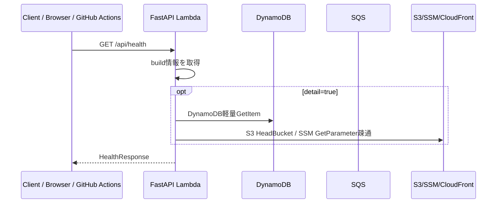

##### データ・呼び出しリソース

| 対象 | 内容 |
| :--- | :--- |
| 利用リソース | Lambda環境変数、DynamoDB(optional)、S3(optional)、SSM(optional) |


#### API-002. 公開設定取得API

##### IF

| 項目 | 内容 |
| :--- | :--- |
| operationId | 公開設定取得 |
| HTTP method | GET |
| Path | /api/config |
| 利用者 | 閲覧者 |
| 目的 | フロントエンドが利用する公開設定、静的JSONのbase path、機能フラグを返す。 |
| 認証 | 不要 |
| CSRF | 不要 |

Path parameters

| 名称 | 型 | 必須 | 説明 |
| :--- | :--- | :--- | :--- |
| なし | - | - | - |

Query parameters

| 名称 | 型 | 必須 | 説明 |
| :--- | :--- | :--- | :--- |
| なし | - | - | - |

Request body

Schema: `なし`

| フィールド | 型 | 必須 | 説明 |
| :--- | :--- | :--- | :--- |
| なし | - | - | - |

Response schema

Schema: `PublicConfigResponse`

| フィールド | 型 | 必須 | 説明 |
| :--- | :--- | :--- | :--- |
| public_data_base_path | string | はい | 例: `/data`。 |
| static_json_version | string | はい | 最新export版。 |
| features | object | はい | UI機能フラグ。 |
| updated_at | string(date-time) | はい | 設定生成日時。 |

HTTPステータス

| HTTPステータス | 意味 |
| :--- | :--- |
| 200/201/202/204 | 成功。GETは200、作成は201、非同期受付は202、bodyなし成功は204を使う。 |
| 400 | 入力形式、型、必須項目、query/path parameterが不正。 |
| 401 | 管理APIで認証情報がない、または無効。 |
| 403 | 認証済みだが管理権限がない、CSRF不正、署名URL対象外。 |
| 404 | 対象video/job/artifactが存在しない、または公開対象外。 |
| 409 | 冪等性キー衝突、既に実行中、状態遷移不可。 |
| 429 | 管理APIのrate limit超過。YouTube quota超過はジョブ側イベントで表現する。 |
| 500 | 想定外エラー。`trace_id`を返す。 |

##### シーケンス図

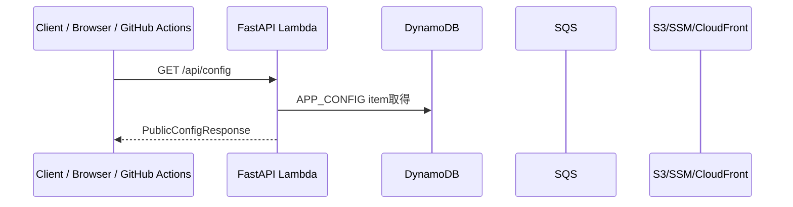

##### データ・呼び出しリソース

| 対象 | 内容 |
| :--- | :--- |
| 利用リソース | DynamoDB AppConfig |


#### API-003. ホーム集約API

##### IF

| 項目 | 内容 |
| :--- | :--- |
| operationId | ホーム集約 |
| HTTP method | GET |
| Path | /api/home |
| 利用者 | 閲覧者 |
| 目的 | ホーム起点フィード向けに、最新、人気タグ、最近の配信予定、ライブ中情報を小さく返す。静的JSON `/data/home.json` のfallback。 |
| 認証 | 不要 |
| CSRF | 不要 |

Path parameters

| 名称 | 型 | 必須 | 説明 |
| :--- | :--- | :--- | :--- |
| なし | - | - | - |

Query parameters

| 名称 | 型 | 必須 | 説明 |
| :--- | :--- | :--- | :--- |
| refresh | boolean? | いいえ | trueでも外部取得はせず、DynamoDB/S3の最新read modelだけを読む。 |

Request body

Schema: `なし`

| フィールド | 型 | 必須 | 説明 |
| :--- | :--- | :--- | :--- |
| なし | - | - | - |

Response schema

Schema: `HomeSummaryResponse`

| フィールド | 型 | 必須 | 説明 |
| :--- | :--- | :--- | :--- |
| latest_videos | VideoCard[] | はい | 最新動画カード。 |
| quick_tags | TagSummary[] | はい | クイック検索タグ。 |
| live_now | VideoCard[] | はい | 現在配信中候補。 |
| upcoming | VideoCard[] | はい | 直近予定枠。 |
| generated_at | string(date-time) | はい | read model生成日時。 |

HTTPステータス

| HTTPステータス | 意味 |
| :--- | :--- |
| 200/201/202/204 | 成功。GETは200、作成は201、非同期受付は202、bodyなし成功は204を使う。 |
| 400 | 入力形式、型、必須項目、query/path parameterが不正。 |
| 401 | 管理APIで認証情報がない、または無効。 |
| 403 | 認証済みだが管理権限がない、CSRF不正、署名URL対象外。 |
| 404 | 対象video/job/artifactが存在しない、または公開対象外。 |
| 409 | 冪等性キー衝突、既に実行中、状態遷移不可。 |
| 429 | 管理APIのrate limit超過。YouTube quota超過はジョブ側イベントで表現する。 |
| 500 | 想定外エラー。`trace_id`を返す。 |

##### シーケンス図

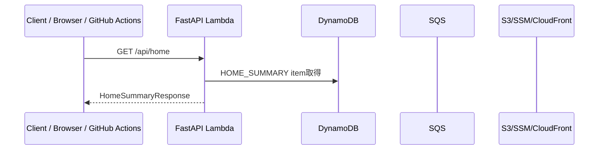

##### データ・呼び出しリソース

| 対象 | 内容 |
| :--- | :--- |
| 利用リソース | DynamoDB HomeSummary |


#### API-004. 動画一覧・検索API

##### IF

| 項目 | 内容 |
| :--- | :--- |
| operationId | 動画一覧・検索 |
| HTTP method | GET |
| Path | /api/videos |
| 利用者 | 閲覧者 |
| 目的 | 動画一覧をDynamoDB read modelから返す。通常はS3静的JSONを優先し、APIはfallbackまたは管理確認用。 |
| 認証 | 不要 |
| CSRF | 不要 |

Path parameters

| 名称 | 型 | 必須 | 説明 |
| :--- | :--- | :--- | :--- |
| なし | - | - | - |

Query parameters

| 名称 | 型 | 必須 | 説明 |
| :--- | :--- | :--- | :--- |
| q | string? | いいえ | タイトル・説明・タグの簡易検索語。 |
| tag | string[]? | いいえ | AND/OR検索用タグ。 |
| year | integer? | いいえ | 公開年。 |
| type | string? | いいえ | `video`,`live`,`short`,`playlist`など。 |
| duration | string? | いいえ | `short`,`medium`,`long`,`very_long`。 |
| sort | string? | いいえ | `published_desc`,`published_asc`,`view_count_desc`,`random`。 |
| cursor | string? | いいえ | 次ページカーソル。 |
| limit | integer? | いいえ | 既定30、最大100。 |

Request body

Schema: `なし`

| フィールド | 型 | 必須 | 説明 |
| :--- | :--- | :--- | :--- |
| なし | - | - | - |

Response schema

Schema: `VideoListResponse`

| フィールド | 型 | 必須 | 説明 |
| :--- | :--- | :--- | :--- |
| items | VideoCard[] | はい | 動画カード一覧。 |
| next_cursor | string? | いいえ | 次ページカーソル。 |
| total_estimate | integer? | いいえ | 推定件数。 |
| generated_at | string(date-time) | はい | read model生成日時。 |

HTTPステータス

| HTTPステータス | 意味 |
| :--- | :--- |
| 200/201/202/204 | 成功。GETは200、作成は201、非同期受付は202、bodyなし成功は204を使う。 |
| 400 | 入力形式、型、必須項目、query/path parameterが不正。 |
| 401 | 管理APIで認証情報がない、または無効。 |
| 403 | 認証済みだが管理権限がない、CSRF不正、署名URL対象外。 |
| 404 | 対象video/job/artifactが存在しない、または公開対象外。 |
| 409 | 冪等性キー衝突、既に実行中、状態遷移不可。 |
| 429 | 管理APIのrate limit超過。YouTube quota超過はジョブ側イベントで表現する。 |
| 500 | 想定外エラー。`trace_id`を返す。 |

##### シーケンス図

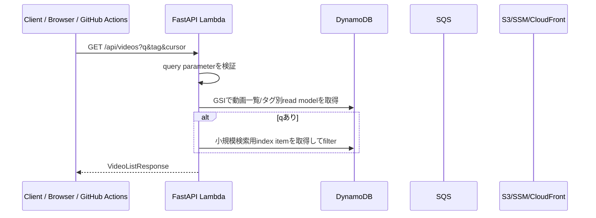

##### データ・呼び出しリソース

| 対象 | 内容 |
| :--- | :--- |
| 利用リソース | DynamoDB Videos, VideoTagIndex, SearchIndex |


#### API-005. 動画詳細API

##### IF

| 項目 | 内容 |
| :--- | :--- |
| operationId | 動画詳細 |
| HTTP method | GET |
| Path | /api/videos/{video_id} |
| 利用者 | 閲覧者 |
| 目的 | 動画詳細、YouTube主要情報、集計summary、成果物pathを返す。静的JSON `/data/videos/{video_id}.json` のfallback。 |
| 認証 | 不要 |
| CSRF | 不要 |

Path parameters

| 名称 | 型 | 必須 | 説明 |
| :--- | :--- | :--- | :--- |
| video_id | string | はい | YouTube video ID。 |

Query parameters

| 名称 | 型 | 必須 | 説明 |
| :--- | :--- | :--- | :--- |
| include | string[]? | いいえ | `summary`,`artifacts`,`timestamps`,`chat_stats`。 |

Request body

Schema: `なし`

| フィールド | 型 | 必須 | 説明 |
| :--- | :--- | :--- | :--- |
| なし | - | - | - |

Response schema

Schema: `VideoDetailResponse`

| フィールド | 型 | 必須 | 説明 |
| :--- | :--- | :--- | :--- |
| video | VideoDetail | はい | 動画詳細。 |
| chat_summary | ChatSummary? | いいえ | チャット件数、時系列ヒートなど。 |
| artifacts | VideoArtifact[] | はい | wordcloud、timestamp、raw summaryなどの公開成果物。 |
| related | VideoCard[] | はい | 同タグ関連動画。 |

HTTPステータス

| HTTPステータス | 意味 |
| :--- | :--- |
| 200/201/202/204 | 成功。GETは200、作成は201、非同期受付は202、bodyなし成功は204を使う。 |
| 400 | 入力形式、型、必須項目、query/path parameterが不正。 |
| 401 | 管理APIで認証情報がない、または無効。 |
| 403 | 認証済みだが管理権限がない、CSRF不正、署名URL対象外。 |
| 404 | 対象video/job/artifactが存在しない、または公開対象外。 |
| 409 | 冪等性キー衝突、既に実行中、状態遷移不可。 |
| 429 | 管理APIのrate limit超過。YouTube quota超過はジョブ側イベントで表現する。 |
| 500 | 想定外エラー。`trace_id`を返す。 |

##### シーケンス図

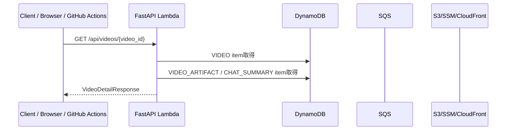

##### データ・呼び出しリソース

| 対象 | 内容 |
| :--- | :--- |
| 利用リソース | DynamoDB Video, Artifact, ChatSummary |


#### API-006. タグ一覧API

##### IF

| 項目 | 内容 |
| :--- | :--- |
| operationId | タグ一覧 |
| HTTP method | GET |
| Path | /api/tags |
| 利用者 | 閲覧者 |
| 目的 | タグ一覧、階層、件数、クイック検索候補を返す。 |
| 認証 | 不要 |
| CSRF | 不要 |

Path parameters

| 名称 | 型 | 必須 | 説明 |
| :--- | :--- | :--- | :--- |
| なし | - | - | - |

Query parameters

| 名称 | 型 | 必須 | 説明 |
| :--- | :--- | :--- | :--- |
| category | string? | いいえ | `content`,`game`,`music`,`collab`など。 |
| q | string? | いいえ | タグ名部分一致。 |

Request body

Schema: `なし`

| フィールド | 型 | 必須 | 説明 |
| :--- | :--- | :--- | :--- |
| なし | - | - | - |

Response schema

Schema: `TagListResponse`

| フィールド | 型 | 必須 | 説明 |
| :--- | :--- | :--- | :--- |
| items | TagSummary[] | はい | タグ一覧。 |
| categories | TagCategory[] | はい | カテゴリ一覧。 |
| generated_at | string(date-time) | はい | 集計生成日時。 |

HTTPステータス

| HTTPステータス | 意味 |
| :--- | :--- |
| 200/201/202/204 | 成功。GETは200、作成は201、非同期受付は202、bodyなし成功は204を使う。 |
| 400 | 入力形式、型、必須項目、query/path parameterが不正。 |
| 401 | 管理APIで認証情報がない、または無効。 |
| 403 | 認証済みだが管理権限がない、CSRF不正、署名URL対象外。 |
| 404 | 対象video/job/artifactが存在しない、または公開対象外。 |
| 409 | 冪等性キー衝突、既に実行中、状態遷移不可。 |
| 429 | 管理APIのrate limit超過。YouTube quota超過はジョブ側イベントで表現する。 |
| 500 | 想定外エラー。`trace_id`を返す。 |

##### シーケンス図

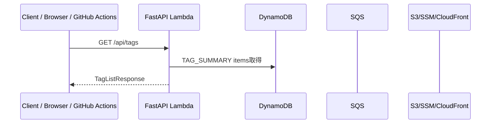

##### データ・呼び出しリソース

| 対象 | 内容 |
| :--- | :--- |
| 利用リソース | DynamoDB TagSummary |


#### API-007. 年/月別アーカイブAPI

##### IF

| 項目 | 内容 |
| :--- | :--- |
| operationId | 年/月別アーカイブ |
| HTTP method | GET |
| Path | /api/archive-calendar |
| 利用者 | 閲覧者 |
| 目的 | 年表・月別ブラウズ用に、年月別件数と日別動画IDを返す。 |
| 認証 | 不要 |
| CSRF | 不要 |

Path parameters

| 名称 | 型 | 必須 | 説明 |
| :--- | :--- | :--- | :--- |
| なし | - | - | - |

Query parameters

| 名称 | 型 | 必須 | 説明 |
| :--- | :--- | :--- | :--- |
| year | integer? | いいえ | 対象年。未指定なら全体summary。 |
| month | integer? | いいえ | 対象月。指定時は日別一覧も返す。 |

Request body

Schema: `なし`

| フィールド | 型 | 必須 | 説明 |
| :--- | :--- | :--- | :--- |
| なし | - | - | - |

Response schema

Schema: `ArchiveCalendarResponse`

| フィールド | 型 | 必須 | 説明 |
| :--- | :--- | :--- | :--- |
| years | YearSummary[] | はい | 年別件数。 |
| months | MonthSummary[] | はい | 月別件数。 |
| days | DayArchiveSummary[] | いいえ | 日別件数と動画ID。 |

HTTPステータス

| HTTPステータス | 意味 |
| :--- | :--- |
| 200/201/202/204 | 成功。GETは200、作成は201、非同期受付は202、bodyなし成功は204を使う。 |
| 400 | 入力形式、型、必須項目、query/path parameterが不正。 |
| 401 | 管理APIで認証情報がない、または無効。 |
| 403 | 認証済みだが管理権限がない、CSRF不正、署名URL対象外。 |
| 404 | 対象video/job/artifactが存在しない、または公開対象外。 |
| 409 | 冪等性キー衝突、既に実行中、状態遷移不可。 |
| 429 | 管理APIのrate limit超過。YouTube quota超過はジョブ側イベントで表現する。 |
| 500 | 想定外エラー。`trace_id`を返す。 |

##### シーケンス図

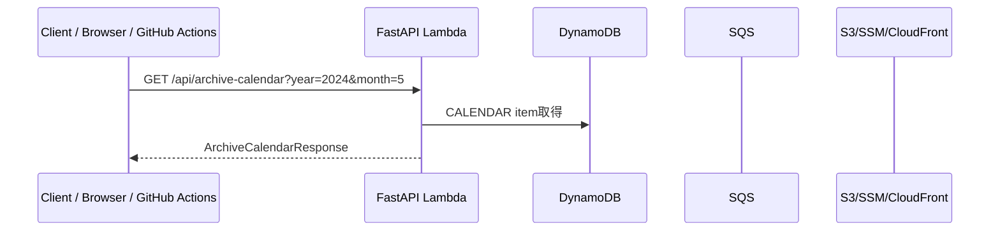

##### データ・呼び出しリソース

| 対象 | 内容 |
| :--- | :--- |
| 利用リソース | DynamoDB CalendarSummary |


#### API-008. ランダム動画API

##### IF

| 項目 | 内容 |
| :--- | :--- |
| operationId | ランダム動画 |
| HTTP method | GET |
| Path | /api/random-videos |
| 利用者 | 閲覧者 |
| 目的 | ランダム動画発見機能向けに条件付きで動画を返す。 |
| 認証 | 不要 |
| CSRF | 不要 |

Path parameters

| 名称 | 型 | 必須 | 説明 |
| :--- | :--- | :--- | :--- |
| なし | - | - | - |

Query parameters

| 名称 | 型 | 必須 | 説明 |
| :--- | :--- | :--- | :--- |
| tag | string[]? | いいえ | タグ条件。 |
| year | integer? | いいえ | 公開年。 |
| count | integer? | いいえ | 返却件数。既定1、最大20。 |
| seed | string? | いいえ | 再現用seed。 |

Request body

Schema: `なし`

| フィールド | 型 | 必須 | 説明 |
| :--- | :--- | :--- | :--- |
| なし | - | - | - |

Response schema

Schema: `RandomVideoResponse`

| フィールド | 型 | 必須 | 説明 |
| :--- | :--- | :--- | :--- |
| items | VideoCard[] | はい | ランダム抽出された動画。 |
| seed | string | はい | 抽出に使ったseed。 |

HTTPステータス

| HTTPステータス | 意味 |
| :--- | :--- |
| 200/201/202/204 | 成功。GETは200、作成は201、非同期受付は202、bodyなし成功は204を使う。 |
| 400 | 入力形式、型、必須項目、query/path parameterが不正。 |
| 401 | 管理APIで認証情報がない、または無効。 |
| 403 | 認証済みだが管理権限がない、CSRF不正、署名URL対象外。 |
| 404 | 対象video/job/artifactが存在しない、または公開対象外。 |
| 409 | 冪等性キー衝突、既に実行中、状態遷移不可。 |
| 429 | 管理APIのrate limit超過。YouTube quota超過はジョブ側イベントで表現する。 |
| 500 | 想定外エラー。`trace_id`を返す。 |

##### シーケンス図

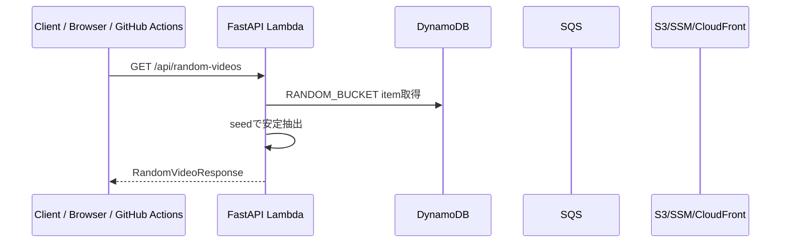

##### データ・呼び出しリソース

| 対象 | 内容 |
| :--- | :--- |
| 利用リソース | DynamoDB RandomBucket |


#### API-009. 動画成果物一覧API

##### IF

| 項目 | 内容 |
| :--- | :--- |
| operationId | 動画成果物一覧 |
| HTTP method | GET |
| Path | /api/videos/{video_id}/artifacts |
| 利用者 | 閲覧者 |
| 目的 | wordcloud、timestamp、chat summary、static JSONなど公開成果物のURLと版を返す。 |
| 認証 | 不要 |
| CSRF | 不要 |

Path parameters

| 名称 | 型 | 必須 | 説明 |
| :--- | :--- | :--- | :--- |
| video_id | string | はい | YouTube video ID。 |

Query parameters

| 名称 | 型 | 必須 | 説明 |
| :--- | :--- | :--- | :--- |
| artifact_type | string? | いいえ | `wordcloud`,`timestamp`,`chat_stats`,`raw_sample`。 |

Request body

Schema: `なし`

| フィールド | 型 | 必須 | 説明 |
| :--- | :--- | :--- | :--- |
| なし | - | - | - |

Response schema

Schema: `VideoArtifactListResponse`

| フィールド | 型 | 必須 | 説明 |
| :--- | :--- | :--- | :--- |
| items | VideoArtifact[] | はい | 成果物一覧。 |
| latest_export_version | string | はい | 公開export版。 |

HTTPステータス

| HTTPステータス | 意味 |
| :--- | :--- |
| 200/201/202/204 | 成功。GETは200、作成は201、非同期受付は202、bodyなし成功は204を使う。 |
| 400 | 入力形式、型、必須項目、query/path parameterが不正。 |
| 401 | 管理APIで認証情報がない、または無効。 |
| 403 | 認証済みだが管理権限がない、CSRF不正、署名URL対象外。 |
| 404 | 対象video/job/artifactが存在しない、または公開対象外。 |
| 409 | 冪等性キー衝突、既に実行中、状態遷移不可。 |
| 429 | 管理APIのrate limit超過。YouTube quota超過はジョブ側イベントで表現する。 |
| 500 | 想定外エラー。`trace_id`を返す。 |

##### シーケンス図

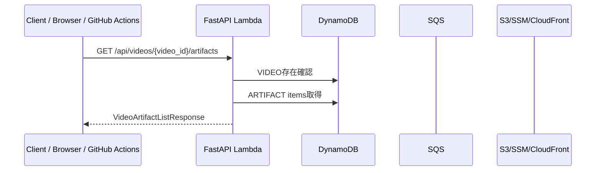

##### データ・呼び出しリソース

| 対象 | 内容 |
| :--- | :--- |
| 利用リソース | DynamoDB Artifact, S3 public paths |


#### API-010. ジョブ一覧API

##### IF

| 項目 | 内容 |
| :--- | :--- |
| operationId | ジョブ一覧 |
| HTTP method | GET |
| Path | /api/admin/jobs |
| 利用者 | 管理者 |
| 目的 | 直近ジョブ、失敗ジョブ、実行中ジョブを返す。 |
| 認証 | 管理者tokenまたはIAM |
| CSRF | 必要（HTTP API公開時） |

Path parameters

| 名称 | 型 | 必須 | 説明 |
| :--- | :--- | :--- | :--- |
| なし | - | - | - |

Query parameters

| 名称 | 型 | 必須 | 説明 |
| :--- | :--- | :--- | :--- |
| job_type | string? | いいえ | metadata、chat、aggregate、exportなど。 |
| derived_state | string? | いいえ | queued、running、succeeded、failed。 |
| cursor | string? | いいえ | ページングカーソル。 |
| limit | integer? | いいえ | 既定50、最大200。 |

Request body

Schema: `なし`

| フィールド | 型 | 必須 | 説明 |
| :--- | :--- | :--- | :--- |
| なし | - | - | - |

Response schema

Schema: `JobListResponse`

| フィールド | 型 | 必須 | 説明 |
| :--- | :--- | :--- | :--- |
| items | JobSummary[] | はい | ジョブ一覧。 |
| next_cursor | string? | いいえ | 次ページカーソル。 |

HTTPステータス

| HTTPステータス | 意味 |
| :--- | :--- |
| 200/201/202/204 | 成功。GETは200、作成は201、非同期受付は202、bodyなし成功は204を使う。 |
| 400 | 入力形式、型、必須項目、query/path parameterが不正。 |
| 401 | 管理APIで認証情報がない、または無効。 |
| 403 | 認証済みだが管理権限がない、CSRF不正、署名URL対象外。 |
| 404 | 対象video/job/artifactが存在しない、または公開対象外。 |
| 409 | 冪等性キー衝突、既に実行中、状態遷移不可。 |
| 429 | 管理APIのrate limit超過。YouTube quota超過はジョブ側イベントで表現する。 |
| 500 | 想定外エラー。`trace_id`を返す。 |

##### シーケンス図

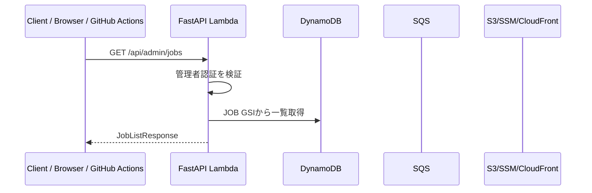

##### データ・呼び出しリソース

| 対象 | 内容 |
| :--- | :--- |
| 利用リソース | DynamoDB Job/Event |


#### API-011. ジョブ詳細API

##### IF

| 項目 | 内容 |
| :--- | :--- |
| operationId | ジョブ詳細 |
| HTTP method | GET |
| Path | /api/admin/jobs/{job_id} |
| 利用者 | 管理者 |
| 目的 | ジョブ本体、イベント履歴、入出力S3 prefix、再実行可否を返す。 |
| 認証 | 管理者tokenまたはIAM |
| CSRF | 不要 |

Path parameters

| 名称 | 型 | 必須 | 説明 |
| :--- | :--- | :--- | :--- |
| job_id | string | はい | ジョブID。 |

Query parameters

| 名称 | 型 | 必須 | 説明 |
| :--- | :--- | :--- | :--- |
| なし | - | - | - |

Request body

Schema: `なし`

| フィールド | 型 | 必須 | 説明 |
| :--- | :--- | :--- | :--- |
| なし | - | - | - |

Response schema

Schema: `JobDetailResponse`

| フィールド | 型 | 必須 | 説明 |
| :--- | :--- | :--- | :--- |
| job | JobSummary | はい | ジョブ概要。 |
| events | JobEvent[] | はい | イベント履歴。 |
| retryable | boolean | はい | 再実行可否。 |
| input | object | はい | 投入payloadの要約。 |
| output | object? | いいえ | 出力summary。 |

HTTPステータス

| HTTPステータス | 意味 |
| :--- | :--- |
| 200/201/202/204 | 成功。GETは200、作成は201、非同期受付は202、bodyなし成功は204を使う。 |
| 400 | 入力形式、型、必須項目、query/path parameterが不正。 |
| 401 | 管理APIで認証情報がない、または無効。 |
| 403 | 認証済みだが管理権限がない、CSRF不正、署名URL対象外。 |
| 404 | 対象video/job/artifactが存在しない、または公開対象外。 |
| 409 | 冪等性キー衝突、既に実行中、状態遷移不可。 |
| 429 | 管理APIのrate limit超過。YouTube quota超過はジョブ側イベントで表現する。 |
| 500 | 想定外エラー。`trace_id`を返す。 |

##### シーケンス図

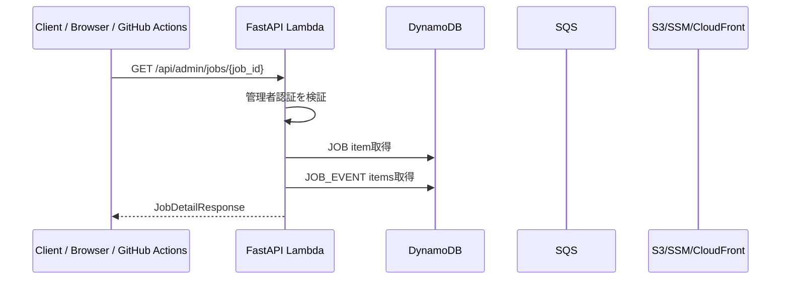

##### データ・呼び出しリソース

| 対象 | 内容 |
| :--- | :--- |
| 利用リソース | DynamoDB Job/Event |


#### API-012. メタデータ同期開始API

##### IF

| 項目 | 内容 |
| :--- | :--- |
| operationId | メタデータ同期開始 |
| HTTP method | POST |
| Path | /api/admin/jobs/metadata-sync |
| 利用者 | 管理者/GitHub Actions |
| 目的 | チャンネルまたは動画単位でYouTubeメタデータ取得ジョブをenqueueする。 |
| 認証 | 管理者tokenまたはIAM |
| CSRF | 必要 |

Path parameters

| 名称 | 型 | 必須 | 説明 |
| :--- | :--- | :--- | :--- |
| なし | - | - | - |

Query parameters

| 名称 | 型 | 必須 | 説明 |
| :--- | :--- | :--- | :--- |
| なし | - | - | - |

Request body

Schema: `StartMetadataSyncRequest`

| フィールド | 型 | 必須 | 説明 |
| :--- | :--- | :--- | :--- |
| channel_id | string? | いいえ | 対象チャンネルID。未指定時は設定済み既定チャンネル。 |
| video_id | string? | いいえ | 単一動画再取得時に指定。 |
| scope | string | はい | `channel`,`uploads`,`video`,`live_status`。 |
| force | boolean? | いいえ | ETag/更新時刻を無視して再取得する。 |
| idempotency_key | string | はい | 重複投入防止キー。 |

Response schema

Schema: `StartJobResponse`

| フィールド | 型 | 必須 | 説明 |
| :--- | :--- | :--- | :--- |
| job_id | string | はい | 作成または既存ジョブID。 |
| derived_state | string | はい | `queued`または既存状態。 |
| deduplicated | boolean | はい | 既存ジョブを返したか。 |

HTTPステータス

| HTTPステータス | 意味 |
| :--- | :--- |
| 200/201/202/204 | 成功。GETは200、作成は201、非同期受付は202、bodyなし成功は204を使う。 |
| 400 | 入力形式、型、必須項目、query/path parameterが不正。 |
| 401 | 管理APIで認証情報がない、または無効。 |
| 403 | 認証済みだが管理権限がない、CSRF不正、署名URL対象外。 |
| 404 | 対象video/job/artifactが存在しない、または公開対象外。 |
| 409 | 冪等性キー衝突、既に実行中、状態遷移不可。 |
| 429 | 管理APIのrate limit超過。YouTube quota超過はジョブ側イベントで表現する。 |
| 500 | 想定外エラー。`trace_id`を返す。 |

##### シーケンス図

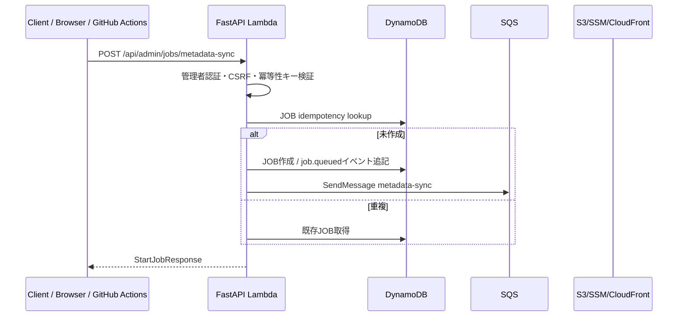

##### データ・呼び出しリソース

| 対象 | 内容 |
| :--- | :--- |
| 利用リソース | DynamoDB Job/Event, SQS metadata-sync |


#### API-013. ライブ状態検知開始API

##### IF

| 項目 | 内容 |
| :--- | :--- |
| operationId | ライブ状態検知開始 |
| HTTP method | POST |
| Path | /api/admin/jobs/live-status-scan |
| 利用者 | 管理者/Scheduler |
| 目的 | 予定枠・配信中・アーカイブ化の状態を再確認するジョブをenqueueする。 |
| 認証 | 管理者tokenまたはIAM |
| CSRF | 必要 |

Path parameters

| 名称 | 型 | 必須 | 説明 |
| :--- | :--- | :--- | :--- |
| なし | - | - | - |

Query parameters

| 名称 | 型 | 必須 | 説明 |
| :--- | :--- | :--- | :--- |
| なし | - | - | - |

Request body

Schema: `StartLiveStatusScanRequest`

| フィールド | 型 | 必須 | 説明 |
| :--- | :--- | :--- | :--- |
| channel_id | string? | いいえ | 対象チャンネルID。 |
| look_ahead_hours | integer? | いいえ | 予定枠確認範囲。既定72。 |
| idempotency_key | string | はい | 重複投入防止キー。 |

Response schema

Schema: `StartJobResponse`

| フィールド | 型 | 必須 | 説明 |
| :--- | :--- | :--- | :--- |
| job_id | string | はい | ジョブID。 |
| derived_state | string | はい | 状態。 |
| deduplicated | boolean | はい | 重複判定結果。 |

HTTPステータス

| HTTPステータス | 意味 |
| :--- | :--- |
| 200/201/202/204 | 成功。GETは200、作成は201、非同期受付は202、bodyなし成功は204を使う。 |
| 400 | 入力形式、型、必須項目、query/path parameterが不正。 |
| 401 | 管理APIで認証情報がない、または無効。 |
| 403 | 認証済みだが管理権限がない、CSRF不正、署名URL対象外。 |
| 404 | 対象video/job/artifactが存在しない、または公開対象外。 |
| 409 | 冪等性キー衝突、既に実行中、状態遷移不可。 |
| 429 | 管理APIのrate limit超過。YouTube quota超過はジョブ側イベントで表現する。 |
| 500 | 想定外エラー。`trace_id`を返す。 |

##### シーケンス図

```mermaid
sequenceDiagram
  participant C as Client / Browser / GitHub Actions
  participant A as FastAPI Lambda
  participant D as DynamoDB
  participant Q as SQS
  participant S as S3/SSM/CloudFront
  C->>A: POST /api/admin/jobs/live-status-scan
  A->>A: 管理者認証・CSRF検証
  A->>D: JOB作成 / job.queuedイベント追記
  A->>Q: SendMessage live-status-scan
  A-->>C: StartJobResponse
```

##### データ・呼び出しリソース

| 対象 | 内容 |
| :--- | :--- |
| 利用リソース | DynamoDB Job/Event, SQS metadata-sync |


#### API-014. チャット収集開始API

##### IF

| 項目 | 内容 |
| :--- | :--- |
| operationId | チャット収集開始 |
| HTTP method | POST |
| Path | /api/admin/jobs/chat-collect |
| 利用者 | 管理者/Scheduler |
| 目的 | 動画の公式Live Chatまたはリプレイチャット収集をenqueueする。 |
| 認証 | 管理者tokenまたはIAM |
| CSRF | 必要 |

Path parameters

| 名称 | 型 | 必須 | 説明 |
| :--- | :--- | :--- | :--- |
| なし | - | - | - |

Query parameters

| 名称 | 型 | 必須 | 説明 |
| :--- | :--- | :--- | :--- |
| なし | - | - | - |

Request body

Schema: `StartChatCollectRequest`

| フィールド | 型 | 必須 | 説明 |
| :--- | :--- | :--- | :--- |
| video_id | string | はい | 対象YouTube video ID。 |
| source | string | はい | `live_api`、`replay`、`auto`。 |
| live_chat_id | string? | いいえ | 公式Live Chat APIで使用。 |
| force | boolean? | いいえ | 取得済みページも再取得する。 |
| idempotency_key | string | はい | 重複投入防止キー。 |

Response schema

Schema: `StartJobResponse`

| フィールド | 型 | 必須 | 説明 |
| :--- | :--- | :--- | :--- |
| job_id | string | はい | ジョブID。 |
| derived_state | string | はい | 状態。 |
| deduplicated | boolean | はい | 重複判定結果。 |

HTTPステータス

| HTTPステータス | 意味 |
| :--- | :--- |
| 200/201/202/204 | 成功。GETは200、作成は201、非同期受付は202、bodyなし成功は204を使う。 |
| 400 | 入力形式、型、必須項目、query/path parameterが不正。 |
| 401 | 管理APIで認証情報がない、または無効。 |
| 403 | 認証済みだが管理権限がない、CSRF不正、署名URL対象外。 |
| 404 | 対象video/job/artifactが存在しない、または公開対象外。 |
| 409 | 冪等性キー衝突、既に実行中、状態遷移不可。 |
| 429 | 管理APIのrate limit超過。YouTube quota超過はジョブ側イベントで表現する。 |
| 500 | 想定外エラー。`trace_id`を返す。 |

##### シーケンス図

```mermaid
sequenceDiagram
  participant C as Client / Browser / GitHub Actions
  participant A as FastAPI Lambda
  participant D as DynamoDB
  participant Q as SQS
  participant S as S3/SSM/CloudFront
  C->>A: POST /api/admin/jobs/chat-collect
  A->>A: 管理者認証・CSRF・source検証
  A->>D: VIDEO itemからlive_chat_id/状態確認
  A->>D: JOB作成 / job.queuedイベント追記
  alt source=live_api
  A->>Q: SendMessage live-chat-collect
  else source=replay
  A->>Q: SendMessage replay-chat-bootstrap
  else source=auto
  A->>Q: 状態に応じたchat収集queueへ投入
  end
  A-->>C: StartJobResponse
```

##### データ・呼び出しリソース

| 対象 | 内容 |
| :--- | :--- |
| 利用リソース | DynamoDB Video/Job/Event, SQS chat-live/replay |


#### API-015. チャット正規化開始API

##### IF

| 項目 | 内容 |
| :--- | :--- |
| operationId | チャット正規化開始 |
| HTTP method | POST |
| Path | /api/admin/jobs/chat-normalize |
| 利用者 | 管理者/Worker |
| 目的 | raw chatページから共通JSONLへ正規化するジョブをenqueueする。 |
| 認証 | 管理者tokenまたはIAM |
| CSRF | 必要 |

Path parameters

| 名称 | 型 | 必須 | 説明 |
| :--- | :--- | :--- | :--- |
| なし | - | - | - |

Query parameters

| 名称 | 型 | 必須 | 説明 |
| :--- | :--- | :--- | :--- |
| なし | - | - | - |

Request body

Schema: `StartChatNormalizeRequest`

| フィールド | 型 | 必須 | 説明 |
| :--- | :--- | :--- | :--- |
| video_id | string | はい | 対象動画。 |
| raw_source | string | はい | `live_api`または`replay`。 |
| raw_s3_prefix | string? | いいえ | 既定prefix以外を処理する場合。 |
| idempotency_key | string | はい | 重複投入防止キー。 |

Response schema

Schema: `StartJobResponse`

| フィールド | 型 | 必須 | 説明 |
| :--- | :--- | :--- | :--- |
| job_id | string | はい | ジョブID。 |
| derived_state | string | はい | 状態。 |
| deduplicated | boolean | はい | 重複判定結果。 |

HTTPステータス

| HTTPステータス | 意味 |
| :--- | :--- |
| 200/201/202/204 | 成功。GETは200、作成は201、非同期受付は202、bodyなし成功は204を使う。 |
| 400 | 入力形式、型、必須項目、query/path parameterが不正。 |
| 401 | 管理APIで認証情報がない、または無効。 |
| 403 | 認証済みだが管理権限がない、CSRF不正、署名URL対象外。 |
| 404 | 対象video/job/artifactが存在しない、または公開対象外。 |
| 409 | 冪等性キー衝突、既に実行中、状態遷移不可。 |
| 429 | 管理APIのrate limit超過。YouTube quota超過はジョブ側イベントで表現する。 |
| 500 | 想定外エラー。`trace_id`を返す。 |

##### シーケンス図

```mermaid
sequenceDiagram
  participant C as Client / Browser / GitHub Actions
  participant A as FastAPI Lambda
  participant D as DynamoDB
  participant Q as SQS
  participant S as S3/SSM/CloudFront
  C->>A: POST /api/admin/jobs/chat-normalize
  A->>A: 管理者認証・CSRF検証
  A->>D: JOB作成 / job.queuedイベント追記
  A->>Q: SendMessage chat-normalize
  A-->>C: StartJobResponse
```

##### データ・呼び出しリソース

| 対象 | 内容 |
| :--- | :--- |
| 利用リソース | DynamoDB Job/Event, SQS normalize, S3 raw |


#### API-016. 集計再生成API

##### IF

| 項目 | 内容 |
| :--- | :--- |
| operationId | 集計再生成 |
| HTTP method | POST |
| Path | /api/admin/jobs/rebuild-artifacts |
| 利用者 | 管理者/GitHub Actions |
| 目的 | 動画単位または全体のchat stats、wordcloud、timestamp、静的JSONを再生成する。 |
| 認証 | 管理者tokenまたはIAM |
| CSRF | 必要 |

Path parameters

| 名称 | 型 | 必須 | 説明 |
| :--- | :--- | :--- | :--- |
| なし | - | - | - |

Query parameters

| 名称 | 型 | 必須 | 説明 |
| :--- | :--- | :--- | :--- |
| なし | - | - | - |

Request body

Schema: `RebuildArtifactsRequest`

| フィールド | 型 | 必須 | 説明 |
| :--- | :--- | :--- | :--- |
| video_id | string? | いいえ | 単一動画。未指定時は全体。 |
| artifact_types | string[] | はい | `chat_stats`,`wordcloud`,`timestamp`,`static_json`。 |
| force | boolean? | いいえ | 既存成果物を再生成する。 |
| idempotency_key | string | はい | 重複投入防止キー。 |

Response schema

Schema: `StartJobResponse`

| フィールド | 型 | 必須 | 説明 |
| :--- | :--- | :--- | :--- |
| job_id | string | はい | 親ジョブID。 |
| derived_state | string | はい | 状態。 |
| child_job_count | integer | はい | 投入された子ジョブ数。 |

HTTPステータス

| HTTPステータス | 意味 |
| :--- | :--- |
| 200/201/202/204 | 成功。GETは200、作成は201、非同期受付は202、bodyなし成功は204を使う。 |
| 400 | 入力形式、型、必須項目、query/path parameterが不正。 |
| 401 | 管理APIで認証情報がない、または無効。 |
| 403 | 認証済みだが管理権限がない、CSRF不正、署名URL対象外。 |
| 404 | 対象video/job/artifactが存在しない、または公開対象外。 |
| 409 | 冪等性キー衝突、既に実行中、状態遷移不可。 |
| 429 | 管理APIのrate limit超過。YouTube quota超過はジョブ側イベントで表現する。 |
| 500 | 想定外エラー。`trace_id`を返す。 |

##### シーケンス図

```mermaid
sequenceDiagram
  participant C as Client / Browser / GitHub Actions
  participant A as FastAPI Lambda
  participant D as DynamoDB
  participant Q as SQS
  participant S as S3/SSM/CloudFront
  C->>A: POST /api/admin/jobs/rebuild-artifacts
  A->>A: 管理者認証・CSRF検証
  A->>D: 親JOB作成
  loop artifact_types
  A->>Q: 対象queueへchild job投入
  end
  A-->>C: StartJobResponse
```

##### データ・呼び出しリソース

| 対象 | 内容 |
| :--- | :--- |
| 利用リソース | DynamoDB Job/Event, SQS aggregate/wordcloud/timestamp/export |


#### API-017. 静的export開始API

##### IF

| 項目 | 内容 |
| :--- | :--- |
| operationId | 静的export開始 |
| HTTP method | POST |
| Path | /api/admin/jobs/static-export |
| 利用者 | 管理者/Worker/GitHub Actions |
| 目的 | DynamoDB read modelからS3公開JSONを生成し、必要に応じCloudFront invalidationを行う。 |
| 認証 | 管理者tokenまたはIAM |
| CSRF | 必要 |

Path parameters

| 名称 | 型 | 必須 | 説明 |
| :--- | :--- | :--- | :--- |
| なし | - | - | - |

Query parameters

| 名称 | 型 | 必須 | 説明 |
| :--- | :--- | :--- | :--- |
| なし | - | - | - |

Request body

Schema: `StartStaticExportRequest`

| フィールド | 型 | 必須 | 説明 |
| :--- | :--- | :--- | :--- |
| target | string | はい | `all`,`home`,`videos`,`video_detail`,`tags`,`calendar`。 |
| video_id | string? | いいえ | video_detailのみ指定。 |
| invalidate | boolean? | いいえ | CloudFront invalidationを実行するか。 |
| idempotency_key | string | はい | 重複投入防止キー。 |

Response schema

Schema: `StartJobResponse`

| フィールド | 型 | 必須 | 説明 |
| :--- | :--- | :--- | :--- |
| job_id | string | はい | ジョブID。 |
| derived_state | string | はい | 状態。 |
| export_version | string | はい | 生成予定export版。 |

HTTPステータス

| HTTPステータス | 意味 |
| :--- | :--- |
| 200/201/202/204 | 成功。GETは200、作成は201、非同期受付は202、bodyなし成功は204を使う。 |
| 400 | 入力形式、型、必須項目、query/path parameterが不正。 |
| 401 | 管理APIで認証情報がない、または無効。 |
| 403 | 認証済みだが管理権限がない、CSRF不正、署名URL対象外。 |
| 404 | 対象video/job/artifactが存在しない、または公開対象外。 |
| 409 | 冪等性キー衝突、既に実行中、状態遷移不可。 |
| 429 | 管理APIのrate limit超過。YouTube quota超過はジョブ側イベントで表現する。 |
| 500 | 想定外エラー。`trace_id`を返す。 |

##### シーケンス図

```mermaid
sequenceDiagram
  participant C as Client / Browser / GitHub Actions
  participant A as FastAPI Lambda
  participant D as DynamoDB
  participant Q as SQS
  participant S as S3/SSM/CloudFront
  C->>A: POST /api/admin/jobs/static-export
  A->>A: 管理者認証・CSRF検証
  A->>D: JOB作成 / export_version採番
  A->>Q: SendMessage static-export
  A-->>C: StartJobResponse
```

##### データ・呼び出しリソース

| 対象 | 内容 |
| :--- | :--- |
| 利用リソース | DynamoDB Job/Event, SQS export, S3 public, CloudFront optional |


#### API-018. 失敗ジョブ再実行API

##### IF

| 項目 | 内容 |
| :--- | :--- |
| operationId | 失敗ジョブ再実行 |
| HTTP method | POST |
| Path | /api/admin/jobs/{job_id}/retry |
| 利用者 | 管理者 |
| 目的 | retryableなfailed jobを同じ入力または補正入力で再投入する。 |
| 認証 | 管理者tokenまたはIAM |
| CSRF | 必要 |

Path parameters

| 名称 | 型 | 必須 | 説明 |
| :--- | :--- | :--- | :--- |
| job_id | string | はい | 再実行対象ジョブID。 |

Query parameters

| 名称 | 型 | 必須 | 説明 |
| :--- | :--- | :--- | :--- |
| なし | - | - | - |

Request body

Schema: `RetryJobRequest`

| フィールド | 型 | 必須 | 説明 |
| :--- | :--- | :--- | :--- |
| override_input | object? | いいえ | 再実行時に上書きする入力。 |
| reason | string? | いいえ | 再実行理由。 |
| idempotency_key | string | はい | 再実行操作の冪等キー。 |

Response schema

Schema: `StartJobResponse`

| フィールド | 型 | 必須 | 説明 |
| :--- | :--- | :--- | :--- |
| job_id | string | はい | 新規または既存再実行ジョブID。 |
| parent_job_id | string | はい | 元ジョブID。 |
| derived_state | string | はい | 状態。 |

HTTPステータス

| HTTPステータス | 意味 |
| :--- | :--- |
| 200/201/202/204 | 成功。GETは200、作成は201、非同期受付は202、bodyなし成功は204を使う。 |
| 400 | 入力形式、型、必須項目、query/path parameterが不正。 |
| 401 | 管理APIで認証情報がない、または無効。 |
| 403 | 認証済みだが管理権限がない、CSRF不正、署名URL対象外。 |
| 404 | 対象video/job/artifactが存在しない、または公開対象外。 |
| 409 | 冪等性キー衝突、既に実行中、状態遷移不可。 |
| 429 | 管理APIのrate limit超過。YouTube quota超過はジョブ側イベントで表現する。 |
| 500 | 想定外エラー。`trace_id`を返す。 |

##### シーケンス図

```mermaid
sequenceDiagram
  participant C as Client / Browser / GitHub Actions
  participant A as FastAPI Lambda
  participant D as DynamoDB
  participant Q as SQS
  participant S as S3/SSM/CloudFront
  C->>A: POST /api/admin/jobs/{job_id}/retry
  A->>A: 管理者認証・CSRF検証
  A->>D: 元JOB取得 / retryable確認
  A->>D: retry JOB作成 / retry_queuedイベント追記
  A->>Q: 元job_typeに対応するqueueへ投入
  A-->>C: StartJobResponse
```

##### データ・呼び出しリソース

| 対象 | 内容 |
| :--- | :--- |
| 利用リソース | DynamoDB Job/Event, SQS target queue |


#### API-019. ジョブキャンセルAPI

##### IF

| 項目 | 内容 |
| :--- | :--- |
| operationId | ジョブキャンセル |
| HTTP method | POST |
| Path | /api/admin/jobs/{job_id}/cancel |
| 利用者 | 管理者 |
| 目的 | queue待ちまたは自己再投入型ジョブにキャンセル要求を追記する。実行中Lambdaの強制停止はしない。 |
| 認証 | 管理者tokenまたはIAM |
| CSRF | 必要 |

Path parameters

| 名称 | 型 | 必須 | 説明 |
| :--- | :--- | :--- | :--- |
| job_id | string | はい | 対象ジョブID。 |

Query parameters

| 名称 | 型 | 必須 | 説明 |
| :--- | :--- | :--- | :--- |
| なし | - | - | - |

Request body

Schema: `CancelJobRequest`

| フィールド | 型 | 必須 | 説明 |
| :--- | :--- | :--- | :--- |
| reason | string? | いいえ | キャンセル理由。 |

Response schema

Schema: `JobSummary`

| フィールド | 型 | 必須 | 説明 |
| :--- | :--- | :--- | :--- |
| job_id | string | はい | ジョブID。 |
| derived_state | string | はい | `cancel_requested`または`canceled`。 |

HTTPステータス

| HTTPステータス | 意味 |
| :--- | :--- |
| 200/201/202/204 | 成功。GETは200、作成は201、非同期受付は202、bodyなし成功は204を使う。 |
| 400 | 入力形式、型、必須項目、query/path parameterが不正。 |
| 401 | 管理APIで認証情報がない、または無効。 |
| 403 | 認証済みだが管理権限がない、CSRF不正、署名URL対象外。 |
| 404 | 対象video/job/artifactが存在しない、または公開対象外。 |
| 409 | 冪等性キー衝突、既に実行中、状態遷移不可。 |
| 429 | 管理APIのrate limit超過。YouTube quota超過はジョブ側イベントで表現する。 |
| 500 | 想定外エラー。`trace_id`を返す。 |

##### シーケンス図

```mermaid
sequenceDiagram
  participant C as Client / Browser / GitHub Actions
  participant A as FastAPI Lambda
  participant D as DynamoDB
  participant Q as SQS
  participant S as S3/SSM/CloudFront
  C->>A: POST /api/admin/jobs/{job_id}/cancel
  A->>A: 管理者認証・CSRF検証
  A->>D: JOB取得 / cancel可能性確認
  A->>D: job.cancel_requestedイベント追記
  A-->>C: JobSummary
```

##### データ・呼び出しリソース

| 対象 | 内容 |
| :--- | :--- |
| 利用リソース | DynamoDB Job/Event |


#### API-020. quota使用量API

##### IF

| 項目 | 内容 |
| :--- | :--- |
| operationId | quota使用量 |
| HTTP method | GET |
| Path | /api/admin/quota-usage |
| 利用者 | 管理者 |
| 目的 | YouTube APIメソッド別・日別の推定quota消費と上限接近状況を返す。 |
| 認証 | 管理者tokenまたはIAM |
| CSRF | 不要 |

Path parameters

| 名称 | 型 | 必須 | 説明 |
| :--- | :--- | :--- | :--- |
| なし | - | - | - |

Query parameters

| 名称 | 型 | 必須 | 説明 |
| :--- | :--- | :--- | :--- |
| from | string(date)? | いいえ | 開始日。 |
| to | string(date)? | いいえ | 終了日。 |
| method | string? | いいえ | YouTube API method。 |

Request body

Schema: `なし`

| フィールド | 型 | 必須 | 説明 |
| :--- | :--- | :--- | :--- |
| なし | - | - | - |

Response schema

Schema: `QuotaUsageResponse`

| フィールド | 型 | 必須 | 説明 |
| :--- | :--- | :--- | :--- |
| daily | QuotaDailyUsage[] | はい | 日別使用量。 |
| by_method | QuotaMethodUsage[] | はい | メソッド別使用量。 |
| limit_per_day | integer | はい | 既定上限。 |
| warning | string? | いいえ | 警告メッセージ。 |

HTTPステータス

| HTTPステータス | 意味 |
| :--- | :--- |
| 200/201/202/204 | 成功。GETは200、作成は201、非同期受付は202、bodyなし成功は204を使う。 |
| 400 | 入力形式、型、必須項目、query/path parameterが不正。 |
| 401 | 管理APIで認証情報がない、または無効。 |
| 403 | 認証済みだが管理権限がない、CSRF不正、署名URL対象外。 |
| 404 | 対象video/job/artifactが存在しない、または公開対象外。 |
| 409 | 冪等性キー衝突、既に実行中、状態遷移不可。 |
| 429 | 管理APIのrate limit超過。YouTube quota超過はジョブ側イベントで表現する。 |
| 500 | 想定外エラー。`trace_id`を返す。 |

##### シーケンス図

```mermaid
sequenceDiagram
  participant C as Client / Browser / GitHub Actions
  participant A as FastAPI Lambda
  participant D as DynamoDB
  participant Q as SQS
  participant S as S3/SSM/CloudFront
  C->>A: GET /api/admin/quota-usage?from&to
  A->>A: 管理者認証を検証
  A->>D: QUOTA_USAGE items取得
  A->>A: 日別・method別に集計
  A-->>C: QuotaUsageResponse
```

##### データ・呼び出しリソース

| 対象 | 内容 |
| :--- | :--- |
| 利用リソース | DynamoDB QuotaUsage |


#### API-021. 対象チャンネル設定取得API

##### IF

| 項目 | 内容 |
| :--- | :--- |
| operationId | 対象チャンネル設定取得 |
| HTTP method | GET |
| Path | /api/admin/channels |
| 利用者 | 管理者 |
| 目的 | 収集対象チャンネル、uploads playlist、巡回間隔、通知設定を返す。 |
| 認証 | 管理者tokenまたはIAM |
| CSRF | 不要 |

Path parameters

| 名称 | 型 | 必須 | 説明 |
| :--- | :--- | :--- | :--- |
| なし | - | - | - |

Query parameters

| 名称 | 型 | 必須 | 説明 |
| :--- | :--- | :--- | :--- |
| なし | - | - | - |

Request body

Schema: `なし`

| フィールド | 型 | 必須 | 説明 |
| :--- | :--- | :--- | :--- |
| なし | - | - | - |

Response schema

Schema: `ChannelConfigListResponse`

| フィールド | 型 | 必須 | 説明 |
| :--- | :--- | :--- | :--- |
| items | ChannelConfig[] | はい | 対象チャンネル設定。 |

HTTPステータス

| HTTPステータス | 意味 |
| :--- | :--- |
| 200/201/202/204 | 成功。GETは200、作成は201、非同期受付は202、bodyなし成功は204を使う。 |
| 400 | 入力形式、型、必須項目、query/path parameterが不正。 |
| 401 | 管理APIで認証情報がない、または無効。 |
| 403 | 認証済みだが管理権限がない、CSRF不正、署名URL対象外。 |
| 404 | 対象video/job/artifactが存在しない、または公開対象外。 |
| 409 | 冪等性キー衝突、既に実行中、状態遷移不可。 |
| 429 | 管理APIのrate limit超過。YouTube quota超過はジョブ側イベントで表現する。 |
| 500 | 想定外エラー。`trace_id`を返す。 |

##### シーケンス図

```mermaid
sequenceDiagram
  participant C as Client / Browser / GitHub Actions
  participant A as FastAPI Lambda
  participant D as DynamoDB
  participant Q as SQS
  participant S as S3/SSM/CloudFront
  C->>A: GET /api/admin/channels
  A->>A: 管理者認証を検証
  A->>D: CHANNEL_CONFIG items取得
  A-->>C: ChannelConfigListResponse
```

##### データ・呼び出しリソース

| 対象 | 内容 |
| :--- | :--- |
| 利用リソース | DynamoDB ChannelConfig |


#### API-022. 対象チャンネル設定更新API

##### IF

| 項目 | 内容 |
| :--- | :--- |
| operationId | 対象チャンネル設定更新 |
| HTTP method | PUT |
| Path | /api/admin/channels/{channel_id} |
| 利用者 | 管理者 |
| 目的 | 対象チャンネルの有効/無効、uploads playlist、巡回間隔、通知設定を更新する。 |
| 認証 | 管理者tokenまたはIAM |
| CSRF | 必要 |

Path parameters

| 名称 | 型 | 必須 | 説明 |
| :--- | :--- | :--- | :--- |
| channel_id | string | はい | YouTube channel ID。 |

Query parameters

| 名称 | 型 | 必須 | 説明 |
| :--- | :--- | :--- | :--- |
| なし | - | - | - |

Request body

Schema: `UpdateChannelConfigRequest`

| フィールド | 型 | 必須 | 説明 |
| :--- | :--- | :--- | :--- |
| enabled | boolean | はい | 収集対象にするか。 |
| uploads_playlist_id | string? | いいえ | uploads playlist ID。 |
| metadata_interval_minutes | integer | はい | メタデータ巡回間隔。 |
| live_scan_interval_minutes | integer | はい | ライブ状態巡回間隔。 |
| notification_enabled | boolean | はい | 通知イベントを生成するか。 |

Response schema

Schema: `ChannelConfig`

| フィールド | 型 | 必須 | 説明 |
| :--- | :--- | :--- | :--- |
| channel_id | string | はい | チャンネルID。 |
| enabled | boolean | はい | 有効/無効。 |
| updated_at | string(date-time) | はい | 更新日時。 |

HTTPステータス

| HTTPステータス | 意味 |
| :--- | :--- |
| 200/201/202/204 | 成功。GETは200、作成は201、非同期受付は202、bodyなし成功は204を使う。 |
| 400 | 入力形式、型、必須項目、query/path parameterが不正。 |
| 401 | 管理APIで認証情報がない、または無効。 |
| 403 | 認証済みだが管理権限がない、CSRF不正、署名URL対象外。 |
| 404 | 対象video/job/artifactが存在しない、または公開対象外。 |
| 409 | 冪等性キー衝突、既に実行中、状態遷移不可。 |
| 429 | 管理APIのrate limit超過。YouTube quota超過はジョブ側イベントで表現する。 |
| 500 | 想定外エラー。`trace_id`を返す。 |

##### シーケンス図

```mermaid
sequenceDiagram
  participant C as Client / Browser / GitHub Actions
  participant A as FastAPI Lambda
  participant D as DynamoDB
  participant Q as SQS
  participant S as S3/SSM/CloudFront
  C->>A: PUT /api/admin/channels/{channel_id}
  A->>A: 管理者認証・CSRF検証
  A->>D: CHANNEL_CONFIG更新
  A->>D: CONFIG_EVENT追記
  A-->>C: ChannelConfig
```

##### データ・呼び出しリソース

| 対象 | 内容 |
| :--- | :--- |
| 利用リソース | DynamoDB ChannelConfig/Event |


#### API-023. 管理用S3署名URL発行API

##### IF

| 項目 | 内容 |
| :--- | :--- |
| operationId | 管理用S3署名URL発行 |
| HTTP method | POST |
| Path | /api/admin/artifacts/presigned-url |
| 利用者 | 管理者 |
| 目的 | 非公開raw/normalized成果物の一時閲覧URLを発行する。大量チャット本文はAPI bodyで返さない。 |
| 認証 | 管理者tokenまたはIAM |
| CSRF | 必要 |

Path parameters

| 名称 | 型 | 必須 | 説明 |
| :--- | :--- | :--- | :--- |
| なし | - | - | - |

Query parameters

| 名称 | 型 | 必須 | 説明 |
| :--- | :--- | :--- | :--- |
| なし | - | - | - |

Request body

Schema: `IssueArtifactPresignedUrlRequest`

| フィールド | 型 | 必須 | 説明 |
| :--- | :--- | :--- | :--- |
| artifact_id | string | はい | 対象成果物ID。 |
| purpose | string | はい | `download`,`inspect`。 |
| expires_in_seconds | integer? | いいえ | 既定300、最大900。 |

Response schema

Schema: `IssueArtifactPresignedUrlResponse`

| フィールド | 型 | 必須 | 説明 |
| :--- | :--- | :--- | :--- |
| url | string | はい | 署名URL。 |
| expires_at | string(date-time) | はい | 失効日時。 |

HTTPステータス

| HTTPステータス | 意味 |
| :--- | :--- |
| 200/201/202/204 | 成功。GETは200、作成は201、非同期受付は202、bodyなし成功は204を使う。 |
| 400 | 入力形式、型、必須項目、query/path parameterが不正。 |
| 401 | 管理APIで認証情報がない、または無効。 |
| 403 | 認証済みだが管理権限がない、CSRF不正、署名URL対象外。 |
| 404 | 対象video/job/artifactが存在しない、または公開対象外。 |
| 409 | 冪等性キー衝突、既に実行中、状態遷移不可。 |
| 429 | 管理APIのrate limit超過。YouTube quota超過はジョブ側イベントで表現する。 |
| 500 | 想定外エラー。`trace_id`を返す。 |

##### シーケンス図

```mermaid
sequenceDiagram
  participant C as Client / Browser / GitHub Actions
  participant A as FastAPI Lambda
  participant D as DynamoDB
  participant Q as SQS
  participant S as S3/SSM/CloudFront
  C->>A: POST /api/admin/artifacts/presigned-url
  A->>A: 管理者認証・CSRF検証
  A->>D: ARTIFACT item取得 / 閲覧可否確認
  A->>S: S3 Presigned URL生成
  A-->>C: IssueArtifactPresignedUrlResponse
```

##### データ・呼び出しリソース

| 対象 | 内容 |
| :--- | :--- |
| 利用リソース | DynamoDB Artifact, S3 private buckets |


## 9.5. S3静的データIF

公開UIは、可能な限り本節のS3静的データを読む。API-002〜API-009は、静的データがまだ生成されていない場合、管理確認、または低頻度のfallbackとして利用する。

| ID | 名称 | Method | Path | Schema | 用途 |
| :--- | :--- | :--- | :--- | :--- | :--- |
| STATIC-001 | ホームJSON | GET | /data/home.json | HomeSummaryResponse | ホーム起点フィード。最新、クイックタグ、ライブ中、予定枠を含む。 |
| STATIC-002 | 動画一覧JSON | GET | /data/videos/index.json | VideoIndexResponse | 動画カードの圧縮一覧。ページング用に年/月/タグ別indexへ分割可能。 |
| STATIC-003 | 動画詳細JSON | GET | /data/videos/{video_id}.json | VideoDetailResponse | 動画詳細、成果物URL、チャット集計、タイムスタンプ候補を含む。 |
| STATIC-004 | タグJSON | GET | /data/tags.json | TagListResponse | タグカテゴリ、件数、クイック検索候補。 |
| STATIC-005 | 年/月カレンダーJSON | GET | /data/calendar/{year}.json | ArchiveCalendarResponse | 年表・月別ブラウズ用。 |
| STATIC-006 | export manifest | GET | /data/latest-manifest.json | ExportManifestResponse | 現在公開中のexport_version、生成日時、各JSONのchecksum。 |
| STATIC-007 | ワードクラウド画像/JSON | GET | /data/artifacts/wordcloud/{video_id}.{png|json} | WordCloudArtifact | 動画別ワードクラウドと単語頻度。 |
| STATIC-008 | タイムスタンプ候補JSON | GET | /data/artifacts/timestamps/{video_id}.json | TimestampCandidateList | 動画別タイムスタンプ候補。 |


#### STATIC-001. ホームJSON

##### IF

| 項目 | 内容 |
| :--- | :--- |
| Method | GET |
| Path | /data/home.json |
| Schema | HomeSummaryResponse |
| 用途 | ホーム起点フィード。最新、クイックタグ、ライブ中、予定枠を含む。 |
| 認証 | 不要。CloudFront + S3 OAC経由で公開配信。 |
| 更新主体 | static-exporter / file-output-service |

##### シーケンス図

```mermaid
sequenceDiagram
  participant B as Browser
  participant CF as CloudFront
  participant S as S3 public-data bucket
  B->>CF: GET /data/home.json
  CF->>S: OAC付き取得
  S-->>CF: HomeSummaryResponse
  CF-->>B: cached JSON / image
```


#### STATIC-002. 動画一覧JSON

##### IF

| 項目 | 内容 |
| :--- | :--- |
| Method | GET |
| Path | /data/videos/index.json |
| Schema | VideoIndexResponse |
| 用途 | 動画カードの圧縮一覧。ページング用に年/月/タグ別indexへ分割可能。 |
| 認証 | 不要。CloudFront + S3 OAC経由で公開配信。 |
| 更新主体 | static-exporter / file-output-service |

##### シーケンス図

```mermaid
sequenceDiagram
  participant B as Browser
  participant CF as CloudFront
  participant S as S3 public-data bucket
  B->>CF: GET /data/videos/index.json
  CF->>S: OAC付き取得
  S-->>CF: VideoIndexResponse
  CF-->>B: cached JSON / image
```


#### STATIC-003. 動画詳細JSON

##### IF

| 項目 | 内容 |
| :--- | :--- |
| Method | GET |
| Path | /data/videos/{video_id}.json |
| Schema | VideoDetailResponse |
| 用途 | 動画詳細、成果物URL、チャット集計、タイムスタンプ候補を含む。 |
| 認証 | 不要。CloudFront + S3 OAC経由で公開配信。 |
| 更新主体 | static-exporter / file-output-service |

##### シーケンス図

```mermaid
sequenceDiagram
  participant B as Browser
  participant CF as CloudFront
  participant S as S3 public-data bucket
  B->>CF: GET /data/videos/{video_id}.json
  CF->>S: OAC付き取得
  S-->>CF: VideoDetailResponse
  CF-->>B: cached JSON / image
```


#### STATIC-004. タグJSON

##### IF

| 項目 | 内容 |
| :--- | :--- |
| Method | GET |
| Path | /data/tags.json |
| Schema | TagListResponse |
| 用途 | タグカテゴリ、件数、クイック検索候補。 |
| 認証 | 不要。CloudFront + S3 OAC経由で公開配信。 |
| 更新主体 | static-exporter / file-output-service |

##### シーケンス図

```mermaid
sequenceDiagram
  participant B as Browser
  participant CF as CloudFront
  participant S as S3 public-data bucket
  B->>CF: GET /data/tags.json
  CF->>S: OAC付き取得
  S-->>CF: TagListResponse
  CF-->>B: cached JSON / image
```


#### STATIC-005. 年/月カレンダーJSON

##### IF

| 項目 | 内容 |
| :--- | :--- |
| Method | GET |
| Path | /data/calendar/{year}.json |
| Schema | ArchiveCalendarResponse |
| 用途 | 年表・月別ブラウズ用。 |
| 認証 | 不要。CloudFront + S3 OAC経由で公開配信。 |
| 更新主体 | static-exporter / file-output-service |

##### シーケンス図

```mermaid
sequenceDiagram
  participant B as Browser
  participant CF as CloudFront
  participant S as S3 public-data bucket
  B->>CF: GET /data/calendar/{year}.json
  CF->>S: OAC付き取得
  S-->>CF: ArchiveCalendarResponse
  CF-->>B: cached JSON / image
```


#### STATIC-006. export manifest

##### IF

| 項目 | 内容 |
| :--- | :--- |
| Method | GET |
| Path | /data/latest-manifest.json |
| Schema | ExportManifestResponse |
| 用途 | 現在公開中のexport_version、生成日時、各JSONのchecksum。 |
| 認証 | 不要。CloudFront + S3 OAC経由で公開配信。 |
| 更新主体 | static-exporter / file-output-service |

##### シーケンス図

```mermaid
sequenceDiagram
  participant B as Browser
  participant CF as CloudFront
  participant S as S3 public-data bucket
  B->>CF: GET /data/latest-manifest.json
  CF->>S: OAC付き取得
  S-->>CF: ExportManifestResponse
  CF-->>B: cached JSON / image
```


#### STATIC-007. ワードクラウド画像/JSON

##### IF

| 項目 | 内容 |
| :--- | :--- |
| Method | GET |
| Path | /data/artifacts/wordcloud/{video_id}.{png|json} |
| Schema | WordCloudArtifact |
| 用途 | 動画別ワードクラウドと単語頻度。 |
| 認証 | 不要。CloudFront + S3 OAC経由で公開配信。 |
| 更新主体 | static-exporter / file-output-service |

##### シーケンス図

```mermaid
sequenceDiagram
  participant B as Browser
  participant CF as CloudFront
  participant S as S3 public-data bucket
  B->>CF: GET /data/artifacts/wordcloud/{video_id}.{png|json}
  CF->>S: OAC付き取得
  S-->>CF: WordCloudArtifact
  CF-->>B: cached JSON / image
```


#### STATIC-008. タイムスタンプ候補JSON

##### IF

| 項目 | 内容 |
| :--- | :--- |
| Method | GET |
| Path | /data/artifacts/timestamps/{video_id}.json |
| Schema | TimestampCandidateList |
| 用途 | 動画別タイムスタンプ候補。 |
| 認証 | 不要。CloudFront + S3 OAC経由で公開配信。 |
| 更新主体 | static-exporter / file-output-service |

##### シーケンス図

```mermaid
sequenceDiagram
  participant B as Browser
  participant CF as CloudFront
  participant S as S3 public-data bucket
  B->>CF: GET /data/artifacts/timestamps/{video_id}.json
  CF->>S: OAC付き取得
  S-->>CF: TimestampCandidateList
  CF-->>B: cached JSON / image
```


## 9.6. バッチカバレッジ一覧

| ID | バッチ | 起動契機 | 主な出力 |
| :--- | :--- | :--- | :--- |
| BATCH-001 | 定期メタデータ同期ディスパッチ | EventBridge Scheduler: 1日1〜4回 + 手動API | SQS metadata-sync message |
| BATCH-002 | チャンネル情報取得 | SQS metadata-sync: scope=channel | DynamoDB CHANNEL/UPLOADS_PLAYLIST更新、raw JSON S3保存 |
| BATCH-003 | uploads playlist差分取得 | SQS metadata-sync: scope=uploads | video_id候補、raw playlistItems JSON、次page自己再投入 |
| BATCH-004 | 動画詳細取得 | SQS metadata-sync: scope=video / candidate投入 | DynamoDB VIDEO更新、raw videos.list JSON、状態変化イベント |
| BATCH-005 | ライブ状態監視 | EventBridge Scheduler: 5〜15分間隔 + API | upcoming/live/ended状態、通知予定、chat collect開始 |
| BATCH-006 | 配信予定通知生成 | live状態監視 / EventBridge Scheduler | 通知イベント、任意SNS/Discord/メール連携payload |
| BATCH-007 | 公式Live Chat取得 | live開始検知 / 管理API | S3 raw live chat pages、DynamoDB cursor、次page自己再投入 |
| BATCH-008 | リプレイチャット初期化 | アーカイブ化検知 / 管理API | initial continuation、raw watch/player JSON、page collector投入 |
| BATCH-009 | リプレイチャットページ取得 | SQS replay-chat-page自己再投入 | S3 raw replay pages、次continuation、normalize投入 |
| BATCH-010 | チャット正規化 | SQS chat-normalize / S3 raw page event | normalized JSONL shard、message index、normalize summary |
| BATCH-011 | チャット集計 | SQS aggregate / normalize完了 / 手動API | chat_summary JSON、時系列ヒート、話者/メッセージ種別統計 |
| BATCH-012 | ワードクラウド生成 | SQS wordcloud / aggregate完了 / 手動API | wordcloud.png/svg/json、単語頻度JSON |
| BATCH-013 | タイムスタンプ候補生成 | SQS timestamp / aggregate完了 / 手動API | timestamp_candidates.json、chapters_suggestion.md |
| BATCH-014 | ファイル出力サービス | 各生成workerからのSQS file-output | S3公開/非公開成果物、Artifact item |
| BATCH-015 | 静的JSON export | SQS static-export / 集計更新 / 手動API | S3 public JSON、manifest、任意CloudFront invalidation |
| BATCH-016 | quota使用量ロールアップ | EventBridge Scheduler: 日次 | 日別・method別quota summary、警告イベント |
| BATCH-017 | アーカイブ確定処理 | live ended検知から遅延実行 / EventBridge Scheduler | 最終metadata再取得、replay取得、集計/export投入 |
| BATCH-018 | 失敗ジョブ再投入/Redrive | EventBridge Scheduler: 日次 + 管理API | retry job、redrive report |
| BATCH-019 | 古いraw/中間成果物クリーンアップ | EventBridge Scheduler: 週次 | delete marker/report、S3 lifecycle補助 |
| BATCH-020 | 管理手動ジョブディスパッチ | 管理API / GitHub Actions workflow_dispatch | 対象SQS message、Job item |

## 9.7. SQSメッセージ共通schema

Schema: `JobMessage`

```json
{
  "job_id": "job_01H...",
  "job_type": "metadata_sync",
  "idempotency_key": "metadata:channel:UCxxx:20260527T12",
  "requested_by": "scheduler",
  "attempt": 0,
  "trace_id": "trc_01H...",
  "payload": {
"channel_id": "UC...",
"scope": "uploads"
  }
}
```

| フィールド | 型 | 必須 | 説明 |
| :--- | :--- | :--- | :--- |
| job_id | string | はい | ジョブID。DynamoDBのJOB itemと対応する。 |
| job_type | string | はい | Worker分岐に使う種別。 |
| idempotency_key | string | はい | 同一業務処理の重複防止キー。 |
| requested_by | string | はい | `scheduler`,`admin`,`worker`,`github_actions`。 |
| attempt | integer | はい | 試行回数。SQS redriveとは別にアプリ側でも保持する。 |
| trace_id | string | はい | ログ・イベント・成果物を横断する追跡ID。 |
| payload | object | はい | バッチ固有payload。 |

## 9.8. バッチ詳細


#### BATCH-001. 定期メタデータ同期ディスパッチ

##### IF

| 項目 | 内容 |
| :--- | :--- |
| 起動契機 | EventBridge Scheduler: 1日1〜4回 + 手動API |
| 入力 | ScheduleEvent または StartMetadataSyncRequest |
| 出力 | SQS metadata-sync message |
| 目的 | 対象チャンネルのuploads playlist差分検出と既存動画の軽量再取得を開始する。 |
| 冪等性 | `job_type + channel_id + yyyyMMddHH`。同一時間帯の重複投入を抑制。 |
| エラー方針 | DynamoDB job作成に失敗した場合はLambda retry、最終的にDLQ。 |

##### 共通入力フィールド

| フィールド | 型 | 必須 | 説明 |
| :--- | :--- | :--- | :--- |
| job_id | string | はい | ジョブID。API起動時またはdispatcherで採番する。 |
| job_type | string | はい | このバッチの種別。 |
| idempotency_key | string | はい | 重複実行防止キー。Scheduler起動時も生成する。 |
| requested_by | string | はい | `scheduler`,`admin`,`worker`,`github_actions`のいずれか。 |
| attempt | integer | はい | 試行回数。初回0。 |
| trace_id | string | はい | API、worker、S3出力を横断する追跡ID。 |
| payload | object | はい | バッチ固有入力。 |

##### シーケンス図

```mermaid
sequenceDiagram
  participant E as EventBridge Scheduler
  participant C as Admin Client / GitHub Actions
  participant Q as SQS Queue
  participant Qm as metadata Queue
  participant Qc as live-chat Queue
  participant Qr as replay Queue
  participant Qn as normalize/notify Queue
  participant Qa as aggregate Queue
  participant Qw as wordcloud Queue
  participant Qt as timestamp Queue
  participant Qe as export Queue
  participant Q2 as downstream Queue
  participant L as Worker Lambda
  participant D as DynamoDB
  participant S as S3
  participant P as SSM Parameter Store
  participant Y as YouTube API / YouTube Web
  participant H as HTTP Client
  participant X as External Notification
  participant CF as CloudFront
  participant GH as GitHub Actions
  E->>L: scheduled metadata sync
  L->>D: CHANNEL_CONFIG取得
  L->>D: JOB作成 / job.queuedイベント
  L->>Q: SendMessage metadata-sync(channel_id, scope=uploads)
  L-->>E: success
```


#### BATCH-002. チャンネル情報取得

##### IF

| 項目 | 内容 |
| :--- | :--- |
| 起動契機 | SQS metadata-sync: scope=channel |
| 入力 | channel_id, force, job_id |
| 出力 | DynamoDB CHANNEL/UPLOADS_PLAYLIST更新、raw JSON S3保存 |
| 目的 | channels.listでチャンネル主要情報とuploads playlist IDを取得する。 |
| 冪等性 | `channel_id + etag`。ETag未変更ならDynamoDB更新をskip。 |
| エラー方針 | quota/rateLimitはretryable、notFoundはnon-retryable failed。 |

##### 共通入力フィールド

| フィールド | 型 | 必須 | 説明 |
| :--- | :--- | :--- | :--- |
| job_id | string | はい | ジョブID。API起動時またはdispatcherで採番する。 |
| job_type | string | はい | このバッチの種別。 |
| idempotency_key | string | はい | 重複実行防止キー。Scheduler起動時も生成する。 |
| requested_by | string | はい | `scheduler`,`admin`,`worker`,`github_actions`のいずれか。 |
| attempt | integer | はい | 試行回数。初回0。 |
| trace_id | string | はい | API、worker、S3出力を横断する追跡ID。 |
| payload | object | はい | バッチ固有入力。 |

##### シーケンス図

```mermaid
sequenceDiagram
  participant E as EventBridge Scheduler
  participant C as Admin Client / GitHub Actions
  participant Q as SQS Queue
  participant Qm as metadata Queue
  participant Qc as live-chat Queue
  participant Qr as replay Queue
  participant Qn as normalize/notify Queue
  participant Qa as aggregate Queue
  participant Qw as wordcloud Queue
  participant Qt as timestamp Queue
  participant Qe as export Queue
  participant Q2 as downstream Queue
  participant L as Worker Lambda
  participant D as DynamoDB
  participant S as S3
  participant P as SSM Parameter Store
  participant Y as YouTube API / YouTube Web
  participant H as HTTP Client
  participant X as External Notification
  participant CF as CloudFront
  participant GH as GitHub Actions
  Q->>L: metadata-sync(scope=channel)
  L->>D: JOB runningイベント
  L->>P: SSMからYouTube API key取得
  L->>Y: channels.list(part=snippet,contentDetails,statistics)
  Y-->>L: channel resource
  L->>S: raw response保存
  L->>D: CHANNEL item upsert / quota_usage加算
  L->>D: JOB succeededイベント
  L->>Q2: 必要ならuploads差分取得をenqueue
```


#### BATCH-003. uploads playlist差分取得

##### IF

| 項目 | 内容 |
| :--- | :--- |
| 起動契機 | SQS metadata-sync: scope=uploads |
| 入力 | channel_id, uploads_playlist_id, page_token?, job_id |
| 出力 | video_id候補、raw playlistItems JSON、次page自己再投入 |
| 目的 | playlistItems.listを使って新規/更新候補video_idを低quotaで列挙する。 |
| 冪等性 | `playlist_id + page_token + etag`。既存rawがあればskip可能。 |
| エラー方針 | nextPageToken処理中のtimeoutは同一page_tokenで再試行。 |

##### 共通入力フィールド

| フィールド | 型 | 必須 | 説明 |
| :--- | :--- | :--- | :--- |
| job_id | string | はい | ジョブID。API起動時またはdispatcherで採番する。 |
| job_type | string | はい | このバッチの種別。 |
| idempotency_key | string | はい | 重複実行防止キー。Scheduler起動時も生成する。 |
| requested_by | string | はい | `scheduler`,`admin`,`worker`,`github_actions`のいずれか。 |
| attempt | integer | はい | 試行回数。初回0。 |
| trace_id | string | はい | API、worker、S3出力を横断する追跡ID。 |
| payload | object | はい | バッチ固有入力。 |

##### シーケンス図

```mermaid
sequenceDiagram
  participant E as EventBridge Scheduler
  participant C as Admin Client / GitHub Actions
  participant Q as SQS Queue
  participant Qm as metadata Queue
  participant Qc as live-chat Queue
  participant Qr as replay Queue
  participant Qn as normalize/notify Queue
  participant Qa as aggregate Queue
  participant Qw as wordcloud Queue
  participant Qt as timestamp Queue
  participant Qe as export Queue
  participant Q2 as downstream Queue
  participant L as Worker Lambda
  participant D as DynamoDB
  participant S as S3
  participant P as SSM Parameter Store
  participant Y as YouTube API / YouTube Web
  participant H as HTTP Client
  participant X as External Notification
  participant CF as CloudFront
  participant GH as GitHub Actions
  Q->>L: metadata-sync(scope=uploads, page_token)
  L->>Y: playlistItems.list(playlistId, pageToken)
  Y-->>L: items,nextPageToken
  L->>S: raw playlist page保存
  L->>D: QUOTA_USAGE + PLAYLIST_CURSOR更新
  loop item
  L->>D: VIDEO_DISCOVERY candidate upsert
  L->>Q2: video-detail job投入
  end
  alt nextPageTokenあり
  L->>Q: DelaySeconds付き自己再投入
  end
  L->>D: JOB page_completedイベント
```


#### BATCH-004. 動画詳細取得

##### IF

| 項目 | 内容 |
| :--- | :--- |
| 起動契機 | SQS metadata-sync: scope=video / candidate投入 |
| 入力 | video_ids[<=50], job_id, force |
| 出力 | DynamoDB VIDEO更新、raw videos.list JSON、状態変化イベント |
| 目的 | videos.listでsnippet/contentDetails/liveStreamingDetails/statisticsを取得する。 |
| 冪等性 | `video_id + etag`。未変更なら集計再生成を抑制。 |
| エラー方針 | quotaExceededは当日停止イベント、404はvideo.deletedまたはunavailable扱い。 |

##### 共通入力フィールド

| フィールド | 型 | 必須 | 説明 |
| :--- | :--- | :--- | :--- |
| job_id | string | はい | ジョブID。API起動時またはdispatcherで採番する。 |
| job_type | string | はい | このバッチの種別。 |
| idempotency_key | string | はい | 重複実行防止キー。Scheduler起動時も生成する。 |
| requested_by | string | はい | `scheduler`,`admin`,`worker`,`github_actions`のいずれか。 |
| attempt | integer | はい | 試行回数。初回0。 |
| trace_id | string | はい | API、worker、S3出力を横断する追跡ID。 |
| payload | object | はい | バッチ固有入力。 |

##### シーケンス図

```mermaid
sequenceDiagram
  participant E as EventBridge Scheduler
  participant C as Admin Client / GitHub Actions
  participant Q as SQS Queue
  participant Qm as metadata Queue
  participant Qc as live-chat Queue
  participant Qr as replay Queue
  participant Qn as normalize/notify Queue
  participant Qa as aggregate Queue
  participant Qw as wordcloud Queue
  participant Qt as timestamp Queue
  participant Qe as export Queue
  participant Q2 as downstream Queue
  participant L as Worker Lambda
  participant D as DynamoDB
  participant S as S3
  participant P as SSM Parameter Store
  participant Y as YouTube API / YouTube Web
  participant H as HTTP Client
  participant X as External Notification
  participant CF as CloudFront
  participant GH as GitHub Actions
  Q->>L: video-detail batch
  L->>Y: videos.list(id=最大50件, part=snippet,contentDetails,liveStreamingDetails,statistics,status)
  Y-->>L: video resources
  L->>S: raw videos response保存
  loop video
  L->>D: VIDEO item upsert
  L->>D: live state差分イベント追記
  alt 集計影響あり
  L->>Q2: static-export/video-detail enqueue
  end
  end
  L->>D: quota_usage加算 / JOB succeeded
```


#### BATCH-005. ライブ状態監視

##### IF

| 項目 | 内容 |
| :--- | :--- |
| 起動契機 | EventBridge Scheduler: 5〜15分間隔 + API |
| 入力 | channel_id, look_ahead_hours, job_id |
| 出力 | upcoming/live/ended状態、通知予定、chat collect開始 |
| 目的 | 予定枠・配信中・終了直後を検出し、通知とチャット収集を起動する。 |
| 冪等性 | `video_id + detected_state + detected_at_bucket`。同じ状態の通知重複を防ぐ。 |
| エラー方針 | API失敗は短いretry。連続失敗時はscan_intervalを延ばす。 |

##### 共通入力フィールド

| フィールド | 型 | 必須 | 説明 |
| :--- | :--- | :--- | :--- |
| job_id | string | はい | ジョブID。API起動時またはdispatcherで採番する。 |
| job_type | string | はい | このバッチの種別。 |
| idempotency_key | string | はい | 重複実行防止キー。Scheduler起動時も生成する。 |
| requested_by | string | はい | `scheduler`,`admin`,`worker`,`github_actions`のいずれか。 |
| attempt | integer | はい | 試行回数。初回0。 |
| trace_id | string | はい | API、worker、S3出力を横断する追跡ID。 |
| payload | object | はい | バッチ固有入力。 |

##### シーケンス図

```mermaid
sequenceDiagram
  participant E as EventBridge Scheduler
  participant C as Admin Client / GitHub Actions
  participant Q as SQS Queue
  participant Qm as metadata Queue
  participant Qc as live-chat Queue
  participant Qr as replay Queue
  participant Qn as normalize/notify Queue
  participant Qa as aggregate Queue
  participant Qw as wordcloud Queue
  participant Qt as timestamp Queue
  participant Qe as export Queue
  participant Q2 as downstream Queue
  participant L as Worker Lambda
  participant D as DynamoDB
  participant S as S3
  participant P as SSM Parameter Store
  participant Y as YouTube API / YouTube Web
  participant H as HTTP Client
  participant X as External Notification
  participant CF as CloudFront
  participant GH as GitHub Actions
  E->>L: scheduled live status scan
  L->>D: 直近upcoming/live候補取得
  L->>Q: video-detail取得をenqueue
  L->>D: live_state差分を判定
  alt upcoming検知
  L->>Qn: notify schedule enqueue
  end
  alt live開始検知
  L->>Qc: live-chat-collect enqueue
  L->>Qn: live started notification enqueue
  end
  alt ended検知
  L->>Qr: replay/bootstrap enqueue
  L->>Qa: aggregate enqueue
  end
```


#### BATCH-006. 配信予定通知生成

##### IF

| 項目 | 内容 |
| :--- | :--- |
| 起動契機 | live状態監視 / EventBridge Scheduler |
| 入力 | video_id, scheduled_start_time, notify_type(30min/start) |
| 出力 | 通知イベント、任意SNS/Discord/メール連携payload |
| 目的 | NotifyDeliveryScheduleApp相当の30分前・開始時刻通知を低コストに統合する。 |
| 冪等性 | `video_id + notify_type`。同じ通知は1回だけ。 |
| エラー方針 | 外部通知失敗は通知DLQへ隔離。UI公開JSON生成は継続。 |

##### 共通入力フィールド

| フィールド | 型 | 必須 | 説明 |
| :--- | :--- | :--- | :--- |
| job_id | string | はい | ジョブID。API起動時またはdispatcherで採番する。 |
| job_type | string | はい | このバッチの種別。 |
| idempotency_key | string | はい | 重複実行防止キー。Scheduler起動時も生成する。 |
| requested_by | string | はい | `scheduler`,`admin`,`worker`,`github_actions`のいずれか。 |
| attempt | integer | はい | 試行回数。初回0。 |
| trace_id | string | はい | API、worker、S3出力を横断する追跡ID。 |
| payload | object | はい | バッチ固有入力。 |

##### シーケンス図

```mermaid
sequenceDiagram
  participant E as EventBridge Scheduler
  participant C as Admin Client / GitHub Actions
  participant Q as SQS Queue
  participant Qm as metadata Queue
  participant Qc as live-chat Queue
  participant Qr as replay Queue
  participant Qn as normalize/notify Queue
  participant Qa as aggregate Queue
  participant Qw as wordcloud Queue
  participant Qt as timestamp Queue
  participant Qe as export Queue
  participant Q2 as downstream Queue
  participant L as Worker Lambda
  participant D as DynamoDB
  participant S as S3
  participant P as SSM Parameter Store
  participant Y as YouTube API / YouTube Web
  participant H as HTTP Client
  participant X as External Notification
  participant CF as CloudFront
  participant GH as GitHub Actions
  Q->>L: notify schedule message
  L->>D: VIDEO状態と通知済み確認
  alt 通知時刻未到達
  L->>E: EventBridge Scheduler one-shot登録またはSQS delay
  else 通知対象
  L->>D: NOTIFICATION_EVENT作成
  opt 外部通知有効
  L->>X: SNS/Discord/Emailへ送信
  end
  L->>Qe: static-export(home/upcoming) enqueue
  end
```


#### BATCH-007. 公式Live Chat取得

##### IF

| 項目 | 内容 |
| :--- | :--- |
| 起動契機 | live開始検知 / 管理API |
| 入力 | video_id, live_chat_id, page_token?, cursor_seq, job_id |
| 出力 | S3 raw live chat pages、DynamoDB cursor、次page自己再投入 |
| 目的 | liveChatMessages.listのnextPageToken/pollingIntervalMillisに従って配信中チャットを取得する。 |
| 冪等性 | `video_id + source=live_api + page_token`。同じpage_tokenは二重保存しない。 |
| エラー方針 | liveChatEnded/offlineAtで正常終了、rateLimitExceededはpollingIntervalMillis以上に遅延。 |

##### 共通入力フィールド

| フィールド | 型 | 必須 | 説明 |
| :--- | :--- | :--- | :--- |
| job_id | string | はい | ジョブID。API起動時またはdispatcherで採番する。 |
| job_type | string | はい | このバッチの種別。 |
| idempotency_key | string | はい | 重複実行防止キー。Scheduler起動時も生成する。 |
| requested_by | string | はい | `scheduler`,`admin`,`worker`,`github_actions`のいずれか。 |
| attempt | integer | はい | 試行回数。初回0。 |
| trace_id | string | はい | API、worker、S3出力を横断する追跡ID。 |
| payload | object | はい | バッチ固有入力。 |

##### シーケンス図

```mermaid
sequenceDiagram
  participant E as EventBridge Scheduler
  participant C as Admin Client / GitHub Actions
  participant Q as SQS Queue
  participant Qm as metadata Queue
  participant Qc as live-chat Queue
  participant Qr as replay Queue
  participant Qn as normalize/notify Queue
  participant Qa as aggregate Queue
  participant Qw as wordcloud Queue
  participant Qt as timestamp Queue
  participant Qe as export Queue
  participant Q2 as downstream Queue
  participant L as Worker Lambda
  participant D as DynamoDB
  participant S as S3
  participant P as SSM Parameter Store
  participant Y as YouTube API / YouTube Web
  participant H as HTTP Client
  participant X as External Notification
  participant CF as CloudFront
  participant GH as GitHub Actions
  Q->>L: live-chat-collect(video_id, live_chat_id, page_token)
  L->>D: cancel要求とcursor確認
  L->>Y: liveChatMessages.list(liveChatId,pageToken,part=id,snippet,authorDetails)
  Y-->>L: items,nextPageToken,pollingIntervalMillis,offlineAt
  L->>S: raw page JSON保存
  L->>D: CHAT_CURSOR更新 / quota_usage加算
  L->>Qn: chat-normalize enqueue(page_s3_key)
  alt offlineAtあり or liveChatEnded
  L->>D: chat_collect.completedイベント
  L->>Qa: aggregate enqueue
  else 継続
  L->>Q: DelaySeconds=pollingIntervalMillis/1000で自己再投入
  end
```


#### BATCH-008. リプレイチャット初期化

##### IF

| 項目 | 内容 |
| :--- | :--- |
| 起動契機 | アーカイブ化検知 / 管理API |
| 入力 | video_id, job_id, force |
| 出力 | initial continuation、raw watch/player JSON、page collector投入 |
| 目的 | アーカイブ後の公開リプレイチャット取得に必要なcontinuationを抽出する。 |
| 冪等性 | `video_id + replay_bootstrap_version`。構造ごとに再取得版を分ける。 |
| エラー方針 | continuationが取れない場合はbest_effort_failedとして終了し、UIには取得不可を表示。 |

##### 共通入力フィールド

| フィールド | 型 | 必須 | 説明 |
| :--- | :--- | :--- | :--- |
| job_id | string | はい | ジョブID。API起動時またはdispatcherで採番する。 |
| job_type | string | はい | このバッチの種別。 |
| idempotency_key | string | はい | 重複実行防止キー。Scheduler起動時も生成する。 |
| requested_by | string | はい | `scheduler`,`admin`,`worker`,`github_actions`のいずれか。 |
| attempt | integer | はい | 試行回数。初回0。 |
| trace_id | string | はい | API、worker、S3出力を横断する追跡ID。 |
| payload | object | はい | バッチ固有入力。 |

##### シーケンス図

```mermaid
sequenceDiagram
  participant E as EventBridge Scheduler
  participant C as Admin Client / GitHub Actions
  participant Q as SQS Queue
  participant Qm as metadata Queue
  participant Qc as live-chat Queue
  participant Qr as replay Queue
  participant Qn as normalize/notify Queue
  participant Qa as aggregate Queue
  participant Qw as wordcloud Queue
  participant Qt as timestamp Queue
  participant Qe as export Queue
  participant Q2 as downstream Queue
  participant L as Worker Lambda
  participant D as DynamoDB
  participant S as S3
  participant P as SSM Parameter Store
  participant Y as YouTube API / YouTube Web
  participant H as HTTP Client
  participant X as External Notification
  participant CF as CloudFront
  participant GH as GitHub Actions
  Q->>L: replay-chat-bootstrap(video_id)
  L->>H: YouTube watch/player page取得(best-effort)
  H-->>L: HTML/JSON
  L->>S: diagnostic raw保存
  L->>L: replay continuation抽出
  alt continuationあり
  L->>D: CHAT_CURSOR source=replay作成
  L->>Qr: replay-chat-page enqueue
  else continuationなし
  L->>D: JOB failed/non_retryableイベント
  end
```


#### BATCH-009. リプレイチャットページ取得

##### IF

| 項目 | 内容 |
| :--- | :--- |
| 起動契機 | SQS replay-chat-page自己再投入 |
| 入力 | video_id, continuation, page_seq, job_id |
| 出力 | S3 raw replay pages、次continuation、normalize投入 |
| 目的 | 公開リプレイチャットのcontinuationを順に取得する。 |
| 冪等性 | `video_id + continuation_hash`。同一continuationは一度だけ保存。 |
| エラー方針 | 構造変更/空actions/429は安全停止。部分取得済みデータは保持。 |

##### 共通入力フィールド

| フィールド | 型 | 必須 | 説明 |
| :--- | :--- | :--- | :--- |
| job_id | string | はい | ジョブID。API起動時またはdispatcherで採番する。 |
| job_type | string | はい | このバッチの種別。 |
| idempotency_key | string | はい | 重複実行防止キー。Scheduler起動時も生成する。 |
| requested_by | string | はい | `scheduler`,`admin`,`worker`,`github_actions`のいずれか。 |
| attempt | integer | はい | 試行回数。初回0。 |
| trace_id | string | はい | API、worker、S3出力を横断する追跡ID。 |
| payload | object | はい | バッチ固有入力。 |

##### シーケンス図

```mermaid
sequenceDiagram
  participant E as EventBridge Scheduler
  participant C as Admin Client / GitHub Actions
  participant Q as SQS Queue
  participant Qm as metadata Queue
  participant Qc as live-chat Queue
  participant Qr as replay Queue
  participant Qn as normalize/notify Queue
  participant Qa as aggregate Queue
  participant Qw as wordcloud Queue
  participant Qt as timestamp Queue
  participant Qe as export Queue
  participant Q2 as downstream Queue
  participant L as Worker Lambda
  participant D as DynamoDB
  participant S as S3
  participant P as SSM Parameter Store
  participant Y as YouTube API / YouTube Web
  participant H as HTTP Client
  participant X as External Notification
  participant CF as CloudFront
  participant GH as GitHub Actions
  Q->>L: replay-chat-page(video_id, continuation)
  L->>D: cursor/cancel確認
  L->>H: YouTube replay continuation endpoint取得(best-effort)
  H-->>L: continuationContents
  L->>S: raw replay page保存
  L->>Qn: chat-normalize enqueue(page_s3_key)
  L->>L: next continuation抽出
  alt nextあり
  L->>Q: backoff付き自己再投入
  else 終端
  L->>D: replay_collect.completedイベント
  L->>Qa: aggregate enqueue
  end
```


#### BATCH-010. チャット正規化

##### IF

| 項目 | 内容 |
| :--- | :--- |
| 起動契機 | SQS chat-normalize / S3 raw page event |
| 入力 | video_id, source, page_s3_key, job_id |
| 出力 | normalized JSONL shard、message index、normalize summary |
| 目的 | Live Chat APIとリプレイ構造を共通ChatMessage schemaへ変換する。 |
| 冪等性 | `page_s3_key + normalizer_version`。同一版の重複出力を避ける。 |
| エラー方針 | 個別メッセージparse失敗はdead-letter shardへ逃がし、ページ全体は継続。 |

##### 共通入力フィールド

| フィールド | 型 | 必須 | 説明 |
| :--- | :--- | :--- | :--- |
| job_id | string | はい | ジョブID。API起動時またはdispatcherで採番する。 |
| job_type | string | はい | このバッチの種別。 |
| idempotency_key | string | はい | 重複実行防止キー。Scheduler起動時も生成する。 |
| requested_by | string | はい | `scheduler`,`admin`,`worker`,`github_actions`のいずれか。 |
| attempt | integer | はい | 試行回数。初回0。 |
| trace_id | string | はい | API、worker、S3出力を横断する追跡ID。 |
| payload | object | はい | バッチ固有入力。 |

##### シーケンス図

```mermaid
sequenceDiagram
  participant E as EventBridge Scheduler
  participant C as Admin Client / GitHub Actions
  participant Q as SQS Queue
  participant Qm as metadata Queue
  participant Qc as live-chat Queue
  participant Qr as replay Queue
  participant Qn as normalize/notify Queue
  participant Qa as aggregate Queue
  participant Qw as wordcloud Queue
  participant Qt as timestamp Queue
  participant Qe as export Queue
  participant Q2 as downstream Queue
  participant L as Worker Lambda
  participant D as DynamoDB
  participant S as S3
  participant P as SSM Parameter Store
  participant Y as YouTube API / YouTube Web
  participant H as HTTP Client
  participant X as External Notification
  participant CF as CloudFront
  participant GH as GitHub Actions
  Q->>L: chat-normalize(page_s3_key)
  L->>S: raw page取得
  alt source=live_api
  L->>L: liveChatMessage resourceをparse
  else source=replay
  L->>L: replayChatItemAction/actionsをparse
  end
  L->>S: normalized jsonl shard保存
  L->>D: CHAT_SHARD item upsert / parse error count記録
  L->>Qa: chat-aggregate enqueue(video_id, shard_key)
```


#### BATCH-011. チャット集計

##### IF

| 項目 | 内容 |
| :--- | :--- |
| 起動契機 | SQS aggregate / normalize完了 / 手動API |
| 入力 | video_id, shard_keys?, aggregate_scope |
| 出力 | chat_summary JSON、時系列ヒート、話者/メッセージ種別統計 |
| 目的 | 動画別のチャット件数、盛り上がり区間、スパチャ系件数、時系列bucketを作る。 |
| 冪等性 | `video_id + normalized_version + aggregate_version`。入力shard版で成果物を分ける。 |
| エラー方針 | shard欠損時はpartial=trueで出力し、後続再実行対象にする。 |

##### 共通入力フィールド

| フィールド | 型 | 必須 | 説明 |
| :--- | :--- | :--- | :--- |
| job_id | string | はい | ジョブID。API起動時またはdispatcherで採番する。 |
| job_type | string | はい | このバッチの種別。 |
| idempotency_key | string | はい | 重複実行防止キー。Scheduler起動時も生成する。 |
| requested_by | string | はい | `scheduler`,`admin`,`worker`,`github_actions`のいずれか。 |
| attempt | integer | はい | 試行回数。初回0。 |
| trace_id | string | はい | API、worker、S3出力を横断する追跡ID。 |
| payload | object | はい | バッチ固有入力。 |

##### シーケンス図

```mermaid
sequenceDiagram
  participant E as EventBridge Scheduler
  participant C as Admin Client / GitHub Actions
  participant Q as SQS Queue
  participant Qm as metadata Queue
  participant Qc as live-chat Queue
  participant Qr as replay Queue
  participant Qn as normalize/notify Queue
  participant Qa as aggregate Queue
  participant Qw as wordcloud Queue
  participant Qt as timestamp Queue
  participant Qe as export Queue
  participant Q2 as downstream Queue
  participant L as Worker Lambda
  participant D as DynamoDB
  participant S as S3
  participant P as SSM Parameter Store
  participant Y as YouTube API / YouTube Web
  participant H as HTTP Client
  participant X as External Notification
  participant CF as CloudFront
  participant GH as GitHub Actions
  Q->>L: chat-aggregate(video_id)
  L->>D: CHAT_SHARD一覧取得
  loop shard
  L->>S: normalized jsonl取得
  L->>L: bucket集計
  end
  L->>S: chat_summary.json保存
  L->>D: CHAT_SUMMARY item更新
  L->>Qw: wordcloud enqueue
  L->>Qt: timestamp enqueue
  L->>Qe: static-export(video_detail) enqueue
```


#### BATCH-012. ワードクラウド生成

##### IF

| 項目 | 内容 |
| :--- | :--- |
| 起動契機 | SQS wordcloud / aggregate完了 / 手動API |
| 入力 | video_id, normalized_s3_prefix, exclude_words_version |
| 出力 | wordcloud.png/svg/json、単語頻度JSON |
| 目的 | CreateWordCloudService相当の成果物を動画単位に生成する。 |
| 冪等性 | `video_id + wordcloud_version + exclude_words_version`。同条件なら再生成をskip。 |
| エラー方針 | 形態素解析失敗時はword_frequency.jsonのみ出すかfailedにする。 |

##### 共通入力フィールド

| フィールド | 型 | 必須 | 説明 |
| :--- | :--- | :--- | :--- |
| job_id | string | はい | ジョブID。API起動時またはdispatcherで採番する。 |
| job_type | string | はい | このバッチの種別。 |
| idempotency_key | string | はい | 重複実行防止キー。Scheduler起動時も生成する。 |
| requested_by | string | はい | `scheduler`,`admin`,`worker`,`github_actions`のいずれか。 |
| attempt | integer | はい | 試行回数。初回0。 |
| trace_id | string | はい | API、worker、S3出力を横断する追跡ID。 |
| payload | object | はい | バッチ固有入力。 |

##### シーケンス図

```mermaid
sequenceDiagram
  participant E as EventBridge Scheduler
  participant C as Admin Client / GitHub Actions
  participant Q as SQS Queue
  participant Qm as metadata Queue
  participant Qc as live-chat Queue
  participant Qr as replay Queue
  participant Qn as normalize/notify Queue
  participant Qa as aggregate Queue
  participant Qw as wordcloud Queue
  participant Qt as timestamp Queue
  participant Qe as export Queue
  participant Q2 as downstream Queue
  participant L as Worker Lambda
  participant D as DynamoDB
  participant S as S3
  participant P as SSM Parameter Store
  participant Y as YouTube API / YouTube Web
  participant H as HTTP Client
  participant X as External Notification
  participant CF as CloudFront
  participant GH as GitHub Actions
  Q->>L: wordcloud(video_id)
  L->>S: normalized chat / chat_summary取得
  L->>D: EXCLUDE_WORDS辞書取得
  L->>L: tokenization / stopword除外 / frequency計算
  L->>S: wordcloud画像とfrequency JSON保存
  L->>D: ARTIFACT item upsert
  L->>Qe: static-export(video_detail) enqueue
```


#### BATCH-013. タイムスタンプ候補生成

##### IF

| 項目 | 内容 |
| :--- | :--- |
| 起動契機 | SQS timestamp / aggregate完了 / 手動API |
| 入力 | video_id, chat_summary, description, normalized_chat |
| 出力 | timestamp_candidates.json、chapters_suggestion.md |
| 目的 | CreateTimestamp相当の候補生成。概要欄時刻、チャット盛り上がり、頻出語を組み合わせる。 |
| 冪等性 | `video_id + timestamp_algorithm_version + input_versions`。同条件ならskip。 |
| エラー方針 | 候補0件は成功扱い。description取得不可でもchat由来候補のみ生成。 |

##### 共通入力フィールド

| フィールド | 型 | 必須 | 説明 |
| :--- | :--- | :--- | :--- |
| job_id | string | はい | ジョブID。API起動時またはdispatcherで採番する。 |
| job_type | string | はい | このバッチの種別。 |
| idempotency_key | string | はい | 重複実行防止キー。Scheduler起動時も生成する。 |
| requested_by | string | はい | `scheduler`,`admin`,`worker`,`github_actions`のいずれか。 |
| attempt | integer | はい | 試行回数。初回0。 |
| trace_id | string | はい | API、worker、S3出力を横断する追跡ID。 |
| payload | object | はい | バッチ固有入力。 |

##### シーケンス図

```mermaid
sequenceDiagram
  participant E as EventBridge Scheduler
  participant C as Admin Client / GitHub Actions
  participant Q as SQS Queue
  participant Qm as metadata Queue
  participant Qc as live-chat Queue
  participant Qr as replay Queue
  participant Qn as normalize/notify Queue
  participant Qa as aggregate Queue
  participant Qw as wordcloud Queue
  participant Qt as timestamp Queue
  participant Qe as export Queue
  participant Q2 as downstream Queue
  participant L as Worker Lambda
  participant D as DynamoDB
  participant S as S3
  participant P as SSM Parameter Store
  participant Y as YouTube API / YouTube Web
  participant H as HTTP Client
  participant X as External Notification
  participant CF as CloudFront
  participant GH as GitHub Actions
  Q->>L: timestamp(video_id)
  L->>D: VIDEO detail取得
  L->>S: chat_summary / normalized chat取得
  L->>L: 概要欄時刻表現抽出
  L->>L: 盛り上がりbucketから候補抽出
  L->>L: 候補merge / confidence付与
  L->>S: timestamp_candidates.json保存
  L->>D: ARTIFACT item upsert
  L->>Qe: static-export(video_detail) enqueue
```


#### BATCH-014. ファイル出力サービス

##### IF

| 項目 | 内容 |
| :--- | :--- |
| 起動契機 | 各生成workerからのSQS file-output |
| 入力 | artifact_type, content_s3_tmp_key or payload, destination_key, content_type |
| 出力 | S3公開/非公開成果物、Artifact item |
| 目的 | FileOutputService相当の共通出力処理。JSON/画像/Markdownの保存・checksum・metadata記録を標準化する。 |
| 冪等性 | `destination_key + sha256`。同一内容なら書き込みskip。 |
| エラー方針 | S3 Put失敗はretry、checksum不一致はfailed。 |

##### 共通入力フィールド

| フィールド | 型 | 必須 | 説明 |
| :--- | :--- | :--- | :--- |
| job_id | string | はい | ジョブID。API起動時またはdispatcherで採番する。 |
| job_type | string | はい | このバッチの種別。 |
| idempotency_key | string | はい | 重複実行防止キー。Scheduler起動時も生成する。 |
| requested_by | string | はい | `scheduler`,`admin`,`worker`,`github_actions`のいずれか。 |
| attempt | integer | はい | 試行回数。初回0。 |
| trace_id | string | はい | API、worker、S3出力を横断する追跡ID。 |
| payload | object | はい | バッチ固有入力。 |

##### シーケンス図

```mermaid
sequenceDiagram
  participant E as EventBridge Scheduler
  participant C as Admin Client / GitHub Actions
  participant Q as SQS Queue
  participant Qm as metadata Queue
  participant Qc as live-chat Queue
  participant Qr as replay Queue
  participant Qn as normalize/notify Queue
  participant Qa as aggregate Queue
  participant Qw as wordcloud Queue
  participant Qt as timestamp Queue
  participant Qe as export Queue
  participant Q2 as downstream Queue
  participant L as Worker Lambda
  participant D as DynamoDB
  participant S as S3
  participant P as SSM Parameter Store
  participant Y as YouTube API / YouTube Web
  participant H as HTTP Client
  participant X as External Notification
  participant CF as CloudFront
  participant GH as GitHub Actions
  Q->>L: file-output message
  L->>S: tmp content取得またはpayload受領
  L->>L: sha256/content-type計算
  L->>S: destinationへPutObject(metadata付与)
  L->>D: ARTIFACT item upsert
  L-->>Q: success
```


#### BATCH-015. 静的JSON export

##### IF

| 項目 | 内容 |
| :--- | :--- |
| 起動契機 | SQS static-export / 集計更新 / 手動API |
| 入力 | target, video_id?, export_version, invalidate |
| 出力 | S3 public JSON、manifest、任意CloudFront invalidation |
| 目的 | 公開UIが読むhome/videos/tags/detail/calendar JSONを生成する。 |
| 冪等性 | `target + video_id + export_version`。同一export_versionは不変。 |
| エラー方針 | 個別video detail失敗はmanifestにfailedを記録し、全体exportをpartialにする。 |

##### 共通入力フィールド

| フィールド | 型 | 必須 | 説明 |
| :--- | :--- | :--- | :--- |
| job_id | string | はい | ジョブID。API起動時またはdispatcherで採番する。 |
| job_type | string | はい | このバッチの種別。 |
| idempotency_key | string | はい | 重複実行防止キー。Scheduler起動時も生成する。 |
| requested_by | string | はい | `scheduler`,`admin`,`worker`,`github_actions`のいずれか。 |
| attempt | integer | はい | 試行回数。初回0。 |
| trace_id | string | はい | API、worker、S3出力を横断する追跡ID。 |
| payload | object | はい | バッチ固有入力。 |

##### シーケンス図

```mermaid
sequenceDiagram
  participant E as EventBridge Scheduler
  participant C as Admin Client / GitHub Actions
  participant Q as SQS Queue
  participant Qm as metadata Queue
  participant Qc as live-chat Queue
  participant Qr as replay Queue
  participant Qn as normalize/notify Queue
  participant Qa as aggregate Queue
  participant Qw as wordcloud Queue
  participant Qt as timestamp Queue
  participant Qe as export Queue
  participant Q2 as downstream Queue
  participant L as Worker Lambda
  participant D as DynamoDB
  participant S as S3
  participant P as SSM Parameter Store
  participant Y as YouTube API / YouTube Web
  participant H as HTTP Client
  participant X as External Notification
  participant CF as CloudFront
  participant GH as GitHub Actions
  Q->>L: static-export(target)
  L->>D: 必要なread modelをQuery/BatchGet
  L->>S: /data/_versions/{export_version}/... にJSON出力
  L->>S: /data/latest-manifest.json 更新
  L->>D: EXPORT item / ARTIFACT item upsert
  alt invalidate=true
  L->>CF: CreateInvalidation(/data/*)
  end
  L->>D: JOB succeededイベント
```


#### BATCH-016. quota使用量ロールアップ

##### IF

| 項目 | 内容 |
| :--- | :--- |
| 起動契機 | EventBridge Scheduler: 日次 |
| 入力 | date |
| 出力 | 日別・method別quota summary、警告イベント |
| 目的 | YouTube API呼び出し記録から日別quota消費を集計し、上限接近時に通知する。 |
| 冪等性 | `quota_rollup + date`。日次再実行は上書き可能。 |
| エラー方針 | 集計失敗は翌回再実行可能。API呼び出し自体は行わない。 |

##### 共通入力フィールド

| フィールド | 型 | 必須 | 説明 |
| :--- | :--- | :--- | :--- |
| job_id | string | はい | ジョブID。API起動時またはdispatcherで採番する。 |
| job_type | string | はい | このバッチの種別。 |
| idempotency_key | string | はい | 重複実行防止キー。Scheduler起動時も生成する。 |
| requested_by | string | はい | `scheduler`,`admin`,`worker`,`github_actions`のいずれか。 |
| attempt | integer | はい | 試行回数。初回0。 |
| trace_id | string | はい | API、worker、S3出力を横断する追跡ID。 |
| payload | object | はい | バッチ固有入力。 |

##### シーケンス図

```mermaid
sequenceDiagram
  participant E as EventBridge Scheduler
  participant C as Admin Client / GitHub Actions
  participant Q as SQS Queue
  participant Qm as metadata Queue
  participant Qc as live-chat Queue
  participant Qr as replay Queue
  participant Qn as normalize/notify Queue
  participant Qa as aggregate Queue
  participant Qw as wordcloud Queue
  participant Qt as timestamp Queue
  participant Qe as export Queue
  participant Q2 as downstream Queue
  participant L as Worker Lambda
  participant D as DynamoDB
  participant S as S3
  participant P as SSM Parameter Store
  participant Y as YouTube API / YouTube Web
  participant H as HTTP Client
  participant X as External Notification
  participant CF as CloudFront
  participant GH as GitHub Actions
  E->>L: daily quota rollup
  L->>D: QUOTA_USAGE raw取得
  L->>L: method別/日別に集計
  L->>D: QUOTA_SUMMARY upsert
  alt 閾値超過
  L->>Qn: admin notification enqueue
  end
```


#### BATCH-017. アーカイブ確定処理

##### IF

| 項目 | 内容 |
| :--- | :--- |
| 起動契機 | live ended検知から遅延実行 / EventBridge Scheduler |
| 入力 | video_id, ended_at, delay_minutes |
| 出力 | 最終metadata再取得、replay取得、集計/export投入 |
| 目的 | 配信終了直後は統計やアーカイブ状態が揺れるため、遅延して最終化する。 |
| 冪等性 | `video_id + archive_finalize + date`。短時間の重複を防ぐ。 |
| エラー方針 | 動画未公開/処理中の場合は指数backoffで最大数回再試行。 |

##### 共通入力フィールド

| フィールド | 型 | 必須 | 説明 |
| :--- | :--- | :--- | :--- |
| job_id | string | はい | ジョブID。API起動時またはdispatcherで採番する。 |
| job_type | string | はい | このバッチの種別。 |
| idempotency_key | string | はい | 重複実行防止キー。Scheduler起動時も生成する。 |
| requested_by | string | はい | `scheduler`,`admin`,`worker`,`github_actions`のいずれか。 |
| attempt | integer | はい | 試行回数。初回0。 |
| trace_id | string | はい | API、worker、S3出力を横断する追跡ID。 |
| payload | object | はい | バッチ固有入力。 |

##### シーケンス図

```mermaid
sequenceDiagram
  participant E as EventBridge Scheduler
  participant C as Admin Client / GitHub Actions
  participant Q as SQS Queue
  participant Qm as metadata Queue
  participant Qc as live-chat Queue
  participant Qr as replay Queue
  participant Qn as normalize/notify Queue
  participant Qa as aggregate Queue
  participant Qw as wordcloud Queue
  participant Qt as timestamp Queue
  participant Qe as export Queue
  participant Q2 as downstream Queue
  participant L as Worker Lambda
  participant D as DynamoDB
  participant S as S3
  participant P as SSM Parameter Store
  participant Y as YouTube API / YouTube Web
  participant H as HTTP Client
  participant X as External Notification
  participant CF as CloudFront
  participant GH as GitHub Actions
  E/Q->>L: archive-finalize(video_id)
  L->>Qm: video-detail force enqueue
  L->>Qr: replay-chat-bootstrap enqueue
  L->>Qa: aggregate enqueue
  L->>Qe: static-export enqueue
  L->>D: archive_finalize.queuedイベント
```


#### BATCH-018. 失敗ジョブ再投入/Redrive

##### IF

| 項目 | 内容 |
| :--- | :--- |
| 起動契機 | EventBridge Scheduler: 日次 + 管理API |
| 入力 | job_type?, max_age_hours, dry_run |
| 出力 | retry job、redrive report |
| 目的 | retryable failed/DLQメッセージを安全に再投入する。 |
| 冪等性 | `redrive + job_id + retry_no`。同じretry_noの重複を防ぐ。 |
| エラー方針 | non_retryableは再投入せず、管理レポートに残す。 |

##### 共通入力フィールド

| フィールド | 型 | 必須 | 説明 |
| :--- | :--- | :--- | :--- |
| job_id | string | はい | ジョブID。API起動時またはdispatcherで採番する。 |
| job_type | string | はい | このバッチの種別。 |
| idempotency_key | string | はい | 重複実行防止キー。Scheduler起動時も生成する。 |
| requested_by | string | はい | `scheduler`,`admin`,`worker`,`github_actions`のいずれか。 |
| attempt | integer | はい | 試行回数。初回0。 |
| trace_id | string | はい | API、worker、S3出力を横断する追跡ID。 |
| payload | object | はい | バッチ固有入力。 |

##### シーケンス図

```mermaid
sequenceDiagram
  participant E as EventBridge Scheduler
  participant C as Admin Client / GitHub Actions
  participant Q as SQS Queue
  participant Qm as metadata Queue
  participant Qc as live-chat Queue
  participant Qr as replay Queue
  participant Qn as normalize/notify Queue
  participant Qa as aggregate Queue
  participant Qw as wordcloud Queue
  participant Qt as timestamp Queue
  participant Qe as export Queue
  participant Q2 as downstream Queue
  participant L as Worker Lambda
  participant D as DynamoDB
  participant S as S3
  participant P as SSM Parameter Store
  participant Y as YouTube API / YouTube Web
  participant H as HTTP Client
  participant X as External Notification
  participant CF as CloudFront
  participant GH as GitHub Actions
  E/C->>L: redrive request
  L->>D: failed retryable JOB検索
  loop job
  L->>D: retry JOB作成
  L->>Q: 対応queueへ再投入
  end
  L->>S: redrive-report.json保存
  L-->>C: report(optional)
```


#### BATCH-019. 古いraw/中間成果物クリーンアップ

##### IF

| 項目 | 内容 |
| :--- | :--- |
| 起動契機 | EventBridge Scheduler: 週次 |
| 入力 | retention_policy_version, dry_run |
| 出力 | delete marker/report、S3 lifecycle補助 |
| 目的 | 個人開発のS3/CloudWatchコストを抑えるため、中間rawや診断ファイルを保持期間に従い削除する。 |
| 冪等性 | `cleanup + yyyyMMdd + policy_version`。dry_runと実削除を分離。 |
| エラー方針 | 削除失敗はreportに残し、次週再実行。公開成果物は削除しない。 |

##### 共通入力フィールド

| フィールド | 型 | 必須 | 説明 |
| :--- | :--- | :--- | :--- |
| job_id | string | はい | ジョブID。API起動時またはdispatcherで採番する。 |
| job_type | string | はい | このバッチの種別。 |
| idempotency_key | string | はい | 重複実行防止キー。Scheduler起動時も生成する。 |
| requested_by | string | はい | `scheduler`,`admin`,`worker`,`github_actions`のいずれか。 |
| attempt | integer | はい | 試行回数。初回0。 |
| trace_id | string | はい | API、worker、S3出力を横断する追跡ID。 |
| payload | object | はい | バッチ固有入力。 |

##### シーケンス図

```mermaid
sequenceDiagram
  participant E as EventBridge Scheduler
  participant C as Admin Client / GitHub Actions
  participant Q as SQS Queue
  participant Qm as metadata Queue
  participant Qc as live-chat Queue
  participant Qr as replay Queue
  participant Qn as normalize/notify Queue
  participant Qa as aggregate Queue
  participant Qw as wordcloud Queue
  participant Qt as timestamp Queue
  participant Qe as export Queue
  participant Q2 as downstream Queue
  participant L as Worker Lambda
  participant D as DynamoDB
  participant S as S3
  participant P as SSM Parameter Store
  participant Y as YouTube API / YouTube Web
  participant H as HTTP Client
  participant X as External Notification
  participant CF as CloudFront
  participant GH as GitHub Actions
  E->>L: cleanup schedule
  L->>D: ARTIFACT/JOBから削除候補取得
  L->>S: 対象prefixをListObjects
  alt dry_run
  L->>S: cleanup-reportのみ保存
  else execute
  L->>S: DeleteObjects
  L->>D: cleanupイベント追記
  end
```


#### BATCH-020. 管理手動ジョブディスパッチ

##### IF

| 項目 | 内容 |
| :--- | :--- |
| 起動契機 | 管理API / GitHub Actions workflow_dispatch |
| 入力 | job_type, payload, requested_by, idempotency_key |
| 出力 | 対象SQS message、Job item |
| 目的 | AWS Console常用を避け、個人開発でも再実行・部分再生成を安全に行う入口。 |
| 冪等性 | リクエストの`idempotency_key`を必須化。 |
| エラー方針 | 未知job_typeは400/failed、queue送信失敗はJOB failed。 |

##### 共通入力フィールド

| フィールド | 型 | 必須 | 説明 |
| :--- | :--- | :--- | :--- |
| job_id | string | はい | ジョブID。API起動時またはdispatcherで採番する。 |
| job_type | string | はい | このバッチの種別。 |
| idempotency_key | string | はい | 重複実行防止キー。Scheduler起動時も生成する。 |
| requested_by | string | はい | `scheduler`,`admin`,`worker`,`github_actions`のいずれか。 |
| attempt | integer | はい | 試行回数。初回0。 |
| trace_id | string | はい | API、worker、S3出力を横断する追跡ID。 |
| payload | object | はい | バッチ固有入力。 |

##### シーケンス図

```mermaid
sequenceDiagram
  participant E as EventBridge Scheduler
  participant C as Admin Client / GitHub Actions
  participant Q as SQS Queue
  participant Qm as metadata Queue
  participant Qc as live-chat Queue
  participant Qr as replay Queue
  participant Qn as normalize/notify Queue
  participant Qa as aggregate Queue
  participant Qw as wordcloud Queue
  participant Qt as timestamp Queue
  participant Qe as export Queue
  participant Q2 as downstream Queue
  participant L as Worker Lambda
  participant D as DynamoDB
  participant S as S3
  participant P as SSM Parameter Store
  participant Y as YouTube API / YouTube Web
  participant H as HTTP Client
  participant X as External Notification
  participant CF as CloudFront
  participant GH as GitHub Actions
  C/GH->>A: manual job request
  A->>A: 認証・schema検証
  A->>D: JOB作成 / job.queued
  A->>Q: job_type対応queueへSendMessage
  A-->>C/GH: StartJobResponse
```


## 9.9. ジョブ状態イベント

ジョブの現在状態は、DynamoDBの固定状態列ではなく、`JOB_EVENT`から導出する。ただし一覧高速化のため、`JOB` itemには最新イベント名、最終更新時刻、失敗理由summaryをread modelとして保持してよい。read modelは正本ではない。

```mermaid
stateDiagram-v2
  [*] --> QUEUED: job.queued
  QUEUED --> RUNNING: job.started
  RUNNING --> WAITING: job.waiting_next_page
  WAITING --> RUNNING: job.resumed
  RUNNING --> SUCCEEDED: job.succeeded
  RUNNING --> FAILED: job.failed
  WAITING --> FAILED: job.failed
  FAILED --> QUEUED: job.retry_queued
  QUEUED --> CANCEL_REQUESTED: job.cancel_requested
  RUNNING --> CANCEL_REQUESTED: job.cancel_requested
  WAITING --> CANCEL_REQUESTED: job.cancel_requested
  CANCEL_REQUESTED --> CANCELED: job.canceled
```

| event_name | 導出状態 | 用途 |
| :--- | :--- | :--- |
| `job.queued` | queued | API、Scheduler、Workerがジョブを投入した。 |
| `job.started` | running | Workerが処理を開始した。 |
| `job.waiting_next_page` | waiting | Live Chatやreplay chatで次page取得待ち。 |
| `job.page_completed` | running/waiting | page単位処理が完了した。 |
| `job.succeeded` | succeeded | 全処理が成功した。 |
| `job.partial_succeeded` | succeeded | 取得不能部分はあるが公開成果物として利用可能。 |
| `job.failed` | failed | retryableまたはnon_retryableな失敗。 |
| `job.retry_queued` | queued | 管理APIまたはredriveで再投入された。 |
| `job.cancel_requested` | cancel_requested | キャンセル要求を受けた。 |
| `job.canceled` | canceled | Workerがキャンセル要求を確認して停止した。 |

## 9.10. API・バッチ間の代表エンドツーエンドシーケンス

### 9.10.1. 新規動画検知から公開JSON反映まで

```mermaid
sequenceDiagram
  participant EB as EventBridge Scheduler
  participant M as metadata-dispatcher
  participant Qm as metadata Queue
  participant V as video-detail-collector
  participant Y as YouTube Data API
  participant D as DynamoDB
  participant Qa as aggregate Queue
  participant E as static-exporter
  participant S as S3 public-data
  participant CF as CloudFront
  EB->>M: 定期起動
  M->>Qm: uploads差分取得を投入
  Qm->>V: video detail job
  V->>Y: playlistItems.list / videos.list
  Y-->>V: video resources
  V->>D: VIDEO upsert / VIDEO_EVENT追記
  V->>Qa: 必要な集計・exportを投入
  Qa->>E: static export
  E->>D: read model取得
  E->>S: /data/latest-manifest.json / detail JSON出力
  E->>CF: optional invalidation
```

### 9.10.2. ライブ開始からチャット収集・ワードクラウド生成まで

```mermaid
sequenceDiagram
  participant EB as EventBridge Scheduler
  participant L as live-status-monitor
  participant Qc as live-chat Queue
  participant C as live-chat-collector
  participant Y as YouTube Live Chat API
  participant S as S3 raw/normalized
  participant Qn as normalize Queue
  participant N as chat-normalizer
  participant Qa as aggregate Queue
  participant A as chat-aggregator
  participant W as wordcloud-generator
  participant T as timestamp-generator
  participant E as static-exporter
  EB->>L: ライブ状態scan
  L->>Qc: live_chat_id付きで収集開始
  loop 配信中
Qc->>C: page_token付き収集
C->>Y: liveChatMessages.list
Y-->>C: items / nextPageToken / pollingIntervalMillis
C->>S: raw page保存
C->>Qn: normalize投入
C->>Qc: pollingIntervalMillisに従い自己再投入
  end
  Qn->>N: raw page parse
  N->>S: normalized JSONL保存
  N->>Qa: aggregate投入
  Qa->>A: 集計
  A->>S: chat_summary.json保存
  A->>W: wordcloud生成依頼
  A->>T: timestamp生成依頼
  W->>S: wordcloud成果物保存
  T->>S: timestamp候補保存
  W->>E: video_detail export依頼
  T->>E: video_detail export依頼
```

### 9.10.3. リプレイチャット取得不能時の安全停止

```mermaid
sequenceDiagram
  participant R as replay-chat-bootstrap
  participant H as YouTube Web
  participant S as S3 raw diagnostic
  participant D as DynamoDB
  participant E as static-exporter
  R->>H: watch/player HTML取得(best-effort)
  H-->>R: HTML/JSON
  R->>S: 最小診断raw保存
  R->>R: continuation抽出
  alt continuationなし
R->>D: job.failed(non_retryable, reason=continuation_not_found)
R->>D: VIDEO_ARTIFACTにchat_replay_unavailableを記録
R->>E: detail JSON export依頼
  else continuationあり
R->>D: cursor作成
R->>R: page collectorへ継続
  end
```

## 9.11. 実装時の生成物チェックリスト

| 分類 | チェック |
| :--- | :--- |
| API | 9.3の23 APIすべてにroute、schema、handler、単体テストを作る。 |
| 管理API | POST/PUT/DELETE系は`X-Idempotency-Key`、管理認証、CSRF、rate limitを通す。 |
| 静的IF | 9.5の8静的IFすべてにJSON schema、sample fixture、checksum検証を作る。 |
| バッチ | 9.6の20バッチすべてにSQS message schema、handler、idempotency testを作る。 |
| YouTube client | YouTube API呼び出しはquota_usage wrapperを必ず通す。 |
| チャット | live_api/replayのraw保存、normalize、aggregate、exportの各段階で再実行可能にする。 |
| コスト | CloudWatch Logsへチャット本文全文、raw HTML全文、API keyを出力しない。 |

# 8. 参考資料

| 資料 | 用途 |
| :--- | :--- |
| `tsuji-tomonori/diopside` README | 既存中心リポジトリ、技術スタック、画面構成の前提。 |
| `tsuji-tomonori/ArchiveChatAggregationMessage` README | replay chat JSON構造、renderer分岐、timestamp/author/message抽出の根拠。 |
| `tsuji-tomonori/CollectYouTubeChatApp` README | YouTubeチャット取得サービスの既存責務。 |
| `tsuji-tomonori/NotifyDeliveryScheduleApp` README | 配信30分前・開始時刻通知の既存責務。 |
| `tsuji-tomonori/LiveMap` README | 配信支援、通知、word cloudの既存発想。 |
| YouTube Data API Quota Calculator | quota最適化設計の根拠。 |
| YouTube Data API `playlistItems.list` | uploads playlist利用の根拠。 |
| YouTube Data API `videos.list` / video resource | 動画主要情報・liveStreamingDetails取得の根拠。 |
| YouTube Live Streaming API `liveChatMessages.list` | 配信中チャット取得方式の根拠。 |
| AWS CloudFront OAC for Lambda Function URL | Function URLをCloudFront originとして制限する場合の根拠。 |
| AWS DynamoDB on-demand | 個人開発向けサーバレスDB方針の根拠。 |


---

# 10. CloudFront・パス・フロントエンド設計（v0.4追補）

## 10.1. 設計方針

本章では、diopsideの公開閲覧をCloudFront + S3静的配信で完結させることを第一方針とし、動的APIは管理操作、health、手動ジョブ起動、署名URL/管理セッション発行に限定する。SQL系DB、常時稼働サーバー、SSRサーバー、OpenSearchは初期構成では使わない。

| 方針ID | 方針 | 内容 |
| :--- | :--- | :--- |
| CF-F-001 | 単一ドメイン | 公開UI、静的JSON、画像成果物、必要最小限のAPIを単一CloudFront distribution配下に集約する。 |
| CF-F-002 | 静的優先 | 一覧、検索、動画詳細、タグ、カレンダー、ワードクラウド、タイムスタンプ候補は`/data/*`の静的成果物から取得する。 |
| CF-F-003 | versioned data | 公開データ本体は`/data/v/{export_version}/...`へ置き、`/data/latest-manifest.json`だけを短TTLにする。 |
| CF-F-004 | SPA shell | フロントエンドは静的HTML/JSとして配信し、動画追加のたびにフロントを再ビルドしない。 |
| CF-F-005 | Admin非公開データ保護 | 管理API、raw/processed S3、DynamoDB、YouTube API keyはブラウザから直接触れない。 |
| CF-F-006 | 低invalidation | exportごとに大量invalidationしない。manifest差し替えだけで新しいデータ版へ誘導する。 |
| CF-F-007 | モバイルファースト | UIの主要操作は下部ナビ、検索ボタン、フィルターボトムシート、カード操作に寄せる。 |

## 10.2. CloudFront全体構成

```mermaid
flowchart LR
  B[Browser / Mobile] --> CF[CloudFront Distribution]
  CF --> WAF[AWS WAF]
  CF --> O1[S3 web bucket\nSPA / _next static]
  CF --> O2[S3 public-data bucket\n/data / images / artifacts]
  CF --> O3[API Gateway HTTP API\n/admin API / jobs / health]
  O3 --> L[FastAPI on Lambda]
  L --> D[DynamoDB single-table]
  L --> Q[SQS job queues]
  L --> SSM[SSM / Secrets]
```

### 10.2.1. Origin設計

| Origin ID | Origin | 用途 | CloudFrontからの接続 | 公開可否 | 備考 |
| :--- | :--- | :--- | :--- | :--- | :--- |
| `web-origin` | `diopside-{env}-web.s3.{region}.amazonaws.com` | SPA shell、Next.js static export、画像、manifest.webmanifest | S3 REST origin + OAC always sign | CloudFront経由のみ公開 | S3 website endpointは使わない。 |
| `public-data-origin` | `diopside-{env}-public-data.s3.{region}.amazonaws.com` | 公開JSON、ワードクラウド、OGP、タイムスタンプ候補 | S3 REST origin + OAC always sign | CloudFront経由のみ公開 | `/data/v/*`は長TTL immutable。 |
| `api-origin` | API Gateway HTTP API domain | health、管理ログイン、管理ジョブ起動、再実行、署名URL発行 | HTTPS custom origin | 認証付きAPIのみ | POSTを扱うため、初期はLambda Function URLではなくHTTP APIを推奨する。 |
| `lambda-url-origin` | Lambda Function URL | 任意。GET中心の軽量API fallback | CloudFront OAC for Lambda URL | 初期は原則不使用 | POSTでpayload hashが必要になるため、ブラウザ管理APIの主経路にはしない。 |

## 10.3. Ordered Cache Behavior設計

CloudFrontは上から順にpath patternを評価し、最初に一致したbehaviorを適用する。したがって、`/api/*`、`/data/latest-manifest.json`、`/data/v/*`、`/admin/*`、`/_next/static/*`のように、認可・cache要件が強いものから順に並べる。

| 優先順 | Path pattern | Origin | Allowed methods | Cache policy | Origin request policy | Function/Headers | 目的 |
| :---: | :--- | :--- | :--- | :--- | :--- | :--- | :--- |
| 1 | `/api/*` | `api-origin` | GET, HEAD, OPTIONS, PUT, POST, PATCH, DELETE | `CachingDisabled` | `DiopsideApiOriginRequestPolicy` | SecurityHeaders | 管理API、手動ジョブ、health。キャッシュしない。 |
| 2 | `/data/latest-manifest.json` | `public-data-origin` | GET, HEAD | `DiopsideManifestCachePolicy` | なし | SecurityHeaders + CORSなし | 現在公開中のexport_versionを返す。短TTL。 |
| 3 | `/data/v/*` | `public-data-origin` | GET, HEAD | `DiopsideImmutableDataCachePolicy` | なし | SecurityHeaders | versioned JSON。長TTL immutable。 |
| 4 | `/data/*` | `public-data-origin` | GET, HEAD | `DiopsideShortDataCachePolicy` | なし | SecurityHeaders | 後方互換用の非versioned JSON。原則manifest経由へ移行。 |
| 5 | `/artifacts/*` | `public-data-origin` | GET, HEAD | `DiopsideImmutableMediaCachePolicy` | なし | SecurityHeaders | ワードクラウド、OGP、タイムスタンプ画像等。 |
| 6 | `/og/*` | `public-data-origin` | GET, HEAD | `DiopsideImmutableMediaCachePolicy` | なし | SecurityHeaders | SNS共有用OGP画像。 |
| 7 | `/_next/static/*` | `web-origin` | GET, HEAD | `DiopsideStaticAssetCachePolicy` | なし | SecurityHeaders | Next.js hashed assets。 |
| 8 | `/assets/*` | `web-origin` | GET, HEAD | `DiopsideStaticAssetCachePolicy` | なし | SecurityHeaders | 追加静的assets。 |
| 9 | `/icons/*` | `web-origin` | GET, HEAD | `DiopsideStaticAssetCachePolicy` | なし | SecurityHeaders | PWA icons等。 |
| 10 | `/admin/*` | `web-origin` | GET, HEAD | `DiopsideHtmlCachePolicy` | なし | `AdminSpaRewriteFunction` | 管理SPA。JS自体に秘密は含めない。データは管理APIで保護。 |
| 11 | `/*` default | `web-origin` | GET, HEAD | `DiopsideHtmlCachePolicy` | なし | `PublicSpaRewriteFunction` | 公開SPA shell。 |

### 10.3.1. Cache policy詳細

| Policy名 | Min TTL | Default TTL | Max TTL | Cookie | Query | Header | 用途 |
| :--- | ---: | ---: | ---: | :--- | :--- | :--- | :--- |
| `DiopsideHtmlCachePolicy` | 0秒 | 60秒 | 300秒 | なし | なし | `Accept-Encoding`のみ | `index.html`、`admin/index.html`。deploy反映を早くする。 |
| `DiopsideStaticAssetCachePolicy` | 86400秒 | 2592000秒 | 31536000秒 | なし | なし | `Accept-Encoding`のみ | hash付きJS/CSS/画像。 |
| `DiopsideManifestCachePolicy` | 0秒 | 30秒 | 60秒 | なし | なし | `Accept-Encoding`のみ | `latest-manifest.json`。export反映を早くする。 |
| `DiopsideShortDataCachePolicy` | 0秒 | 300秒 | 600秒 | なし | なし | `Accept-Encoding`のみ | 後方互換の`/data/*.json`。 |
| `DiopsideImmutableDataCachePolicy` | 86400秒 | 2592000秒 | 31536000秒 | なし | なし | `Accept-Encoding`のみ | `/data/v/{export_version}/...`。version不変。 |
| `DiopsideImmutableMediaCachePolicy` | 86400秒 | 2592000秒 | 31536000秒 | なし | なし | `Accept-Encoding`のみ | `/artifacts/*`、`/og/*`。 |
| `DiopsideApiNoCachePolicy` | 0秒 | 0秒 | 0秒 | allowlist | all | allowlist | `/api/*`。 |

### 10.3.2. Origin request policy詳細

| Policy名 | 対象 | Forward query | Forward cookies | Forward headers |
| :--- | :--- | :--- | :--- | :--- |
| `DiopsideApiOriginRequestPolicy` | `/api/*` | all | `diopside_admin_session`, `diopside_csrf` | `Authorization`, `Content-Type`, `Accept`, `Origin`, `Referer`, `User-Agent`, `X-Request-Id`, `X-Idempotency-Key`, `X-CSRF-Token`, `CloudFront-Viewer-Country` |
| `DiopsideStaticNoForwardPolicy` | `/data/*`, assets | none | none | `Accept-Encoding`のみ |

## 10.4. CloudFront viewer path設計

### 10.4.1. 公開UI path

| Viewer path | Origin URI | フロント画面 | データ取得 | 備考 |
| :--- | :--- | :--- | :--- | :--- |
| `/` | `/index.html` | ホーム検索ハブ | `/data/latest-manifest.json` → `home.json` | 最初に表示する画面。 |
| `/search` | `/search/index.html` | 検索結果フィード | `videos/index-*.json`、`tags.json` | query stringで検索状態を保持。 |
| `/search?q={keyword}&tags={csv}&sort={sort}` | `/search/index.html` | 検索結果フィード | 同上 | URL共有可能。 |
| `/videos/{video_id}` | `/watch/index.html` | 動画詳細 | `videos/{video_id}.json` | CloudFront Functionで`/watch/index.html`へrewriteする。ブラウザURLは維持する。 |
| `/watch?v={video_id}` | `/watch/index.html` | 動画詳細 | `videos/{video_id}.json` | pretty URLが使えない環境向けfallback。 |
| `/tags` | `/tags/index.html` | タグ探索 | `tags.json`、必要なindex shard | タグカテゴリと件数。 |
| `/tags/{tag_slug}` | `/tags/index.html` | タグ別結果 | `tags.json`、index shard | クライアントでtag_slugを読む。 |
| `/calendar` | `/calendar/index.html` | 年/月ブラウズ | `calendar/{year}.json` | 既定は最新年。 |
| `/calendar/{year}` | `/calendar/index.html` | 年別ブラウズ | `calendar/{year}.json` | CloudFront Functionでrewrite。 |
| `/random` | `/random/index.html` | ランダム動画 | `videos/index-*.json` | local historyで重複抑制。 |
| `/favorites` | `/favorites/index.html` | お気に入り | localStorage + detail JSON | サーバ保存しない。 |
| `/history` | `/history/index.html` | 閲覧履歴 | localStorage + index JSON | サーバ保存しない。 |
| `/about` | `/about/index.html` | このサイトについて | static HTML | 任意。 |

### 10.4.2. 管理UI path

管理UIは、JS/HTML自体は静的に配信してよい。ただし管理データと操作はすべて`/api/admin/*`で保護する。フロントに管理token、YouTube API key、AWS credentialを埋め込まない。

| Viewer path | Origin URI | 画面 | 認証 | 主なAPI |
| :--- | :--- | :--- | :--- | :--- |
| `/admin` | `/admin/index.html` | 管理ダッシュボード | `/api/admin/me`で確認 | quota、last export、job summary |
| `/admin/login` | `/admin/index.html` | 管理ログイン | passphrase → HttpOnly cookie | `POST /api/admin/session` |
| `/admin/videos` | `/admin/index.html` | 動画管理 | admin session | `GET /api/admin/videos`、`POST /api/admin/jobs` |
| `/admin/jobs` | `/admin/index.html` | ジョブ一覧 | admin session | `GET /api/admin/jobs` |
| `/admin/jobs/{job_id}` | `/admin/index.html` | ジョブ詳細・再実行 | admin session | `GET /api/admin/jobs/{job_id}`、`POST /api/admin/jobs/{job_id}/retry` |
| `/admin/exports` | `/admin/index.html` | export履歴 | admin session | `GET /api/admin/exports`、`POST /api/admin/exports` |
| `/admin/settings` | `/admin/index.html` | 対象チャンネル/タグ設定 | admin session | `GET/PATCH /api/admin/settings` |

### 10.4.3. 静的データpath

| Viewer path | S3 key | Schema | TTL方針 | 用途 |
| :--- | :--- | :--- | :--- | :--- |
| `/data/latest-manifest.json` | `public/latest-manifest.json` | `ExportManifestResponse` | 30秒 | 現行export版を示す唯一の可変入口。 |
| `/data/v/{export_version}/home.json` | `public/v/{export_version}/home.json` | `HomeSummaryResponse` | 1年 | ホーム初期表示。 |
| `/data/v/{export_version}/videos/index.json` | `public/v/{export_version}/videos/index.json` | `VideoIndexResponse` | 1年 | 小規模時の全件index。 |
| `/data/v/{export_version}/videos/index-{shard}.json` | `public/v/{export_version}/videos/index-{shard}.json` | `VideoIndexShardResponse` | 1年 | 年/月/タグ別shard。 |
| `/data/v/{export_version}/videos/{video_id}.json` | `public/v/{export_version}/videos/{video_id}.json` | `VideoDetailResponse` | 1年 | 動画詳細。 |
| `/data/v/{export_version}/tags.json` | `public/v/{export_version}/tags.json` | `TagListResponse` | 1年 | タグ一覧、タグカテゴリ、件数。 |
| `/data/v/{export_version}/calendar/{year}.json` | `public/v/{export_version}/calendar/{year}.json` | `ArchiveCalendarResponse` | 1年 | 年/月/日別ブラウズ。 |
| `/data/v/{export_version}/artifacts/wordcloud/{video_id}.json` | `public/v/{export_version}/artifacts/wordcloud/{video_id}.json` | `WordCloudArtifactJson` | 1年 | ワードクラウド元データ。 |
| `/artifacts/wordcloud/{video_id}-{artifact_hash}.png` | `artifacts/wordcloud/{video_id}-{artifact_hash}.png` | image/png | 1年 | ワードクラウド画像。 |
| `/data/v/{export_version}/artifacts/timestamps/{video_id}.json` | `public/v/{export_version}/artifacts/timestamps/{video_id}.json` | `TimestampCandidateList` | 1年 | タイムスタンプ候補。 |
| `/og/videos/{video_id}-{artifact_hash}.png` | `og/videos/{video_id}-{artifact_hash}.png` | image/png | 1年 | SNS/カード用画像。 |

## 10.5. SPA rewrite設計

### 10.5.1. Rewrite対象と除外

| 条件 | 処理 |
| :--- | :--- |
| URIが`/api/`で始まる | rewriteしない。API behaviorへ渡す。 |
| URIが`/data/`で始まる | rewriteしない。public-data behaviorへ渡す。 |
| URIが`/_next/`, `/assets/`, `/icons/`, `/og/`, `/artifacts/`で始まる | rewriteしない。静的assetとして扱う。 |
| URIが`/admin`または`/admin/`で始まり、拡張子がない | `/admin/index.html`へrewrite。 |
| URIが`/videos/{video_id}`形式 | `/watch/index.html`へrewrite。 |
| URIが`/calendar/{year}`形式 | `/calendar/index.html`へrewrite。 |
| URIが`/tags/{tag_slug}`形式 | `/tags/index.html`へrewrite。 |
| URIが`/` | `/index.html`へrewrite。 |
| URIに拡張子がなく公開routeに一致 | 対応する`/{route}/index.html`または`/index.html`へrewrite。 |
| その他 | そのままoriginへ転送。S3が404/403を返す。 |

### 10.5.2. CloudFront Function疑似コード

```javascript
function handler(event) {
  var request = event.request;
  var uri = request.uri;

  if (uri === "/") {
    request.uri = "/index.html";
    return request;
  }

  if (
    uri.startsWith("/api/") ||
    uri.startsWith("/data/") ||
    uri.startsWith("/_next/") ||
    uri.startsWith("/assets/") ||
    uri.startsWith("/icons/") ||
    uri.startsWith("/og/") ||
    uri.startsWith("/artifacts/")
  ) {
    return request;
  }

  if (uri === "/admin" || uri.startsWith("/admin/")) {
    if (!hasFileExtension(uri)) request.uri = "/admin/index.html";
    return request;
  }

  if (/^\/videos\/[A-Za-z0-9_-]{6,}$/.test(uri)) {
    request.uri = "/watch/index.html";
    return request;
  }

  if (/^\/calendar\/\d{4}$/.test(uri)) {
    request.uri = "/calendar/index.html";
    return request;
  }

  if (/^\/tags\/[^/]+$/.test(uri)) {
    request.uri = "/tags/index.html";
    return request;
  }

  var routes = ["/search", "/tags", "/calendar", "/random", "/favorites", "/history", "/about", "/watch"];
  if (routes.indexOf(uri) >= 0) {
    request.uri = uri + "/index.html";
    return request;
  }

  if (!hasFileExtension(uri)) {
    request.uri = "/index.html";
  }
  return request;
}

function hasFileExtension(uri) {
  var last = uri.split("/").pop();
  return last.indexOf(".") >= 0;
}
```

## 10.6. Response Headers / Security Header設計

| Header | 値 | 対象 | 理由 |
| :--- | :--- | :--- | :--- |
| `Strict-Transport-Security` | `max-age=31536000; includeSubDomains; preload` | 全path | HTTPS強制。 |
| `X-Content-Type-Options` | `nosniff` | 全path | MIME sniffing抑止。 |
| `X-Frame-Options` | `SAMEORIGIN` | UI/API | clickjacking抑止。YouTube iframeは`frame-src`で許可する。 |
| `Referrer-Policy` | `strict-origin-when-cross-origin` | 全path | 外部遷移時の情報漏えい抑制。 |
| `Permissions-Policy` | `camera=(), microphone=(), geolocation=()` | 全path | 不要なブラウザ機能を無効化。 |
| `Content-Security-Policy` | `default-src 'self'; img-src 'self' https://i.ytimg.com https://yt3.ggpht.com data:; script-src 'self'; style-src 'self' 'unsafe-inline'; connect-src 'self'; frame-src https://www.youtube.com https://www.youtube-nocookie.com; base-uri 'self'; object-src 'none'` | UI | YouTube埋め込みとサムネイル以外を制限。 |
| `Cache-Control` | `public, max-age=60` | HTML | deploy反映を早くする。 |
| `Cache-Control` | `public, max-age=31536000, immutable` | hashed assets / versioned data | 再取得を減らす。 |
| `Cache-Control` | `public, max-age=30, must-revalidate` | `latest-manifest.json` | export版切替を早く検知する。 |

## 10.7. 管理APIと管理UIの認証設計

個人開発の低コストを優先し、初期の管理認証はCognitoを必須にしない。ブラウザ管理UIを使う場合は、API側で管理passphraseを検証し、HttpOnly cookieを発行する。passphraseや管理tokenはlocalStorage、sessionStorage、静的JS、runtime-configに保存しない。

| 項目 | 設計 |
| :--- | :--- |
| 管理ログイン | `POST /api/admin/session`にpassphraseを送る。APIはSSM SecureStringのhashと照合する。 |
| 管理session | `diopside_admin_session` HttpOnly/Secure/SameSite=Lax cookie。HMAC署名付きstateless cookie、またはDynamoDB session item。 |
| CSRF | `GET /api/admin/me`でCSRF tokenを返す。変更系APIは`X-CSRF-Token`必須。 |
| Rate limit | API側でIP hash + session hash単位の簡易rate limitをDynamoDB TTL itemで実施する。 |
| 管理UI配信 | `/admin/*`のHTML/JSは静的配信。ただし管理データはAPI認証後のみ返す。 |
| raw/processed閲覧 | raw/processed S3は直接公開しない。必要ならAPIが短時間presigned URLを発行する。 |

### 10.7.1. 管理ログインシーケンス

```mermaid
sequenceDiagram
  participant B as Browser
  participant CF as CloudFront
  participant A as API Gateway / FastAPI Lambda
  participant S as SSM SecureString
  participant D as DynamoDB
  B->>CF: GET /admin
  CF->>B: admin/index.html
  B->>CF: GET /api/admin/me
  CF->>A: /api/admin/me
  A-->>B: 401 unauthenticated
  B->>CF: POST /api/admin/session(passphrase)
  CF->>A: no-cache API request
  A->>S: 管理passphrase hash取得
  A->>A: hash照合
  A->>D: 任意でsession item作成 / audit event保存
  A-->>B: 204 Set-Cookie(diopside_admin_session)
  B->>CF: GET /api/admin/me
  CF->>A: cookie付き
  A-->>B: admin profile + csrf_token
```

## 10.8. Invalidation / Export切替設計

| 契機 | 変更対象 | CloudFront invalidation | 理由 |
| :--- | :--- | :--- | :--- |
| 通常export完了 | `/data/v/{export_version}/...`新規作成、`/data/latest-manifest.json`差替 | 原則`/data/latest-manifest.json`のみ。短TTLならinvalidationなしでも可。 | versioned dataはimmutable。 |
| フロントdeploy | `index.html`、route別HTML、`_next/static/{build_id}` | `/*`ではなくHTML entrypointのみ。例: `/index.html`, `/search/index.html`, `/admin/index.html` | assetsはhash付きで長TTL。 |
| OGP/wordcloud再生成 | hash付き新規path、detail JSON差替 | manifestまたは該当detail JSONのみ | 画像pathをhash付きにして差替不要にする。 |
| 緊急修正 | 任意path | 必要最小限 | 個人運用でもinvalidationコストと反映範囲を抑える。 |

### 10.8.1. Export切替シーケンス

```mermaid
sequenceDiagram
  participant E as static-exporter
  participant S as S3 public-data
  participant CF as CloudFront
  participant B as Browser
  E->>S: /public/v/{new_export_version}/... をput
  E->>S: checksum検証用manifestをput
  E->>S: /public/latest-manifest.json をatomicに差替
  opt すぐ反映したい場合
    E->>CF: CreateInvalidation(/data/latest-manifest.json)
  end
  B->>CF: GET /data/latest-manifest.json
  CF->>S: 短TTL切れ後に取得
  S-->>CF: new export_version
  B->>CF: GET /data/v/{new_export_version}/home.json
```

## 10.9. フロントエンド設計

### 10.9.1. 技術方針

既存diopsideはNext.js/Reactを前提としているため、フロントはNext.js static exportを基本にする。ただし、動画追加ごとにフロント再buildが必要になる動的SSGには寄せず、静的shell + `/data/v/{export_version}`のデータ駆動UIにする。

| 項目 | 選定 | 理由 |
| :--- | :--- | :--- |
| Framework | Next.js static export + React client components | 既存構成を活かしつつSSR常駐費をゼロにする。 |
| Dynamic video route | `/videos/{video_id}`をCloudFrontで`/watch/index.html`へrewrite | 新規動画追加時にfront deployを不要にする。 |
| API client | `fetch` wrapper + Zod schema validation | データ契約破壊を早期検知する。 |
| Server state | TanStack Query相当、または軽量custom cache | manifest、home、index、detail JSONをcacheする。 |
| Local state | React state + URLSearchParams | 検索条件はURLへ逃がし、共有・復元可能にする。 |
| Persistent local state | localStorage | お気に入り、履歴、最近の検索。サーバ保存しない。 |
| Styling | 既存スタイルを優先。新規はdesign tokens + CSS Modulesまたはvanilla-extract | 色・余白・角丸・影の一貫性を保つ。 |
| UI principle | mobile first / thumb first | 検索・絞り込み・保存・再生への導線を片手操作に寄せる。 |

### 10.9.2. 画面一覧

| Route | Page component | 主データ | 主な責務 | Mobile UI |
| :--- | :--- | :--- | :--- | :--- |
| `/` | `HomePage` | `home.json`, `tags.json` | 検索ハブ、最新/ライブ/予定/最近の検索 | 大検索バー、クイックチップ、下部ナビ |
| `/search` | `SearchPage` | `videos/index*.json`, `tags.json` | 検索結果、ソート、フィルタ、無限スクロール | sticky search、filter FAB、bottom sheet |
| `/videos/{video_id}` | `VideoDetailPage` | `videos/{video_id}.json` | YouTube埋め込み、メタ情報、タグ、成果物 | 大サムネ/プレイヤー、主要CTA下部固定 |
| `/tags` | `TagBrowsePage` | `tags.json` | タグカテゴリ探索 | chip grid、カテゴリaccordion |
| `/tags/{tag_slug}` | `TagResultPage` | `tags.json`, `index shard` | タグ別結果 | `/search`と同じfeed |
| `/calendar` | `CalendarPage` | `calendar/{year}.json` | 年/月/日付ブラウズ | month strip、日別カード |
| `/random` | `RandomPage` | `videos/index*.json` | ランダム発見 | 大カード、再抽選、保存 |
| `/favorites` | `FavoritesPage` | localStorage + detail/index | 保存済み一覧 | bottom navから即アクセス |
| `/history` | `HistoryPage` | localStorage + index | 閲覧履歴、検索履歴 | 最近見た動画/検索語 |
| `/admin` | `AdminDashboardPage` | `/api/admin/*` | ジョブ、quota、export状況 | desktop寄りでもmobile対応 |

### 10.9.3. フロント画面遷移

```mermaid
flowchart TD
  HOME[/ / Home/] --> SEARCH[/search/]
  HOME --> VIDEO[/videos/{video_id}/]
  HOME --> TAGS[/tags/]
  HOME --> CAL[/calendar/]
  HOME --> RANDOM[/random/]
  SEARCH --> VIDEO
  TAGS --> SEARCH
  CAL --> VIDEO
  RANDOM --> VIDEO
  VIDEO --> SEARCH
  VIDEO --> FAV[/favorites/]
  HOME --> HIST[/history/]
  ADMIN[/admin/] --> JOBS[/admin/jobs/]
  ADMIN --> EXPORTS[/admin/exports/]
  ADMIN --> SETTINGS[/admin/settings/]
```

### 10.9.4. データ取得フロー

```mermaid
sequenceDiagram
  participant B as Browser
  participant CF as CloudFront
  participant W as S3 web
  participant D as S3 public-data
  B->>CF: GET /
  CF->>W: /index.html
  W-->>CF: SPA shell
  CF-->>B: HTML/JS
  B->>CF: GET /data/latest-manifest.json
  CF->>D: public/latest-manifest.json
  D-->>B: export_version and paths
  B->>CF: GET /data/v/{export_version}/home.json
  B->>CF: GET /data/v/{export_version}/tags.json
  B->>CF: GET /data/v/{export_version}/videos/index.json or shard
  B->>B: client-side filter/sort/render
```

### 10.9.5. 検索・フィルタ状態

検索条件はURLSearchParamsへ保存し、リロード・共有・戻る/進むで復元できるようにする。

| Query parameter | 型 | 例 | 説明 |
| :--- | :--- | :--- | :--- |
| `q` | string | `歌枠` | キーワード。NFKC正規化、lowercase、空白分割。 |
| `tags` | csv string | `歌枠,切り抜きOK` | 選択タグ。 |
| `tagMode` | `and`/`or` | `and` | 複数タグ条件。 |
| `type` | string | `live_archive` | 動画/配信/short等。 |
| `from` | yyyy-mm-dd | `2024-01-01` | 配信日または公開日の下限。 |
| `to` | yyyy-mm-dd | `2024-12-31` | 上限。 |
| `duration` | range | `1800-7200` | 秒単位。 |
| `sort` | string | `newest` | `newest`, `oldest`, `popular`, `duration_desc`, `random`。 |
| `view` | string | `feed` | `feed`, `compact`, `grid`。 |

### 10.9.6. クライアント検索アルゴリズム

| Step | 処理 | 入力 | 出力 |
| :--- | :--- | :--- | :--- |
| 1 | manifest取得 | `/data/latest-manifest.json` | export_version |
| 2 | index shard決定 | query, tag, year | 必要な`index-*.json`一覧 |
| 3 | 正規化 | q, title, tags, description_snippet | normalized text |
| 4 | 絞り込み | tag/date/duration/type | candidate video items |
| 5 | スコアリング | q hit, tag exact, recency, popularity | score |
| 6 | ソート | sort parameter | ordered items |
| 7 | 表示 | viewport / pagination | card list |
| 8 | 詳細prefetch | cardがviewport近くに来た時 | `videos/{video_id}.json`をprefetch |

初期はindex全件が数千件規模であれば一括ロードを許容する。重くなった場合のみ、`year`、`tag bucket`、`latest`のshardへ分割する。

### 10.9.7. Component設計

| 階層 | Component | 内容 |
| :--- | :--- | :--- |
| Layout | `PublicAppShell` | header、bottom nav、toast、error boundary。 |
| Layout | `AdminAppShell` | admin header、side nav、auth guard。 |
| Search | `HeroSearchBox` | ホームの大検索バー。 |
| Search | `StickySearchBar` | 検索結果上部のsticky検索。 |
| Search | `QuickTagChips` | 人気タグ・カテゴリチップ。 |
| Search | `FilterBottomSheet` | タグ、期間、長さ、並び順を片手で絞る。 |
| Feed | `VideoFeed` | 仮想化またはページングされたカード一覧。 |
| Feed | `VideoCard` | サムネイル、タイトル、日付、タグ、時間、保存ボタン。 |
| Detail | `VideoHero` | サムネイル/YouTube埋め込み、タイトル、主要meta。 |
| Detail | `ArtifactTabs` | タイムスタンプ、ワードクラウド、チャット集計。 |
| Detail | `TimestampList` | 候補タイムスタンプ、source、confidence。 |
| Detail | `WordCloudPanel` | PNG表示とtop terms。 |
| Navigation | `BottomNavigation` | ホーム、検索、保存、履歴、メニュー。 |
| Navigation | `BackHeader` | 片手戻る、検索、filter。 |
| Admin | `JobTable` | 管理ジョブ一覧。 |
| Admin | `QuotaPanel` | YouTube quota推定使用量。 |
| Admin | `ExportStatusCard` | 最新exportとmanifest状態。 |

### 10.9.8. モバイルUIルール

| 項目 | ルール |
| :--- | :--- |
| 最小幅 | 360pxで崩れない。 |
| タップ領域 | 主要ボタン・チップは44px以上を目安にする。 |
| 主要CTA | 検索、絞り込み適用、保存、YouTubeで開くは画面下部の親指領域に置く。 |
| Bottom navigation | Public UIは5項目まで。Home/Search/Favorites/History/Menu。 |
| Filter | 画面遷移ではなくbottom sheetを基本にする。 |
| Card | 一覧は横長サムネ + テキスト、検索結果は大きめカード。片手スクロールを優先。 |
| Skeleton | home/search/detailの主要領域にskeletonを出す。 |
| Empty state | 「条件をゆるめる」「タグを外す」「ランダムで探す」を出す。 |
| One-handed | filter FABは右下、検索実行は下部固定CTA。 |

### 10.9.9. localStorage schema

| Key | Schema | 用途 | 保持上限 |
| :--- | :--- | :--- | :--- |
| `diopside:favorites:v1` | `{ video_ids: string[], updated_at: string }` | お気に入り動画 | 500件 |
| `diopside:history:v1` | `{ items: { video_id, viewed_at }[] }` | 閲覧履歴 | 200件 |
| `diopside:recent-searches:v1` | `{ items: { query, tags, searched_at }[] }` | 最近の検索 | 30件 |
| `diopside:ui-settings:v1` | `{ theme, default_view, autoplay_embed }` | UI設定 | 1件 |
| `diopside:data-cache-meta:v1` | `{ export_version, cached_at }` | キャッシュ整合 | 1件 |

個人情報を含むauthor名やチャット本文はlocalStorageに保存しない。

### 10.9.10. フロントディレクトリ設計

既存`web`プロジェクトを維持する場合の推奨構成は次の通り。

```text
web/
  src/
    app/
      page.tsx                    # Home shell
      search/page.tsx             # Search shell
      watch/page.tsx              # Video detail shell; /videos/{id} rewrite target
      tags/page.tsx
      calendar/page.tsx
      random/page.tsx
      favorites/page.tsx
      history/page.tsx
      admin/page.tsx              # Admin SPA shell
    features/
      archive/
        components/VideoCard.tsx
        components/VideoFeed.tsx
        hooks/useVideoIndex.ts
      search/
        components/HeroSearchBox.tsx
        components/FilterBottomSheet.tsx
        lib/filterVideos.ts
        lib/normalizeSearchText.ts
      video/
        components/VideoHero.tsx
        components/TimestampList.tsx
        components/WordCloudPanel.tsx
        hooks/useVideoDetail.ts
      calendar/
      favorites/
      admin/
        components/AdminGuard.tsx
        components/JobTable.tsx
        hooks/useAdminSession.ts
    lib/
      api/fetchJson.ts
      data/manifestClient.ts
      data/publicDataClient.ts
      storage/localStore.ts
      routing/routeParams.ts
      telemetry/clientLog.ts
    styles/
      tokens.css
      globals.css
  public/
    manifest.webmanifest
    icons/
```

### 10.9.11. TypeScript data contract例

```ts
export type ExportManifestResponse = {
  schema_version: 'export-manifest/v1';
  export_version: string;
  generated_at: string;
  paths: {
    home: string;
    videos_index: string;
    tags: string;
    calendar_prefix: string;
    video_detail_template: string;
  };
  checksums: Record<string, string>;
};

export type VideoIndexItem = {
  video_id: string;
  title: string;
  published_at: string | null;
  scheduled_start_time: string | null;
  actual_start_time: string | null;
  duration_sec: number | null;
  thumbnail_url: string;
  tags: string[];
  category: '歌枠' | '雑談' | 'ゲーム' | 'ASMR' | '企画' | 'その他';
  archive_state: 'upcoming' | 'live' | 'archived' | 'unavailable';
  view_count?: number;
  detail_path: string;
  wordcloud_available: boolean;
  timestamp_available: boolean;
};
```

## 10.10. CloudFront/Frontendシーケンス図

### 10.10.1. 公開ホーム初期表示

```mermaid
sequenceDiagram
  participant B as Browser
  participant CF as CloudFront
  participant W as S3 web
  participant P as S3 public-data
  B->>CF: GET /
  CF->>CF: PublicSpaRewriteFunction /index.html
  CF->>W: GET /index.html with OAC
  W-->>CF: HTML
  CF-->>B: HTML
  B->>CF: GET /_next/static/...
  CF->>W: static asset
  B->>CF: GET /data/latest-manifest.json
  CF->>P: short TTL manifest
  P-->>B: export_version
  B->>CF: GET /data/v/{export_version}/home.json
  CF->>P: immutable data
  P-->>B: HomeSummaryResponse
```

### 10.10.2. 動画詳細表示

```mermaid
sequenceDiagram
  participant B as Browser
  participant CF as CloudFront
  participant W as S3 web
  participant P as S3 public-data
  B->>CF: GET /videos/abc123
  CF->>CF: rewrite /watch/index.html
  CF->>W: GET /watch/index.html
  W-->>B: detail shell
  B->>B: location.pathnameからvideo_id=abc123抽出
  B->>CF: GET /data/latest-manifest.json
  B->>CF: GET /data/v/{export_version}/videos/abc123.json
  CF->>P: VideoDetailResponse
  P-->>B: detail JSON
  B->>B: YouTube iframe / artifacts / timestampsを描画
```

### 10.10.3. 検索フィード

```mermaid
sequenceDiagram
  participant B as Browser
  participant CF as CloudFront
  participant P as S3 public-data
  B->>B: q/tags/sortをURLSearchParamsへ反映
  B->>CF: GET /data/v/{export_version}/videos/index.json
  CF->>P: index JSON
  P-->>B: VideoIndexResponse
  B->>B: normalize/filter/sort
  B->>B: VideoFeedを描画
  opt card near viewport
    B->>CF: prefetch /data/v/{export_version}/videos/{video_id}.json
  end
```

### 10.10.4. 管理ジョブ再実行

```mermaid
sequenceDiagram
  participant B as Browser
  participant CF as CloudFront
  participant A as API Gateway / FastAPI Lambda
  participant D as DynamoDB
  participant Q as SQS
  B->>CF: POST /api/admin/jobs/{job_id}/retry
  CF->>A: no-cache + cookies + csrf
  A->>A: admin session / csrf / idempotency検証
  A->>D: JobEvent retry_requestedを追加
  A->>Q: retry message enqueue
  A-->>B: 202 RetryJobResponse
```

## 10.11. フロントE2E/CloudFrontテスト観点

| 分類 | テスト | 期待結果 |
| :--- | :--- | :--- |
| CloudFront route | `/` | `/index.html`が返る。 |
| CloudFront route | `/videos/{video_id}` | `/watch/index.html`が返り、ブラウザURLは維持される。 |
| CloudFront route | `/data/latest-manifest.json` | public-data originへ行き、SPA fallbackされない。 |
| CloudFront route | `/api/health` | api-originへ行き、キャッシュされない。 |
| Cache | `/data/v/{export_version}/home.json` | `Cache-Control: public, max-age=31536000, immutable`。 |
| Cache | `/data/latest-manifest.json` | 短TTL。 |
| Security | S3 bucket direct access | 拒否される。CloudFront OAC経由のみ成功。 |
| Security | 管理API cookieなし | 401。 |
| Security | 管理API CSRFなしPOST | 403。 |
| UI | iPhone SE幅 | 下部CTAとfilterが画面内に収まる。 |
| UI | 検索条件URL復元 | reload後に同じ結果が表示される。 |
| UI | offline/manifest失敗 | キャッシュ済みデータまたはエラー状態を表示する。 |
| Data contract | `home.json` schema | Zod検証に成功する。 |
| Data contract | 欠損video detail | 404画面ではなく「詳細未生成」を表示する。 |

## 10.12. 実装チェックリスト

| 項目 | チェック |
| :--- | :--- |
| CloudFront | ordered behaviorの順序が`/api/*`、`/data/latest-manifest.json`、`/data/v/*`、assets、SPA fallbackの順になっている。 |
| CloudFront | S3 originはwebsite endpointではなくREST origin + OACを使う。 |
| CloudFront | `/data/*`がSPA fallbackされない。 |
| CloudFront | API behaviorはTTL 0、必要header/cookie/queryのみforwardする。 |
| CloudFront | `latest-manifest.json`以外の公開データはversioned pathでimmutable配信する。 |
| S3 | `diopside-{env}-web`と`diopside-{env}-public-data`はBlock Public Access有効。 |
| Export | 通常exportでinvalidation対象をmanifest中心に抑える。 |
| Front | API/YouTube/AWSの秘密情報をruntime-configやbundleに含めない。 |
| Front | `/videos/{video_id}`はフロント再buildなしで表示できる。 |
| Front | お気に入り・履歴・最近検索はlocalStorage schema versionを持つ。 |
| Front | 検索条件はURLSearchParamsで復元できる。 |
| Admin | 管理passphraseはSSM/Secretsに置き、ブラウザに保存しない。 |
| Admin | 管理変更APIはCSRFと冪等性keyを検証する。 |
